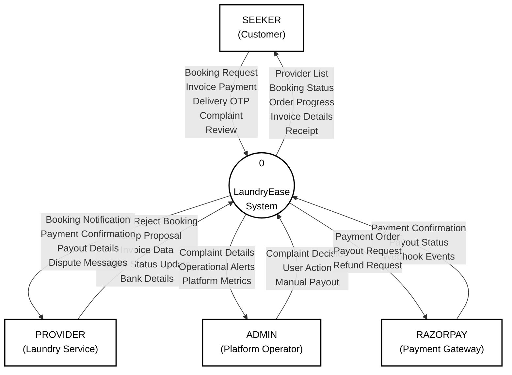
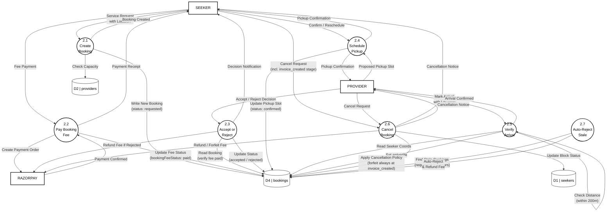
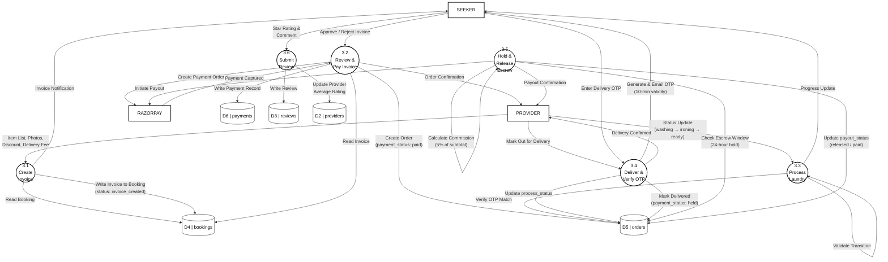

# LaundryEase

---

## CHAPTER 4

## DESIGN

### 4.1 Introduction

The design phase translates the requirements identified in the analysis phase into a structured blueprint for the LaundryEase system. This chapter describes how the application is divided into independent, manageable pieces (modules), how data flows through the system from user actions to database storage and back, how the user interface is laid out for each role, and how the database is structured to store all entities and their relationships.

The design follows three guiding principles:

1. **Separation by role** — Seekers, providers, and administrators each have isolated dashboards, navigation, and access-controlled API routes. No role can access another role's operations.
2. **State-driven workflows** — Bookings and orders progress through defined states. Each state transition is validated on the server before being applied, preventing invalid operations.
3. **Data integrity first** — Financial calculations use precise decimal arithmetic (Decimal.js). Payments are escrow-backed. Database operations use atomic updates and unique indexes to prevent duplicates.

---

### 4.2 Modularity Criteria

The LaundryEase system is divided into the following independent modules. Each module handles a specific area of functionality and communicates with other modules through well-defined interfaces (API routes and shared database collections).

| Module | Responsibility | Key Files |
|--------|---------------|-----------|
| **Authentication Module** | User registration, login, email/phone verification, password management, session handling | `app/api/auth/`, `lib/auth/`, `app/signup/`, `app/auth/` |
| **Provider Discovery Module** | Location-based provider search using geospatial queries, distance calculation, delivery fee computation | `app/api/providers/`, `lib/distance.ts`, `lib/geocoding.ts` |
| **Booking Module** | Booking creation, acceptance, rejection, pickup scheduling, rescheduling, cancellation with fee policies (including cancellation at `invoice_created` stage with mandatory fee forfeiture) | `app/api/bookings/`, `lib/bookings/`, `types/bookings.ts` |
| **Invoice Module** | Item-level invoice creation with photos, discount application, delivery charge calculation, invoice review workflow | `app/(dashboard)/provider/invoice-generation/`, `components/providers/invoice-form.tsx` |
| **Order Module** | Order lifecycle tracking through process states, deadline monitoring, status updates | `app/api/orders/`, `lib/orders/`, `types/orders.ts` |
| **Payment Module** | Razorpay order creation, payment capture, signature verification, webhook handling, refund processing | `app/api/payments/`, `lib/razorpay.ts`, `lib/webhooks/` |
| **Escrow & Payout Module** | Escrow hold after delivery, timed release, payout initiation via RazorpayX, commission calculation, failure handling | `app/api/escrow/`, `lib/payouts.ts`, `lib/payouts/` |
| **Delivery Module** | OTP generation, OTP email delivery, OTP verification, delivery confirmation, deadline compensation | `lib/delivery-otp-email.ts`, `lib/otp.ts`, `lib/orders/deadline-compensation.ts` |
| **Complaint Module** | Complaint filing, admin triage, 3-party chat, evidence upload, resolution with settlement | `app/api/complaints/`, `lib/complaints/`, `types/complaints.ts` |
| **Review Module** | Post-delivery star ratings, comment submission, provider rating aggregation | `app/api/reviews/`, `types/reviews.ts` |
| **Admin Module** | User management, payment oversight, complaint resolution, operational alerts | `app/(dashboard)/admin/`, `app/api/admin/` |
| **Notification Module** | Email outbox with retry logic, SMS OTP via Twilio, magic link delivery | `lib/email-outbox.ts`, `lib/email-transporter.ts`, `lib/magic-link-email.ts` |
| **Cron Module** | Scheduled background tasks — stale booking auto-rejection, no-show detection, email queue processing | `cron/`, `lib/cron-tracking.ts` |
| **Security Module** | Rate limiting, CSP headers, origin validation, CSRF protection, password policy enforcement | `lib/security/`, `lib/auth/password-policy.ts` |
| **Audit Module** | Transaction logging, cross-entity anomaly detection, audit trail with TTL cleanup | `lib/audit.ts`, `lib/audit/` |
| **Real-Time Module** | Socket.IO WebSocket server for live order chat and complaint chat, typing indicators, connection state management, per-socket rate limiting | `server.js`, `components/providers/socket-provider.tsx`, `components/order-chat.tsx`, `components/complaint-chat.tsx`, `lib/realtime/` |

---

### 4.3 Architecture Diagrams / DFD

The following Data Flow Diagrams (DFDs) show how data moves through the LaundryEase system at increasing levels of detail. The notation used is Yourdon-DeMarco for entities (rectangles) and processes (circles), with Gane-Sarson style for data stores (open-ended rectangles).

#### 4.3.1 DFD Level 0 (Context Diagram)

The context diagram shows the entire LaundryEase system as a single process and its interactions with three external entities.



#### 4.3.2 DFD Level 1

The Level 1 DFD breaks the system into its major processes and shows the data stores they read from and write to.

```mermaid
flowchart TB
    %% Styling
    classDef entity fill:#ffffff,stroke:#000000,stroke-width:2px,color:#000000
    classDef process fill:#ffffff,stroke:#000000,stroke-width:2px,color:#000000
    classDef datastore fill:#ffffff,stroke:#000000,stroke-width:1px,color:#000000

    %% External Entities
    SEEKER["SEEKER"]:::entity
    PROVIDER["PROVIDER"]:::entity
    ADMIN["ADMIN"]:::entity
    RAZORPAY["RAZORPAY"]:::entity

    %% Processes (circles)
    P1(("1.0\nUser\nAuthentication")):::process
    P2(("2.0\nBooking\nManagement")):::process
    P3(("3.0\nOrder\nProcessing")):::process
    P4(("4.0\nPayment &\nEscrow")):::process
    P5(("5.0\nComplaint\nResolution")):::process
    P6(("6.0\nProvider\nDiscovery")):::process

    %% Data Stores (Gane-Sarson open-ended rectangles)
    D1[("D1 | seekers")]:::datastore
    D2[("D2 | providers")]:::datastore
    D3[("D3 | admins")]:::datastore
    D4[("D4 | bookings")]:::datastore
    D5[("D5 | orders")]:::datastore
    D6[("D6 | payments")]:::datastore
    D7[("D7 | complaints")]:::datastore
    D8[("D8 | reviews")]:::datastore

    %% Authentication flows
    SEEKER -- "Credentials / OTP" --> P1
    PROVIDER -- "Credentials / OTP" --> P1
    P1 -- "Read / Write User" --> D1
    P1 -- "Read / Write User" --> D2
    P1 -- "Read / Write User" --> D3
    P1 -- "Session Token" --> SEEKER
    P1 -- "Session Token" --> PROVIDER

    %% Provider Discovery
    SEEKER -- "Location Coordinates" --> P6
    P6 -- "Read Provider Data" --> D2
    P6 -- "Provider List with Distance" --> SEEKER

    %% Booking Management
    SEEKER -- "Booking Request / Cancel" --> P2
    PROVIDER -- "Accept / Reject / Propose Slot" --> P2
    P2 -- "Read / Write Booking" --> D4
    P2 -- "Booking Status" --> SEEKER
    P2 -- "Booking Notification" --> PROVIDER

    %% Order Processing
    PROVIDER -- "Invoice Data / Status Update" --> P3
    SEEKER -- "Delivery OTP / Review" --> P3
    P3 -- "Read Booking" --> D4
    P3 -- "Read / Write Order" --> D5
    P3 -- "Write Review" --> D8
    P3 -- "Order Progress" --> SEEKER
    P3 -- "Order Details" --> PROVIDER

    %% Payment & Escrow
    SEEKER -- "Payment Approval" --> P4
    P4 -- "Payment Order" --> RAZORPAY
    RAZORPAY -- "Payment Confirmation" --> P4
    P4 -- "Update Payment Status" --> D4
    P4 -- "Update Payment Status" --> D5
    P4 -- "Write Payment Record" --> D6
    P4 -- "Payout Request" --> RAZORPAY
    P4 -- "Receipt" --> SEEKER
    P4 -- "Payout Confirmation" --> PROVIDER

    %% Complaint Resolution
    SEEKER -- "File Complaint" --> P5
    ADMIN -- "Resolution Decision" --> P5
    P5 -- "Read / Write Complaint" --> D7
    P5 -- "Read Order" --> D5
    P5 -- "Freeze / Release Escrow" --> P4
    P5 -- "Complaint Status" --> SEEKER
    P5 -- "Dispute Messages" --> PROVIDER
    P5 -- "Complaint Details" --> ADMIN
```



#### 4.3.3 DFD Level 2 of Process 2.0 (Booking Management)

This diagram expands Process 2.0 to show the sub-processes within booking management.



#### 4.3.4 DFD Level 2 of Process 3.0 (Order Processing)

This diagram expands Process 3.0 to show the sub-processes within order processing.



---

### 4.4 User Interface Layout

This section describes the user interface layout for each major screen in the LaundryEase application. The interface uses a responsive design that works on both desktop and mobile browsers, with a dark/light theme toggle available on all pages.

#### 4.4.1 Home / Landing Page

The landing page is the first screen visitors see when they open the application. It serves as the public-facing marketing page for unauthenticated users.

**Layout:**

```
┌──────────────────────────────────────────────────────────────┐
│  NAVBAR                                                      │
│  ┌──────┐  Features  How It Works      [Theme] [Sign In]    │
│  │ Logo │                                [Get Started]       │
│  └──────┘                                                    │
├──────────────────────────────────────────────────────────────┤
│                                                              │
│                    HERO SECTION                              │
│                                                              │
│              "Laundry, solved."                              │
│                                                              │
│    Connecting you with trusted laundry providers             │
│    near you. Book, track, and pay — all in one place.       │
│                                                              │
│         [Book a Pickup]    [Become a Provider]              │
│                                                              │
├──────────────────────────────────────────────────────────────┤
│                                                              │
│              ORDER STATUS PREVIEW CARD                       │
│    ┌─────────────────────────────────┐                       │
│    │  Status: Ready for Pickup       │                       │
│    │  Provider: QuickWash Laundry    │                       │
│    │  Pickup: March 7, 2:00 PM       │                       │
│    └─────────────────────────────────┘                       │
│                                                              │
├──────────────────────────────────────────────────────────────┤
│              FEATURES SECTION                                │
│                                                              │
│  ┌──────────┐  ┌──────────┐  ┌──────────┐  ┌──────────┐    │
│  │ Location │  │  Escrow  │  │  Track   │  │  OTP     │    │
│  │ Search   │  │ Payments │  │  Orders  │  │ Delivery │    │
│  └──────────┘  └──────────┘  └──────────┘  └──────────┘    │
│                                                              │
├──────────────────────────────────────────────────────────────┤
│                    FOOTER                                    │
│               © 2026 LaundryEase                             │
└──────────────────────────────────────────────────────────────┘
```

**Key Elements:**
- Fixed navigation bar with backdrop blur effect
- Interactive grid background animation
- Dual call-to-action buttons for seekers and providers
- Feature spotlight cards with hover effects
- Responsive: collapses to hamburger menu on mobile

#### 4.4.2 Seeker (Customer) Dashboard

The seeker dashboard uses a top navigation bar layout. The main content area shows different pages based on the selected menu item.

**Navigation Bar:**
```
┌──────────────────────────────────────────────────────────────┐
│  Logo   Find Providers  Bookings  Invoices  Orders  Profile │
│                                        [Disputes*] [Logout] │
└──────────────────────────────────────────────────────────────┘
  * Disputes link appears only when active disputes exist
```

**Find Providers Page (Default):**
```
┌──────────────────────────────────────────────────────────────┐
│  ┌──────────────────────────────────────────┐                │
│  │  Enter your location...        [Search]  │                │
│  └──────────────────────────────────────────┘                │
│                                                              │
│  Providers Near You                                          │
│                                                              │
│  ┌─────────────────┐  ┌─────────────────┐                   │
│  │ [Profile Image] │  │ [Profile Image] │                   │
│  │ QuickWash       │  │ FreshFold       │                   │
│  │ ★★★★☆ (4.2)    │  │ ★★★★★ (4.8)    │                   │
│  │ 2.3 km away     │  │ 1.1 km away     │                   │
│  │ Wash, Dry, Iron │  │ Wash, Iron      │                   │
│  │ [Book Service]  │  │ [Book Service]  │                   │
│  └─────────────────┘  └─────────────────┘                   │
└──────────────────────────────────────────────────────────────┘
```

**My Bookings Page:**
```
┌──────────────────────────────────────────────────────────────┐
│  My Bookings                                                 │
│                                                              │
│  ┌──────────┐ ┌──────────┐ ┌──────────┐ ┌──────────┐       │
│  │ Pending  │ │ Active   │ │Completed │ │   All    │       │
│  │   (3)    │ │   (1)    │ │   (12)   │ │   (16)   │       │
│  └──────────┘ └──────────┘ └──────────┘ └──────────┘       │
│                                                              │
│  ┌──────────────────────────────────────────────────────┐    │
│  │  Booking #BK-7F3A                                    │    │
│  │  Provider: QuickWash Laundry                         │    │
│  │  Status: [Pickup Proposed]                           │    │
│  │  Pickup: March 8, 10:00 AM                           │    │
│  │  Fee: ₹50 (Paid)                                    │    │
│  │  [Confirm Pickup]  [Request Reschedule]  [Cancel]    │    │
│  └──────────────────────────────────────────────────────┘    │
│                                                              │
│  ┌──────────────────────────────────────────────────────┐    │
│  │  Booking #BK-3C8D                                    │    │
│  │  Provider: FreshFold                                  │    │
│  │  Status: [Invoice Created]                           │    │
│  │  🧾 Invoice Ready — ₹280 due                        │    │
│  │  ⚠ Provider collected items — fee will be forfeited │    │
│  │  [View Full Invoice]  [Cancel & Reject Invoice]      │    │
│  └──────────────────────────────────────────────────────┘    │
└──────────────────────────────────────────────────────────────┘
```

**Orders Page:**
```
┌──────────────────────────────────────────────────────────────┐
│  My Orders                                                   │
│                                                              │
│  ┌──────────────────────────────────────────────────────┐    │
│  │  Order #ORD-A2B4                                     │    │
│  │  Provider: FreshFold                                  │    │
│  │  Items: 3 Shirts, 2 Pants, 1 Bedsheet               │    │
│  │  Total: ₹450                                        │    │
│  │  Process: [✓Wash] [✓Iron] [●Ready] [○Delivery]     │    │
│  │  Payment: Paid (Held in Escrow)                      │    │
│  │                                                      │    │
│  │  [Enter Delivery OTP]    [View Order & Chat]         │    │
│  └──────────────────────────────────────────────────────┘    │
└──────────────────────────────────────────────────────────────┘
```

**Order Detail Page** (with embedded real-time chat):
```
┌──────────────────────────────────────────────────────────────┐
│  Order #ORD-A2B4                                             │
│                                                              │
│  ┌─────────────────────────┐  ┌────────────────────────────┐│
│  │  ORDER DETAILS          │  │  CHAT WITH PROVIDER        ││
│  │                         │  │                            ││
│  │  Provider: FreshFold    │  │  ┌──────────────────────┐  ││
│  │  Items: 3 Shirts, ...   │  │  │ Provider: Items are  │  ││
│  │  Total: ₹450           │  │  │ ready for delivery!  │  ││
│  │                         │  │  └──────────────────────┘  ││
│  │  Process Status:        │  │         ┌──────────────┐   ││
│  │  [✓Wash] [✓Iron]       │  │         │ Great, when  │   ││
│  │  [●Ready] [○Delivery]  │  │         │ can you come?│   ││
│  │                         │  │         └──────────────┘   ││
│  │  Payment: Held          │  │                            ││
│  │                         │  │  Provider is typing…       ││
│  │  [Enter Delivery OTP]   │  │  ┌──────────────────┐      ││
│  │                         │  │  │ Type a message... │ [➤] ││
│  │                         │  │  └──────────────────┘      ││
│  └─────────────────────────┘  └────────────────────────────┘│
└──────────────────────────────────────────────────────────────┘
```

#### 4.4.3 Provider (Laundry Service) Dashboard

The provider dashboard uses a sidebar navigation layout on desktop and a collapsible top navigation on mobile.

**Desktop Layout:**
```
┌──────────┬───────────────────────────────────────────────────┐
│          │                                                   │
│ SIDEBAR  │              MAIN CONTENT AREA                    │
│          │                                                   │
│ Dashboard│  Dashboard Overview                               │
│          │                                                   │
│ Bookings │  ┌──────────┐ ┌──────────┐ ┌──────────┐         │
│          │  │ Revenue  │ │ Due      │ │ Pending  │         │
│ Orders   │  │ ₹12,450  │ │ 3       │ │ 5       │         │
│          │  │ This Week│ │Deliveries│ │ Pickups  │         │
│ Invoices │  └──────────┘ └──────────┘ └──────────┘         │
│          │                                                   │
│ Messages │  Recent Bookings                                  │
│          │  ┌──────────────────────────────────────────┐     │
│ ─────────│  │  Seeker: John D.                         │     │
│ BUSINESS │  │  Status: Requested                       │     │
│ Reviews  │  │  Fee: ₹50 (Paid)                        │     │
│          │  │  [Accept]  [Reject]                      │     │
│ ─────────│  └──────────────────────────────────────────┘     │
│ ACCOUNT  │                                                   │
│ Profile  │                                                   │
│          │                                                   │
│ Disputes*│                                                   │
│          │                                                   │
│ [Logout] │                                                   │
└──────────┴───────────────────────────────────────────────────┘
  * Disputes link appears only when active disputes exist
```

**Invoice Generation Page:**
```
┌──────────┬───────────────────────────────────────────────────┐
│          │  Create Invoice for Booking #BK-7F3A              │
│ SIDEBAR  │                                                   │
│          │  Seeker: John D.                                  │
│          │                                                   │
│          │  Items:                                            │
│          │  ┌────────────┬─────┬────────┬────────┐           │
│          │  │ Item Type  │ Qty │ Price  │ Photo  │           │
│          │  ├────────────┼─────┼────────┼────────┤           │
│          │  │ Shirt      │  3  │ ₹30   │ [📷]  │           │
│          │  │ Pants      │  2  │ ₹40   │ [📷]  │           │
│          │  │ Bedsheet   │  1  │ ₹80   │ [📷]  │           │
│          │  └────────────┴─────┴────────┴────────┘           │
│          │  [+ Add Item]                                     │
│          │                                                   │
│          │  Subtotal:        ₹250                           │
│          │  Discount:        -₹20                           │
│          │  Delivery Charge: +₹50                           │
│          │  ─────────────────────                            │
│          │  Total:           ₹280                           │
│          │                                                   │
│          │  Notes: ___________________________               │
│          │                                                   │
│          │  [Submit Invoice]                                 │
└──────────┴───────────────────────────────────────────────────┘
```

**Order Status Page** (with expandable chat per order):
```
┌──────────┬───────────────────────────────────────────────────┐
│          │  Order Processing                                 │
│ SIDEBAR  │                                                   │
│          │  ┌──────────────────────────────────────────┐     │
│          │  │  Order #ORD-A2B4 — John D.               │     │
│          │  │  Status: [Washing ▼]                      │     │
│          │  │  Items: 3 Shirts, 2 Pants                 │     │
│          │  │  Total: ₹450                             │     │
│          │  │  [▶ Advance to Ironing]                   │     │
│          │  │                                           │     │
│          │  │  💬 Chat  [▾ Expand]                      │     │
│          │  │  ┌─────────────────────────────────────┐  │     │
│          │  │  │  Seeker: When will it be ready?     │  │     │
│          │  │  │         ┌─────────────────────┐     │  │     │
│          │  │  │         │ Should be done by   │     │  │     │
│          │  │  │         │ tomorrow evening.   │     │  │     │
│          │  │  │         └─────────────────────┘     │  │     │
│          │  │  │  ┌──────────────────┐               │  │     │
│          │  │  │  │ Type a message...│ [➤]           │  │     │
│          │  │  │  └──────────────────┘               │  │     │
│          │  │  └─────────────────────────────────────┘  │     │
│          │  └──────────────────────────────────────────┘     │
│          │                                                   │
│          │  ┌──────────────────────────────────────────┐     │
│          │  │  Order #ORD-C7E1 — Jane S.               │     │
│          │  │  Status: [Ready]                          │     │
│          │  │  [▶ Mark Out for Delivery]                │     │
│          │  │  💬 Chat  [▸ Collapsed]                   │     │
│          │  └──────────────────────────────────────────┘     │
└──────────┴───────────────────────────────────────────────────┘
```

**Key Elements:**
- Each order card has an expandable real-time chat panel powered by Socket.IO
- Chat uses the shared `SocketProvider` connection — no extra socket per card
- Typing indicators and disconnect banners appear inside the chat panel
- The Messages page (`/provider/messages`) aggregates all order conversations with last-message preview and unread counts

#### 4.4.4 Admin Dashboard

The admin dashboard also uses a sidebar layout, with sections for operations management.

**Layout:**
```
┌──────────┬───────────────────────────────────────────────────┐
│          │                                                   │
│ SIDEBAR  │  Admin Dashboard                                  │
│          │                                                   │
│ Dashboard│  Critical Alerts                                  │
│          │  ┌──────────────────────────────────────────┐     │
│ ─────────│  │ ⚠ 2 overdue escrow releases              │     │
│OPERATIONS│  │ ⚠ 1 payout failure in last 24h           │     │
│Complaints│  │ ⚠ 3 complaints past response deadline    │     │
│  (5)     │  └──────────────────────────────────────────┘     │
│ Payments │                                                   │
│ Users    │  Platform Stats                                   │
│          │  ┌──────────┐ ┌──────────┐ ┌──────────┐         │
│ [Logout] │  │ Active   │ │ Escrow   │ │ Active   │         │
│          │  │Complaints│ │ Held     │ │Providers │         │
│          │  │    5     │ │ ₹8,200  │ │   23    │         │
│          │  └──────────┘ └──────────┘ └──────────┘         │
│          │                                                   │
│          │  Complaint Resolution                             │
│          │  ┌──────────────────────────────────────────┐     │
│          │  │  Complaint #C-9D2E                       │     │
│          │  │  Seeker: Jane S. → Provider: QuickWash   │     │
│          │  │  Type: Damaged Item                      │     │
│          │  │  Status: [In Review]                     │     │
│          │  │  Deadline: March 10                      │     │
│          │  │  [View Chat]  [Resolve]                  │     │
│          │  └──────────────────────────────────────────┘     │
└──────────┴───────────────────────────────────────────────────┘
```

**Complaint Resolution Dialog:**
```
┌──────────────────────────────────────────────────────────────┐
│  Resolve Complaint #C-9D2E                                   │
│                                                              │
│  Resolution:                                                 │
│  ○ Release Full Payout to Provider                          │
│  ○ Full Refund to Seeker (Distributable Amount)             │
│  ● Partial Split Settlement                                 │
│  ○ Reject Complaint (Invalid)                               │
│                                                              │
│  Distributable Amount: ₹380                                 │
│  Seeker Refund: [₹ ____150____]                             │
│  Provider Payout: ₹230 (auto-calculated)                    │
│                                                              │
│  [Cancel]                    [Confirm Resolution]            │
└──────────────────────────────────────────────────────────────┘
```

---

### 4.5 Database Design

LaundryEase uses MongoDB, a document-based NoSQL database. Data is organized into collections (equivalent to tables in relational databases). Each collection stores documents (equivalent to rows) as JSON-like objects. The database uses 30+ indexes including unique constraints, compound indexes, TTL indexes for automatic expiration, and a geospatial index for location-based queries.

#### 4.5.1 List of Entities and Attributes

**Entity 1: Seeker (Customer)**

| Attribute | Type | Description |
|-----------|------|-------------|
| _id | ObjectId | Unique identifier (primary key) |
| email | String | Email address (unique) |
| name | String | Full name |
| phone | String | Phone number |
| passwordHash | String | Bcrypt-hashed password |
| emailVerified | Boolean | Email verification status |
| phoneVerified | Boolean | Phone verification status |
| address | Object | Street address (line1, city, state, country, postalCode, landmark) |
| coordinates | Object | Latitude and longitude (lat, lng) |
| outstanding_fees | Number | Unpaid booking fees balance |
| blocked_until | Date | Account block expiration (set after cancellation abuse) |
| isFlagged | Boolean | Admin-flagged status |
| cancellationCount | Number | Total cancellations by this seeker |
| createdAt | Date | Registration timestamp |

**Entity 2: Provider (Laundry Service)**

| Attribute | Type | Description |
|-----------|------|-------------|
| _id | ObjectId | Unique identifier (primary key) |
| email | String | Email address (unique) |
| name | String | Owner/operator name |
| phone | String | Phone number |
| passwordHash | String | Bcrypt-hashed password |
| businessName | String | Laundry shop name |
| bio | String | Short description |
| services | Array | List of services offered (e.g., wash, dry, iron) |
| pricing | Number | Base price per item |
| pricingRates | Object | Service-specific pricing map |
| location | String | Text address |
| coordinates | Object | Latitude and longitude |
| locationGeoJSON | Object | GeoJSON Point for geospatial queries |
| radius_km | Number | Maximum service radius in kilometers |
| free_radius_km | Number | Free delivery radius |
| per_km_rate | Number | Delivery charge per kilometer beyond free radius |
| capacity | Number | Maximum concurrent active jobs |
| bankDetails | Object | Bank account (accountNumber, ifsc, accountHolderName, upiId) |
| razorpay_contact_id | String | Razorpay vendor contact ID |
| razorpay_fund_account_id | String | Razorpay fund account ID for payouts |
| profilePicture | String | Profile image URL (Cloudinary) |
| bannerImage | String | Banner image URL (Cloudinary) |
| rating | Number | Average star rating (1–5) |
| ratingTotal | Number | Sum of all ratings received |
| reviewCount | Number | Total number of reviews |
| createdAt | Date | Registration timestamp |

**Entity 3: Admin**

| Attribute | Type | Description |
|-----------|------|-------------|
| _id | ObjectId | Unique identifier (primary key) |
| email | String | Email address (unique) |
| name | String | Administrator name |
| passwordHash | String | Bcrypt-hashed password |
| createdAt | Date | Account creation timestamp |

**Entity 4: Booking**

| Attribute | Type | Description |
|-----------|------|-------------|
| _id | ObjectId | Unique identifier (primary key) |
| seeker_id | ObjectId | Reference to seeker (foreign key) |
| provider_id | ObjectId | Reference to provider (foreign key) |
| status | String | Current state (requested, accepted, rejected, pickup_proposed, reschedule_requested, confirmed, invoice_created, cancelled, completed). Seekers may cancel at any pre-payment state including `invoice_created`; fee is always forfeited at that stage. |
| bookingFee | Number | Booking fee amount (₹50) |
| bookingFeeStatus | String | Fee state (pending, paid, refunded, forfeited, applied) |
| pickupSlot | Object | Proposed pickup date/time with confirmation |
| reschedule | Object | Reschedule details (requestedBy, reason, count, previousSlot) |
| arrivedAt | Date | Provider arrival timestamp |
| invoice | Object | Embedded invoice data (items, subtotal, discount, total, photos, notes) |
| deadline | Date | Service completion deadline |
| seeker_coordinates | Object | Seeker location at time of booking |
| noShowStatus | Boolean | Provider no-show detected |
| cancelledBy | String | Who cancelled (seeker or provider) |
| cancellation_reason | String | Reason for cancellation |
| razorpay_order_id | String | Razorpay order for booking fee (unique) |
| razorpay_payment_id | String | Razorpay payment for booking fee (unique) |
| payout_status | String | Booking fee payout state |
| payout_id | String | Razorpay payout transaction ID (unique) |
| platform_commission | Number | Platform's share of booking fee |
| provider_payout_amount | Number | Provider's share of booking fee |
| createdAt | Date | Booking creation timestamp |
| updatedAt | Date | Last modification timestamp |

**Entity 5: Order**

| Attribute | Type | Description |
|-----------|------|-------------|
| _id | ObjectId | Unique identifier (primary key) |
| booking_id | ObjectId | Reference to parent booking (unique, foreign key) |
| seeker_id | ObjectId | Reference to seeker (foreign key) |
| provider_id | ObjectId | Reference to provider (foreign key) |
| items | Array | Ordered items (name, quantity, unit_price, line_total, photoUrl, notes) |
| subtotal | Number | Sum of item line totals before discount |
| discount | Number | Provider-applied discount |
| delivery_charge | Number | Calculated delivery fee |
| delivery_distance_km | Number | Distance between seeker and provider |
| total_price | Number | Final amount (subtotal - discount + delivery_charge) |
| payment_status | String | Payment state (unpaid, paid, held, released, refunded) |
| process_status | String | Laundry stage (invoiced, processing, washing, ironing, ready, out_for_delivery, delivered) |
| delivery_otp | String | One-time password for delivery confirmation |
| delivery_otp_expires_at | Date | OTP expiration time (10 minutes) |
| delivery_otp_resend_count | Number | Number of OTP resends |
| escrow_started_at | Date | When escrow hold began |
| escrow_release_at | Date | Scheduled escrow release time (24 hours after delivery) |
| deadline | Date | Service deadline from booking |
| deadline_breached_at | Date | When deadline was breached |
| deadline_compensation_mode | String | Compensation type (full_refund or no_charge) |
| razorpay_order_id | String | Razorpay order for invoice payment (unique) |
| razorpay_payment_id | String | Razorpay payment ID (unique) |
| platform_commission | Number | 5% of subtotal |
| provider_payout_amount | Number | Total minus commission |
| payout_status | String | Payout state (pending, processing, paid, failed) |
| payout_id | String | Razorpay payout ID (unique) |
| createdAt | Date | Order creation timestamp |
| updatedAt | Date | Last modification timestamp |

**Entity 6: Complaint**

| Attribute | Type | Description |
|-----------|------|-------------|
| _id | ObjectId | Unique identifier (primary key) |
| order_id | ObjectId | Reference to disputed order (unique, foreign key) |
| booking_id | ObjectId | Reference to related booking (foreign key) |
| seeker_id | ObjectId | Reference to complaining seeker (foreign key) |
| provider_id | ObjectId | Reference to accused provider (foreign key) |
| complaint_type | String | Category of complaint |
| title | String | Short summary |
| description | String | Detailed complaint text |
| photos | Array | Evidence image URLs (max 5) |
| status | String | State (open, accepted, in_review, resolved, rejected) |
| resolution_outcome | String | Decision (refund_full, refund_partial, release_payout, no_action) |
| provider_access_granted | Boolean | Whether provider can see complaint chat |
| response_deadline | Date | Deadline for provider response |
| participants | Array | ObjectIds of involved parties |
| acceptedAt | Date | When admin accepted the complaint |
| resolvedAt | Date | When complaint was resolved |
| createdAt | Date | Filing timestamp |

**Entity 7: Complaint Message**

| Attribute | Type | Description |
|-----------|------|-------------|
| _id | ObjectId | Unique identifier (primary key) |
| complaint_id | ObjectId | Reference to parent complaint (foreign key) |
| sender_id | ObjectId | Reference to message sender (foreign key) |
| sender_role | String | Role of sender (seeker, provider, admin, system) |
| message_type | String | Type (TEXT, IMAGE, SYSTEM) |
| content | String | Message text |
| attachments | Array | Attached image URLs |
| createdAt | Date | Message timestamp |

**Entity 8: Order Chat Message**

| Attribute | Type | Description |
|-----------|------|-------------|
| _id | ObjectId | Unique identifier (primary key) |
| order_id | ObjectId | Reference to parent order (foreign key) |
| sender_id | String | Reference to message sender (user ID) |
| sender_role | String | Role of sender (seeker, provider) |
| message | String | Message text |
| createdAt | Date | Message timestamp |

**Entity 9: Review**

| Attribute | Type | Description |
|-----------|------|-------------|
| _id | ObjectId | Unique identifier (primary key) |
| order_id | ObjectId | Reference to reviewed order (foreign key) |
| seeker_id | ObjectId | Reference to reviewer (foreign key) |
| provider_id | ObjectId | Reference to reviewed provider (foreign key) |
| seeker_name | String | Reviewer display name |
| rating | Number | Star rating (1 to 5) |
| comment | String | Optional text feedback |
| createdAt | Date | Review submission timestamp |

**Entity 10: Payment**

| Attribute | Type | Description |
|-----------|------|-------------|
| _id | ObjectId | Unique identifier (primary key) |
| razorpay_payment_id | String | Razorpay payment reference (unique) |
| amount | Number | Payment amount in paise |
| status | String | Payment status |
| createdAt | Date | Payment record timestamp |

**Entity 11: Email Outbox**

| Attribute | Type | Description |
|-----------|------|-------------|
| _id | ObjectId | Unique identifier (primary key) |
| type | String | Email type (delivery_otp, password_reset, magic_link, otp_email) |
| to | String | Recipient email address |
| subject | String | Email subject |
| body | String | Email content |
| status | String | Delivery state (pending, processing, sent, failed) |
| attempts | Number | Delivery attempt count |
| maxAttempts | Number | Maximum retry limit (default: 5) |
| nextAttemptAt | Date | Next scheduled retry time |
| lastError | String | Most recent error message |
| lockedAt | Date | Processing lock timestamp |
| createdAt | Date | Queue entry timestamp |

**Supporting Entities:**

| Entity | Key Attributes | Purpose |
|--------|---------------|---------|
| Password Reset Token | tokenHash (unique), expiresAt (TTL) | Temporary token for password reset |
| OTP Code | code, expiresAt (TTL) | Temporary verification code |
| Webhook Event | event_id (unique), payload | Razorpay webhook deduplication |
| Audit Log | action, actor, timestamp (TTL: 30 days) | System audit trail |
| Cron Run | job, status, startedAt (TTL: 7 days), durationMs | Background job tracking |
| System Alert | severity, status, message, firstSeenAt | Operational alert records |

#### 4.5.2 E-R Diagram

The following Entity-Relationship diagram uses Chen notation to show all entities, their attributes, and the relationships between them.

```mermaid
erDiagram
    SEEKER {
        ObjectId _id PK
        string email UK
        string name
        string phone
        string passwordHash
        boolean emailVerified
        boolean phoneVerified
        object address
        object coordinates
        number outstanding_fees
        date blocked_until
        boolean isFlagged
        number cancellationCount
        date createdAt
    }

    PROVIDER {
        ObjectId _id PK
        string email UK
        string name
        string phone
        string passwordHash
        string businessName
        string bio
        array services
        number pricing
        object pricingRates
        string location
        object coordinates
        object locationGeoJSON
        number radius_km
        number free_radius_km
        number per_km_rate
        number capacity
        object bankDetails
        string razorpay_contact_id
        string razorpay_fund_account_id
        string profilePicture
        string bannerImage
        number rating
        number ratingTotal
        number reviewCount
        date createdAt
    }

    ADMIN {
        ObjectId _id PK
        string email UK
        string name
        string passwordHash
        date createdAt
    }

    BOOKING {
        ObjectId _id PK
        ObjectId seeker_id FK
        ObjectId provider_id FK
        string status
        number bookingFee
        string bookingFeeStatus
        object pickupSlot
        object reschedule
        date arrivedAt
        object invoice
        date deadline
        object seeker_coordinates
        boolean noShowStatus
        string cancelledBy
        string razorpay_order_id UK
        string razorpay_payment_id UK
        string payout_status
        string payout_id UK
        date createdAt
        date updatedAt
    }

    ORDER {
        ObjectId _id PK
        ObjectId booking_id FK-UK
        ObjectId seeker_id FK
        ObjectId provider_id FK
        array items
        number subtotal
        number discount
        number delivery_charge
        number total_price
        string payment_status
        string process_status
        string delivery_otp
        date escrow_release_at
        date deadline
        string razorpay_order_id UK
        string razorpay_payment_id UK
        number platform_commission
        number provider_payout_amount
        string payout_status
        string payout_id UK
        date createdAt
        date updatedAt
    }

    COMPLAINT {
        ObjectId _id PK
        ObjectId order_id FK-UK
        ObjectId booking_id FK
        ObjectId seeker_id FK
        ObjectId provider_id FK
        string complaint_type
        string title
        string description
        array photos
        string status
        string resolution_outcome
        boolean provider_access_granted
        date response_deadline
        date acceptedAt
        date resolvedAt
        date createdAt
    }

    COMPLAINT_MESSAGE {
        ObjectId _id PK
        ObjectId complaint_id FK
        ObjectId sender_id FK
        string sender_role
        string message_type
        string content
        array attachments
        date createdAt
    }

    ORDER_CHAT_MESSAGE {
        ObjectId _id PK
        ObjectId order_id FK
        string sender_id FK
        string sender_role
        string message
        date createdAt
    }

    REVIEW {
        ObjectId _id PK
        ObjectId order_id FK
        ObjectId seeker_id FK
        ObjectId provider_id FK
        string seeker_name
        number rating
        string comment
        date createdAt
    }

    PAYMENT {
        ObjectId _id PK
        string razorpay_payment_id UK
        number amount
        string status
        date createdAt
    }

    EMAIL_OUTBOX {
        ObjectId _id PK
        string type
        string to
        string subject
        string body
        string status
        number attempts
        date nextAttemptAt
        date createdAt
    }

    SEEKER ||--o{ BOOKING : "requests"
    PROVIDER ||--o{ BOOKING : "receives"
    BOOKING ||--o| ORDER : "generates"
    SEEKER ||--o{ ORDER : "pays for"
    PROVIDER ||--o{ ORDER : "fulfills"
    ORDER ||--o| COMPLAINT : "may have"
    SEEKER ||--o{ COMPLAINT : "files"
    PROVIDER ||--o{ COMPLAINT : "is accused in"
    COMPLAINT ||--o{ COMPLAINT_MESSAGE : "contains"
    ORDER ||--o{ ORDER_CHAT_MESSAGE : "contains"
    ORDER ||--o| REVIEW : "receives"
    SEEKER ||--o{ REVIEW : "writes"
    PROVIDER ||--o{ REVIEW : "is reviewed in"
    ORDER ||--o| PAYMENT : "is paid via"
    BOOKING ||--o| PAYMENT : "fee paid via"
```

#### 4.5.3 Structure of Collections (Tables)

The following tables show the structure of each MongoDB collection as used in the database.

**Collection: seekers**

| Field | Type | Constraints | Description |
|-------|------|-------------|-------------|
| _id | ObjectId | Primary Key | Auto-generated unique ID |
| email | String | Unique Index | Login identifier |
| name | String | — | Display name |
| phone | String | — | Contact number |
| passwordHash | String | — | Bcrypt hash (10 rounds) |
| emailVerified | Boolean | Default: false | Email OTP verified |
| phoneVerified | Boolean | Default: false | Phone OTP verified |
| address.line1 | String | — | Street address |
| address.city | String | — | City |
| address.state | String | — | State |
| address.country | String | — | Country |
| address.postalCode | String | — | PIN/ZIP code |
| address.landmark | String | Optional | Nearby landmark |
| coordinates.lat | Number | — | Latitude |
| coordinates.lng | Number | — | Longitude |
| outstanding_fees | Number | Default: 0 | Unpaid fees |
| blocked_until | Date | Optional | Block expiry |
| isFlagged | Boolean | Default: false | Admin flag |
| cancellationCount | Number | Default: 0 | Cancel count |
| createdAt | Date | — | Registration date |

**Collection: providers**

| Field | Type | Constraints | Description |
|-------|------|-------------|-------------|
| _id | ObjectId | Primary Key | Auto-generated unique ID |
| email | String | Unique Index | Login identifier |
| name | String | — | Owner name |
| businessName | String | — | Shop name |
| phone | String | — | Contact number |
| passwordHash | String | — | Bcrypt hash |
| services | Array[String] | — | Offered services |
| pricing | Number | — | Base price |
| pricingRates | Object | — | Service-specific rates |
| location | String | — | Text address |
| locationGeoJSON | Object | 2dsphere Index | GeoJSON Point for geo queries |
| radius_km | Number | — | Service coverage radius |
| free_radius_km | Number | — | Free delivery zone |
| per_km_rate | Number | — | Extra delivery rate |
| capacity | Number | Default: 100 | Max concurrent jobs |
| bankDetails.accountNumber | String | — | Bank account |
| bankDetails.ifsc | String | — | Bank IFSC code |
| bankDetails.accountHolderName | String | — | Account holder |
| bankDetails.upiId | String | Optional | UPI address |
| razorpay_contact_id | String | — | Razorpay vendor ID |
| razorpay_fund_account_id | String | — | Razorpay payout account |
| rating | Number | — | Average rating (1–5) |
| reviewCount | Number | Default: 0 | Total reviews |
| createdAt | Date | — | Registration date |

**Collection: bookings**

| Field | Type | Constraints | Description |
|-------|------|-------------|-------------|
| _id | ObjectId | Primary Key | Auto-generated |
| seeker_id | ObjectId | Indexed | References seekers._id |
| provider_id | ObjectId | Compound Index (+ status + createdAt) | References providers._id |
| status | String | Compound Index | Booking state |
| bookingFee | Number | — | Fee amount (₹50) |
| bookingFeeStatus | String | — | Fee payment state |
| pickupSlot.proposedBy | String | — | Who proposed (provider/seeker) |
| pickupSlot.dateTime | Date | — | Proposed pickup time |
| pickupSlot.confirmedAt | Date | — | Confirmation timestamp |
| invoice.items | Array | — | Embedded invoice items |
| invoice.subtotal | Number | — | Items total |
| invoice.discount | Number | — | Applied discount |
| invoice.total | Number | — | Final invoice amount |
| razorpay_order_id | String | Unique Index | Razorpay order reference |
| razorpay_payment_id | String | Unique Index | Razorpay payment reference |
| payout_id | String | Unique Index | Payout transaction ID |
| createdAt | Date | — | Creation timestamp |

**Collection: orders**

| Field | Type | Constraints | Description |
|-------|------|-------------|-------------|
| _id | ObjectId | Primary Key | Auto-generated |
| booking_id | ObjectId | Unique Index | One order per booking |
| seeker_id | ObjectId | — | References seekers._id |
| provider_id | ObjectId | — | References providers._id |
| items | Array[Object] | — | Item details (name, qty, price, photo) |
| subtotal | Number | — | Pre-discount sum |
| discount | Number | — | Discount amount |
| delivery_charge | Number | — | Delivery fee |
| total_price | Number | — | Final payable amount |
| payment_status | String | — | unpaid → paid → held → released |
| process_status | String | — | invoiced → ... → delivered |
| delivery_otp | String | — | 6-digit OTP |
| delivery_otp_expires_at | Date | — | OTP expiry (10 min) |
| escrow_release_at | Date | — | Scheduled release time |
| platform_commission | Number | — | 5% of subtotal |
| provider_payout_amount | Number | — | Total minus commission |
| payout_status | String | — | Payout workflow state |
| razorpay_order_id | String | Unique Index | Payment order ref |
| razorpay_payment_id | String | Unique Index | Payment capture ref |
| payout_id | String | Unique Index | Payout ref |
| createdAt | Date | — | Creation timestamp |

**Collection: complaints**

| Field | Type | Constraints | Description |
|-------|------|-------------|-------------|
| _id | ObjectId | Primary Key | Auto-generated |
| order_id | ObjectId | Unique Index | One complaint per order |
| booking_id | ObjectId | — | Related booking |
| seeker_id | ObjectId | — | Complaining seeker |
| provider_id | ObjectId | — | Accused provider |
| complaint_type | String | — | Issue category |
| title | String | — | Short summary |
| description | String | — | Full details |
| photos | Array[String] | Max 5 | Evidence URLs |
| status | String | Compound Index (+ response_deadline) | Complaint state |
| resolution_outcome | String | — | Admin decision |
| provider_access_granted | Boolean | Default: false | Chat visibility |
| response_deadline | Date | Indexed | Provider response due |
| createdAt | Date | — | Filing timestamp |

**Collection: complaint_messages**

| Field | Type | Constraints | Description |
|-------|------|-------------|-------------|
| _id | ObjectId | Primary Key | Auto-generated |
| complaint_id | ObjectId | Indexed | Parent complaint |
| sender_id | ObjectId | — | Message author |
| sender_role | String | — | seeker / provider / admin / system |
| message_type | String | — | TEXT / IMAGE / SYSTEM |
| content | String | — | Message body |
| attachments | Array[String] | — | Attached images |
| createdAt | Date | — | Sent timestamp |

**Collection: order_chats**

| Field | Type | Constraints | Description |
|-------|------|-------------|-------------|
| _id | ObjectId | Primary Key | Auto-generated |
| order_id | ObjectId | Indexed | Parent order |
| sender_id | String | — | Message author (user ID) |
| sender_role | String | — | seeker / provider |
| message | String | — | Message body |
| createdAt | Date | — | Sent timestamp |

**Collection: reviews**

| Field | Type | Constraints | Description |
|-------|------|-------------|-------------|
| _id | ObjectId | Primary Key | Auto-generated |
| order_id | ObjectId | — | Reviewed order |
| seeker_id | ObjectId | — | Reviewer |
| provider_id | ObjectId | — | Reviewed provider |
| seeker_name | String | — | Display name |
| rating | Number | 1–5 | Star rating |
| comment | String | Optional | Text feedback |
| createdAt | Date | — | Submission time |

---

## CHAPTER 5

## CODING AND IMPLEMENTATION

### 5.1 Introduction

This chapter describes the technologies, frameworks, and coding practices used to build the LaundryEase application. The system is implemented as a full-stack web application using a single codebase — the same framework (Next.js) handles both the frontend user interface and the backend API logic. A custom Node.js server (`server.js`) wraps Next.js and adds a Socket.IO WebSocket layer for real-time **order chat** and **complaint chat**; this replaces the default Next.js HTTP server while preserving all routing behaviour.

The codebase follows these coding principles:

1. **Type safety everywhere** — TypeScript is used across the entire codebase. Every function parameter, return value, API request body, and database document has a defined type. This catches errors at build time before they reach users.

2. **Validation at system boundaries** — All data entering the system (API requests, form submissions, webhook payloads) is validated using Zod schemas. Invalid data is rejected with clear error messages before reaching business logic.

3. **Server-side state enforcement** — Critical operations like booking status transitions, order process updates, and payment state changes are validated on the server. The client can request a change, but the server decides whether it is allowed.

4. **Precise financial math** — All monetary calculations (commission, payout amounts, refunds) use Decimal.js, a library that performs exact decimal arithmetic. This prevents the rounding errors that occur with standard floating-point numbers.

### 5.2 Next.js and React Framework

LaundryEase is built on **Next.js 16.1.6** with the **App Router** architecture and **React 19.2.4**.

**Why Next.js was chosen:**

- **Single codebase** — Frontend pages and backend API routes live in the same project. A booking form component and the API endpoint that processes the booking are in adjacent folders.
- **Server-Side Rendering (SSR)** — Pages are rendered on the server before being sent to the browser. This means the browser receives ready-to-display HTML instead of a blank page that loads data afterward.
- **File-based routing** — Each folder in the `app/` directory becomes a URL route. Creating `app/(dashboard)/seeker/bookings/page.tsx` automatically creates the `/seeker/bookings` page.
- **API Routes** — Backend endpoints are defined as `route.ts` files inside `app/api/`. For example, `app/api/bookings/route.ts` handles `GET /api/bookings` and `POST /api/bookings`.
- **Built-in optimizations** — Automatic code splitting (each page loads only the JavaScript it needs), image optimization, and font optimization are included without extra configuration.

**How the frontend is structured:**

```
app/
├── page.tsx                          ← Landing page (public)
├── layout.tsx                        ← Root layout (providers, theme, fonts)
├── (auth)/                           ← Email and phone verification pages
├── (dashboard)/
│   ├── seeker/
│   │   ├── layout.tsx                ← Seeker layout (top nav)
│   │   ├── page.tsx                  ← Provider discovery
│   │   ├── bookings/page.tsx         ← Booking management
│   │   ├── bookings/[id]/invoice-review/ ← Invoice review & payment
│   │   ├── view-orders/page.tsx      ← Order tracking
│   │   ├── orders/[id]/page.tsx      ← Order detail + order chat
│   │   ├── invoices/page.tsx         ← Invoice history
│   │   ├── disputes/page.tsx         ← Complaint management
│   │   └── profile/page.tsx          ← Profile settings
│   ├── provider/
│   │   ├── layout.tsx                ← Provider layout (sidebar)
│   │   ├── page.tsx                  ← Dashboard with stats
│   │   ├── bookings/page.tsx         ← Incoming requests
│   │   ├── bookings/[id]/invoice/    ← Invoice creation for a booking
│   │   ├── manage-booking/page.tsx   ← Active booking mgmt
│   │   ├── order-status/page.tsx     ← Order processing
│   │   ├── invoice-generation/page.tsx ← Invoice creation (general)
│   │   ├── messages/page.tsx         ← Order chat inbox
│   │   ├── reviews-manage/page.tsx   ← Review management
│   │   ├── disputes/page.tsx         ← Dispute handling
│   │   └── profile/page.tsx          ← Business profile
│   └── admin/
│       ├── layout.tsx                ← Admin layout (sidebar)
│       ├── page.tsx                  ← Alert dashboard
│       ├── complaints/page.tsx       ← Complaint triage
│       ├── user-management/page.tsx  ← User admin
│       └── payment-management/page.tsx ← Payment admin
```

**Key React patterns used:**

- **Server Components** — Pages fetch data on the server before rendering. No loading spinners for initial page loads.
- **Client Components** — Interactive elements (forms, buttons, maps) use the `"use client"` directive to run in the browser.
- **SWR for data fetching** — Client-side data uses the stale-while-revalidate pattern: show cached data immediately, then refresh from the server in the background.
- **React Hook Form** — All forms (registration, invoice creation, complaint filing) use React Hook Form for state management with Zod schema validation.

**Styling and UI components:**

- **Tailwind CSS 4** — Utility classes applied directly in JSX for rapid styling. Example: `className="flex items-center gap-2 rounded-lg bg-white p-4 shadow"`.
- **shadcn/ui** — Pre-built, accessible UI components (buttons, dialogs, select dropdowns, cards, toast notifications) based on Radix UI primitives.
- **Framer Motion** — Smooth page transitions and element animations.
- **Lucide React** — Consistent icon set used across all pages.
- **Dark/Light theme** — Managed via `next-themes` with system preference detection.
- **Socket.IO client** — A shared `SocketProvider` context (wrapping the root layout) maintains a single persistent WebSocket connection per session. Components consume it via the `useSocket()` hook, which exposes the socket instance, connection state, and reconnect awareness. This powers live order chat and complaint chat with typing indicators and reconnect banners.

### 5.3 TypeScript

The entire LaundryEase codebase is written in **TypeScript 5**, a typed extension of JavaScript that catches errors during development instead of at runtime.

**How TypeScript is used in the project:**

**1. Type definitions for all entities** (`types/` folder):

Every database entity has a corresponding TypeScript type. This means that when a developer works with a booking object, the editor shows exactly which fields are available and their types.

```typescript
// types/bookings.ts — Every field is explicitly typed
type Booking = {
  _id: ObjectId | string;
  seeker_id: ObjectId | string;
  provider_id: ObjectId | string;
  status: "requested" | "accepted" | "rejected" | "pickup_proposed"
    | "reschedule_requested" | "confirmed" | "invoice_created"
    | "cancelled" | "completed";
  bookingFee?: number;
  // "forfeited" is set when seeker cancels after the 2-hour free window
  // or at invoice_created stage (provider has already done physical work).
  // "applied" means the fee has been released to the provider — no cancellation possible.
  bookingFeeStatus?: "pending" | "paid" | "refunded"
    | "forfeited" | "applied";
  pickupSlot?: {
    proposedBy: "provider" | "seeker";
    dateTime: Date | string;
    confirmedAt?: Date | string;
  };
  arrivedAt?: Date | string;    // Provider arrival timestamp
  invoice?: InvoiceData;        // Embedded after provider creates invoice
  // ... all fields typed
};
```

**2. Zod schemas for runtime validation** (`lib/api/schemas.ts`):

TypeScript checks types at build time but cannot validate data arriving over the network at runtime. Zod bridges this gap:

```typescript
// Validate incoming API request bodies at runtime
const paymentVerifySchema = z.object({
  razorpay_order_id: z.string().min(1),
  razorpay_payment_id: z.string().min(1),
  razorpay_signature: z.string().min(1),
});
```

**3. Strict type checking** for state machines:

Order status transitions are validated against a typed map. Attempting an invalid transition (e.g., jumping from "washing" to "delivered") is caught both by TypeScript at compile time and by runtime validation:

```typescript
// lib/orders/status-machine.ts
const VALID_TRANSITIONS: Record<string, string[]> = {
  invoiced: ["processing"],
  processing: ["washing", "ready"],
  washing: ["ironing", "ready"],
  ironing: ["ready"],
  ready: ["out_for_delivery"],
  out_for_delivery: ["delivered"],
};
```

**4. Precise financial calculations** with Decimal.js:

```typescript
// lib/payouts/amounts.ts — No floating-point errors
import Decimal from "decimal.js";

const subtotal = new Decimal(order.subtotal);
const commission = subtotal.times(COMMISSION_RATE);
const payout = new Decimal(order.total_price).minus(commission);
// Returns amounts in paise (×100) for Razorpay
```

### 5.4 Backend and Infrastructure

#### 5.4.1 MongoDB Database

LaundryEase uses **MongoDB 6.21** through the official Node.js driver (not an ORM). This gives direct control over queries, indexes, and atomic operations.

**Why MongoDB was chosen:**

- **Flexible documents** — A booking document embeds its invoice data (items, subtotal, discount, total) directly, avoiding complex joins.
- **Geospatial queries** — The `$geoWithin` and `$nearSphere` operators with 2dsphere indexes enable the radius-based provider search.
- **Atomic operations** — `findOneAndUpdate` with conditions ensures that two concurrent requests cannot both accept the same booking.
- **TTL indexes** — OTP codes and audit logs automatically expire and delete themselves without cron cleanup.
- **Transaction support** — Multi-document operations (e.g., creating a booking + checking capacity) use MongoDB transactions to ensure all-or-nothing execution.

**Database initialization:**

On application startup, the system creates 30+ indexes across all collections. Critical indexes (unique constraints on payment IDs, email addresses) must succeed or the application refuses to start. Non-critical indexes (compound query optimizations) log warnings but allow startup to continue.

**Key query patterns:**

```typescript
// Provider discovery — find providers within seeker's radius
const providers = await db.collection("providers").find({
  locationGeoJSON: {
    $geoWithin: {
      $centerSphere: [[lng, lat], radiusInRadians]
    }
  }
}).toArray();

// Capacity check — count active jobs before accepting
const activeCount = await db.collection("bookings").countDocuments({
  provider_id: providerId,
  status: {
    $in: ["accepted", "pickup_proposed", "reschedule_requested",
          "confirmed", "invoice_created"]
  }
});
```

**Aggregation pipelines** are used to join data across collections. For example, fetching a seeker's bookings with provider details:

```typescript
const bookings = await db.collection("bookings").aggregate([
  { $match: { seeker_id: seekerId } },
  { $lookup: {
      from: "providers",
      localField: "provider_id",
      foreignField: "_id",
      as: "provider"
  }},
  { $unwind: "$provider" }
]).toArray();
```

#### 5.4.2 Socket.IO Real-Time Layer

LaundryEase uses a custom Node.js server (`server.js`) that wraps Next.js and attaches a **Socket.IO 4.8.3** WebSocket server to the same HTTP port. This allows real-time bidirectional events to coexist with Next.js API routes without a separate server process. The system supports two chat systems: **order chat** (seeker ↔ provider on active orders) and **complaint chat** (3-way: seeker/provider/admin).

**Architecture:**

- The Next.js `requestHandler` is passed to the HTTP server. Socket.IO attaches to the same `httpServer` instance via `new Server(httpServer, { ... })`.
- On application startup the `server.js` process handles both HTTP (Next.js) and WebSocket (Socket.IO) traffic on a single port.
- The Socket.IO instance is stored on `globalThis._socketIoServer` so Next.js API routes can emit events via `lib/realtime/emitter.ts`.
- The custom server is used in both development (`npm run dev`) and production (`npm start`).

**Authentication and Authorization:**

- Every socket connection is authenticated server-side using JWT — the `getToken()` function from `next-auth/jwt` validates the NextAuth session cookie. Unauthenticated connections are rejected before any room join.
- Room join events are rate-limited per socket (max 20 joins per 60-second window) to prevent abuse.
- Order rooms (`order:<id>`) restrict access to the seeker, provider, or admin — verified by looking up the order in MongoDB via `authorizeOrderRoom()`.
- Complaint rooms (`complaint:<id>`) restrict access to participants only — seeker, provider (only after admin grants `provider_access_granted = true`), and admin — verified via `authorizeComplaintRoom()`.

**Events** (defined in `lib/realtime/contracts.js`):

| Event | Direction | Purpose |
|-------|-----------|---------|
| `order:join` | Client → Server | Join an order chat room after participant verification |
| `complaint:join` | Client → Server | Join a complaint chat room after access validation |
| `room:leave` | Client → Server | Leave a room |
| `typing:start` | Client → Server | Relay typing indicator to room |
| `typing:stop` | Client → Server | Relay typing-stopped indicator to room |
| `order:message:created` | Server → Client | New order chat message pushed live |
| `complaint:message:created` | Server → Client | New complaint chat message pushed live |
| `complaint:state:updated` | Server → Client | Complaint status/access change notification |

**Server-side emitter** (`lib/realtime/emitter.ts`):

When a message is sent via a REST API route (e.g., `POST /api/orders/[id]/chat`), the route handler calls `emitOrderMessageCreated()` which pushes the `order:message:created` event to all connected clients in that order's room via `globalThis._socketIoServer`. Similarly, `emitComplaintMessageCreated()` and `emitComplaintStateUpdated()` push events to complaint rooms.

**Client-side shared context:**

```typescript
// components/providers/socket-provider.tsx
// A single Socket.IO connection shared across all chat components
const { socket, isConnected, isReconnecting } = useSocket();
```

This prevents the bug of multiple parallel socket connections when navigating between chat pages. The `OrderChat` component (`components/order-chat.tsx`) and `ComplaintChat` component (`components/complaint-chat.tsx`) both consume this shared connection.

#### 5.4.3 NextAuth Authentication

LaundryEase uses **NextAuth v4.24.13** for authentication and session management.

**Authentication methods supported:**

1. **Email and Password** — Users register with an email and password (hashed with bcrypt, 10 salt rounds). They log in with credentials, which are verified against the stored hash.

2. **Google OAuth** — Users can sign in with their Google account. The system creates or links their account automatically.

3. **Magic Link** — Users can request a one-time login link sent to their email, which authenticates them without a password.

**Session management:**

- Sessions use **JWT (JSON Web Tokens)** stored in HTTP-only cookies.
- Each session contains the user's `id`, `email`, `name`, and `role` (seeker, provider, or admin).
- Sessions are valid for **7 days** (604,800 seconds).
- Every API route checks the session to determine who is making the request and whether they are authorized.

**Verification flow:**

1. User registers with email and phone number.
2. System sends a verification email (magic link or OTP).
3. User clicks the link or enters the OTP to verify their email.
4. System sends an SMS OTP to their phone via Twilio.
5. User enters the phone OTP to verify their phone number.
6. Both verifications must succeed before the account is fully active.

**Role-based access control:**

Every API route and dashboard page checks the user's role before allowing access:

```typescript
// lib/api/auth.ts — Middleware functions
export async function requireSeeker() {
  const session = await getServerSession(authOptions);
  if (!session || session.user.role !== "seeker") {
    throw new AppError(ErrorCode.FORBIDDEN, 403, "Forbidden");
  }
  return { user: session.user };
}
```

---

---

## CHAPTER 6

## SYSTEM TESTING

### 6.1 Introduction

Testing ensures that the LaundryEase application works correctly, handles errors gracefully, and meets its requirements. The project uses a multi-layered testing strategy: fast, focused unit tests for individual functions; integration tests for database operations and API routes; and full browser-based end-to-end tests that simulate real user actions. All tests run automatically as part of the CI/CD pipeline before any code is deployed to production.

The testing infrastructure consists of:

| Tool | Purpose | Test Count |
|------|---------|------------|
| **Vitest** | Unit tests and integration tests | 107 test files, 567 tests |
| **Playwright** | End-to-end browser tests | 5 test suites |
| **mongodb-memory-server** | In-memory MongoDB for isolated database testing | Used in integration tests |

### 6.2 Testing Methods

#### 6.2.1 Unit Testing

Unit tests verify that individual functions produce the correct output for given inputs. They run in isolation without connecting to real databases or external services.

**Framework:** Vitest 3.2.4
**Configuration:** Tests run in Node.js environment with a 30-second timeout. External dependencies (database, email, Razorpay) are replaced with mock implementations so tests are fast and repeatable.

**What is unit tested:**

| Area | What Is Tested | Example |
|------|---------------|---------|
| Cancellation Policy | Fee refund vs. forfeit rules based on timing, role, and booking stage | Seeker cancels within 2h → "refund"; seeker cancels after 2h → "forfeit"; seeker cancels at `invoice_created` (regardless of time window) → always "forfeit"; provider cancels → "refund" |
| Socket Auth | Room join authorization for order and complaint chat | Order/complaint participant allowed in; non-participant rejected; rate limit enforced; admin always allowed for orders |
| Chat State | Real-time chat deduplication and archive state | POST response and socket echo deduplicated by message ID; archived thread locks composer |
| Payout Calculation | Commission math with Decimal.js precision | ₹1000 subtotal → ₹50 commission → ₹950 payout (in paise: 95000) |
| Order Status Machine | Valid and invalid state transitions | washing → ironing is valid; washing → delivered is rejected |
| Deadline Compensation | SLA breach detection logic | Order past deadline triggers full_refund compensation mode |
| Password Policy | Password strength validation | "abc" fails; "Passw0rd!" passes |
| CSP Builder | Content Security Policy header generation | Verify allowed domains appear in script-src directive |
| Schema Validation | Zod schema acceptance and rejection | Valid payment signature passes; missing field throws ZodError |
| Access Control | Role-based permission checks for complaints | Seeker can access own complaint; provider blocked without admin grant |
| Email Outbox | Queue, retry, and backoff logic | Failed email retries with increasing delay; max 5 attempts |
| Audit Integrity | Cross-entity anomaly detection | Order with held payment but no matching booking is flagged |

**Sample unit test:**

```typescript
// lib/bookings/cancellation-policy.test.ts
describe("evaluateCancellationPolicy", () => {
  it("forfeits booking fee when seeker cancels after 2-hour window", () => {
    const createdAt = localDate(2026, 2, 8, 8); // created at 08:00
    const now = localDate(2026, 2, 8, 12);       // 4 hours later
    const decision = evaluateCancellationPolicy({
      actor: "seeker",
      bookingFeeStatus: "paid",
      bookingCreatedAt: createdAt,
      pickupSlotTime: localDate(2026, 2, 9, 9), // tomorrow
      now,
    });
    expect(decision).toMatchObject({ allowed: true, refundAction: "forfeit" });
  });

  it("always forfeits fee when seeker cancels at invoice_created stage", () => {
    // Even if somehow still within 2h window, physical work has been done
    const createdAt = localDate(2026, 2, 8, 10);
    const now = new Date(createdAt.getTime() + 30 * 60 * 1000); // 30 min later
    const decision = evaluateCancellationPolicy({
      actor: "seeker",
      bookingFeeStatus: "paid",
      bookingCreatedAt: createdAt,
      pickupSlotTime: null,
      now,
      bookingStatus: "invoice_created",
    });
    expect(decision).toMatchObject({ allowed: true, refundAction: "forfeit" });
  });

  it("refunds booking fee when provider cancels", () => {
    const now = localDate(2026, 2, 8, 10);
    const decision = evaluateCancellationPolicy({
      actor: "provider",
      bookingFeeStatus: "paid",
      bookingCreatedAt: localDate(2026, 2, 6, 9),
      pickupSlotTime: localDate(2026, 2, 8, 9),
      now,
    });
    expect(decision).toMatchObject({ allowed: true, refundAction: "refund" });
  });
});
```

#### 6.2.2 Integration Testing

Integration tests verify that multiple parts of the system work together correctly, especially database operations and API routes.

**Database integration tests** use `mongodb-memory-server` to spin up a real MongoDB instance in memory. This provides a genuine database without requiring an external server:

```typescript
// lib/db.test.ts — Tests with real MongoDB transactions
describe("createBooking", () => {
  it("creates a booking when capacity is available", async () => {
    const booking = await createBooking({
      seeker_id: seekerId,
      provider_id: providerId,
      bookingFee: 149,
      capacity: 5,
    });
    expect(booking?.status).toBe("requested");
  });

  it("throws CAPACITY_EXCEEDED when provider is full", async () => {
    // Pre-fill to capacity
    await insertActiveBookings(providerId, 5);
    await expect(
      createBooking({ ...params, capacity: 5 })
    ).rejects.toThrow(/CAPACITY_EXCEEDED/);
  });
});
```

**API route tests** verify that HTTP endpoints return correct responses for valid and invalid requests. Each API route has a corresponding `.test.ts` file. Tests use a mock `getServerSession` to simulate authenticated requests without a running auth server:

| API Route | Tests Covered |
|-----------|--------------|
| `/api/auth/signup` | Valid registration, duplicate email rejection, weak password rejection |
| `/api/auth/verify-email` | Valid token acceptance, expired token rejection |
| `/api/bookings` | Booking creation, authorization checks, capacity validation |
| `/api/bookings/[id]/cancel` | Seeker/provider cancel, fee refund vs. forfeit, `invoice_created` stage cancel |
| `/api/bookings/[id]/invoice` | Invoice creation on confirmed booking, rejection on wrong status |
| `/api/invoices/[id]/review` | Seeker approve (creates order) and reject (cancels booking, forfeits fee) |
| `/api/complaints` | Complaint filing within window, rejection after window |
| `/api/complaints/[id]/messages` | Message sending, role-based visibility |
| `/api/webhooks/razorpay` | Signature verification, duplicate event handling |
| `/api/upload` | File upload, size limit enforcement |
| `/api/admin/refund` | Refund processing, authorization, idempotency |

#### 6.2.3 End-to-End (E2E) Testing

End-to-end tests use **Playwright 1.58.2** to automate a real web browser. They simulate actual user actions — clicking buttons, filling forms, navigating pages — and verify that the entire system (frontend + backend + database) works together from the user's perspective.

**Configuration:**
- Browser: Chromium (headless by default, headed mode available for debugging)
- Timeout: 90 seconds per test (to accommodate server-side processing)
- Retries: 1 retry in CI, 0 retries locally
- Artifacts: Screenshots, videos, and traces captured automatically on test failure
- Server: Next.js development server auto-started on port 3405
- Payments: Razorpay is bypassed using `E2E_FAKE_PAYMENTS=1` environment variable

**E2E test suites:**

| Test Suite | Scenario | What Is Verified |
|------------|----------|-----------------|
| **Smoke Role Journeys** | Seeker, provider, and admin can log in and reach their dashboards | Authentication works, role-based redirects are correct, navigation links are functional |
| **Booking Lifecycle Journey** | Full booking flow from request to provider acceptance to arrival | Booking created, provider accepts, card updates, arrival marked, invoice link appears |
| **Booking Negative Journeys** | Seeker cancels a requested booking | Cancel button works, status changes to Cancelled, booking disappears from active list |
| **Complaint Chat Journey** | 3-party message exchange in a dispute | Seeker sends message, provider sees it and replies, admin sees both and replies, seeker sees admin response |
| **Settlement Chain Journey** | Admin resolves a complaint with payout decision | Complaint resolution triggers correct escrow action |

**Sample E2E test:**

```typescript
// e2e/smoke-role-journeys.spec.ts
test("Seeker sign-in and navigate to disputes", async ({ page }) => {
  // Step 1: Log in as seeker
  await page.goto("/auth");
  await page.fill('input[name="email"]', seekerEmail);
  await page.fill('input[name="password"]', seekerPassword);
  await page.click('button[type="submit"]');

  // Step 2: Verify redirect to seeker dashboard
  await page.waitForURL("/seeker");

  // Step 3: Navigate to disputes
  await page.click('a:has-text("Disputes")');
  await page.waitForURL("/seeker/disputes");

  // Step 4: Verify page loaded
  await expect(page.locator("h1")).toContainText("Active Disputes");
});
```

#### 6.2.4 Alpha Testing

Alpha testing was conducted by the development team during the implementation phase. Each feature was tested manually by the developers before being committed to the codebase. The developers acted as seekers, providers, and administrators to verify that all workflows functioned as designed.

Key areas validated during alpha testing:
- Complete booking flow from search to delivery
- Invoice creation with itemized pricing and photo uploads
- Razorpay payment capture in test mode
- Delivery OTP generation, email delivery, and verification
- Real-time order chat between seeker and provider on active orders (message send/receive, typing indicators, disconnect/reconnect banner)
- Complaint filing and 3-party chat functionality
- Admin complaint resolution with partial/full refund calculations
- Provider profile setup with bank account linking
- Cancellation policy enforcement (fee forfeit vs. refund)
- Provider messages inbox aggregation from order chats with last-message preview

#### 6.2.5 Beta Testing

Beta testing involved a small group of external users who tested the application in a staged environment with Razorpay test mode enabled. Beta testers used the system as real seekers and providers, placing actual bookings, generating invoices, and completing deliveries using the OTP flow.

Feedback collected during beta testing was focused on:
- User interface clarity and ease of navigation
- Error messages and validation feedback
- Mobile responsiveness on different screen sizes
- Booking and order status visibility
- Invoice review workflow comprehension

Issues identified during beta testing were documented, prioritized, and resolved before the final deployment.

### 6.3 Test Cases

The following table lists representative test cases covering the major functionalities of the LaundryEase system.

| Test Case ID | Module | Test Description | Input | Expected Output | Status |
|-------------|--------|-----------------|-------|-----------------|--------|
| TC-01 | Authentication | Register a new seeker with valid details | Name, email, phone, valid password, address | Account created, verification emails sent | Pass |
| TC-02 | Authentication | Register with weak password | Password: "abc" | Error: "Password must be at least 8 characters with 1 uppercase, 1 number, 1 special character" | Pass |
| TC-03 | Authentication | Register with duplicate email | Existing email address | Error: "Email already registered" | Pass |
| TC-04 | Authentication | Login with valid credentials | Correct email and password | Session created, redirect to role dashboard | Pass |
| TC-05 | Authentication | Login with wrong password | Correct email, wrong password | Error: "Invalid credentials" | Pass |
| TC-06 | Provider Discovery | Search providers by location | Valid coordinates (lat, lng) | List of providers within radius, sorted by distance | Pass |
| TC-07 | Provider Discovery | Search with no nearby providers | Remote coordinates with no coverage | Empty list with "No providers found" message | Pass |
| TC-08 | Booking | Create booking request | Valid seeker and provider IDs | Booking created with status "requested", fee "pending" | Pass |
| TC-09 | Booking | Create booking when provider at capacity | Provider with max active jobs | Error: "CAPACITY_EXCEEDED" | Pass |
| TC-10 | Booking | Pay booking fee via Razorpay | Valid payment details | bookingFeeStatus updated to "paid", Razorpay order linked | Pass |
| TC-11 | Booking | Provider accepts booking | Booking with fee "paid" | Status changes to "accepted" | Pass |
| TC-12 | Booking | Provider accepts booking without fee payment | Booking with fee "pending" | Error: "Booking fee must be paid first" | Pass |
| TC-13 | Booking | Seeker cancels within 2-hour free window | Booking created <2h ago, fee paid | Status "cancelled", fee "refunded" to seeker | Pass |
| TC-13b | Booking | Seeker cancels after 2-hour free window | Booking created >2h ago, fee paid | Status "cancelled", fee "forfeited" (kept by provider) | Pass |
| TC-13c | Booking | Seeker cancels at invoice_created stage | Booking at invoice_created, fee paid | Status "cancelled", fee always "forfeited" — provider collected & catalogued items | Pass |
| TC-14 | Booking | Provider cancels booking | Active booking at any pre-arrival status | Status "cancelled", fee "refunded" to seeker | Pass |
| TC-15 | Booking | Auto-reject stale booking | Booking in "requested" state for >2 hours | Status "rejected", fee refunded, autoRejected flag set | Pass |
| TC-16 | Booking | Provider marks arrival within 200m | Provider coordinates near seeker | arrivedAt timestamp set, confirmed | Pass |
| TC-17 | Invoice | Provider creates invoice with items | 3 items with quantities, prices, photos | Invoice embedded in booking, status "invoice_created" | Pass |
| TC-18 | Invoice | Provider applies discount | Subtotal ₹500, discount ₹50 | Total = ₹450 + delivery charge | Pass |
| TC-19 | Order | Seeker approves and pays invoice | Valid Razorpay payment | Order created with payment_status "paid", process_status "invoiced" | Pass |
| TC-20 | Order | Seeker rejects invoice via review page | Rejection with reason text | Booking status "cancelled", bookingFeeStatus "forfeited", seeker redirected to invoices page | Pass |
| TC-20b | Booking | Seeker cancels via booking card at invoice_created | "Cancel & Reject Invoice" button with fee warning | Booking status "cancelled", fee "forfeited", card removed from active list | Pass |
| TC-21 | Order | Provider updates order status | Current: "washing", next: "ironing" | process_status updated to "ironing" | Pass |
| TC-22 | Order | Invalid status transition | Current: "washing", next: "delivered" | Error: Invalid transition | Pass |
| TC-23 | Delivery | Generate delivery OTP | Order in "out_for_delivery" status | 6-digit OTP generated, email sent, 10-min expiry set | Pass |
| TC-24 | Delivery | Verify correct OTP | Matching OTP within validity | Order marked "delivered", payment_status "held", escrow timer starts | Pass |
| TC-25 | Delivery | Verify expired OTP | OTP entered after 10 minutes | Error: "OTP expired" | Pass |
| TC-26 | Escrow | Auto-release after 24 hours | Held order past escrow_release_at | payment_status "released", payout initiated | Pass |
| TC-27 | Payout | Calculate provider payout | Subtotal ₹1000, discount ₹200, delivery ₹50, total ₹850 | Commission ₹50 (5% of ₹1000), payout ₹800 | Pass |
| TC-28 | Complaint | File complaint within 24 hours | Valid complaint with description and photos | Complaint created with status "open", escrow frozen | Pass |
| TC-29 | Complaint | File complaint after 24 hours | Complaint filed 25 hours post-delivery | Error: "Complaint window has expired" | Pass |
| TC-30 | Complaint | Admin resolves with partial refund | Refund ₹150 of ₹800 distributable | Seeker receives ₹150, provider receives ₹650 | Pass |
| TC-31 | Review | Submit post-delivery review | Rating: 4, comment: "Good service" | Review saved, provider average rating updated | Pass |
| TC-32 | Security | Rate-limited endpoint | 10+ requests in 60 seconds from same IP | 429 Too Many Requests after limit exceeded | Pass |
| TC-33 | Security | CSRF protection on POST | POST request without valid Origin header | 403 Forbidden | Pass |
| TC-34 | No-Show | Detect provider no-show | Confirmed booking, 30+ min past pickup, no order created | noShowStatus set, booking cancelled, fee refunded | Pass |
| TC-35 | E2E | Full seeker journey | Register → search → book → pay → track → receive → review | All steps complete successfully in browser | Pass |
| TC-36 | Order Chat | Authorize order room join | Socket emits `order:join` with valid orderId for participant | Room joined, `{ ok: true }` acknowledged | Pass |
| TC-37 | Order Chat | Reject non-participant from order room | Socket emits `order:join` for order where user is not seeker/provider/admin | `{ ok: false, error: "Forbidden" }` acknowledged, room not joined | Pass |
| TC-38 | Order Chat | Send and receive order chat message | POST `/api/orders/[id]/chat` with valid message body | Message persisted in `order_chats`, `order:message:created` emitted to room | Pass |

---

## CHAPTER 7

## CONCLUSION

LaundryEase successfully transforms the informal, trust-based local laundry service model into a structured, digitally verified workflow. The platform addresses each of the problems identified in the analysis phase:

- **Trust deficit** is resolved through escrow-backed payments — providers are guaranteed payment before starting work, and customers are protected until delivery is verified with OTP.
- **Operational opacity** is replaced with a deterministic order lifecycle — both parties see the same timeline of explicit states (washing, ironing, ready, out for delivery, delivered) instead of vague promises.
- **Payment insecurity** is eliminated through Razorpay integration with automated commission calculation and provider payouts via RazorpayX.
- **Discovery failure** is solved by geospatial provider search — customers see only providers who actually serve their area, filtered by MongoDB 2dsphere queries.
- **Communication gaps** are addressed by real-time Socket.IO order chat (seeker ↔ provider on active orders) and 3-way complaint chat (seeker/provider/admin), both with JWT-authenticated rooms, typing indicators, and push-based message delivery.
- **Dispute resolution vacuum** is filled by a structured complaint system with 3-party chat, evidence attachments, response deadlines, and commission-aware settlement.
- **Data loss** is prevented by a comprehensive MongoDB database with proper indexing, audit trails, and automated backups.

The system is built on a modern, maintainable technology stack (Next.js, React, TypeScript, MongoDB, Razorpay, Socket.IO) with strict coding standards (type safety, Zod validation, Decimal.js for financial math) and a thorough testing pipeline (567 unit tests across 107 test files, 5 E2E test suites, automated CI/CD quality gates).

### 7.1 Future Enhancements

The following features are planned for future versions of LaundryEase:

1. **Native Mobile Applications** — Develop dedicated iOS and Android applications using React Native, providing push notifications, offline caching, and a native mobile experience for both seekers and providers.

2. **Real-Time Order Tracking with Live Map** — Integrate real-time GPS tracking during the delivery phase so customers can see the provider's location on a live map as their order approaches.

3. **AI-Based Service Recommendations** — Use order history and customer preferences to suggest providers, services, and pickup times. Implement smart pricing based on demand patterns.

4. **Multi-Language Support** — Add internationalization (i18n) to support regional languages (Hindi, Tamil, Malayalam, etc.) for wider adoption across India.

5. **Subscription Plans** — Offer weekly or monthly laundry subscription packages with automatic scheduling and discounted pricing for regular customers.

6. **Provider Analytics Dashboard** — Advanced analytics for providers including revenue trends, peak demand hours, customer retention rates, and service category breakdowns.

7. **Enhanced In-App Chat** — Real-time Socket.IO messaging is already implemented for both order chat (seeker ↔ provider on active orders) and complaint chat (3-way). Future enhancements include read receipts, message reactions, image/file sharing in order chat, and push notifications for new messages when the app is not in focus.

8. **Loyalty and Rewards Program** — Implement a points-based system that rewards frequent customers with discounts, free deliveries, or priority service.

9. **Bulk Order Support** — Enable commercial customers (hotels, hostels, offices) to place bulk laundry orders with special pricing and dedicated pickup schedules.

10. **Automated Delivery Scheduling** — Intelligent delivery slot suggestion based on provider workload, distance, and historical completion times.

### 7.2 Bibliography

#### 7.2.1 Websites

| Resource | URL | Purpose |
|----------|-----|---------|
| Next.js Documentation | https://nextjs.org/docs | Framework reference (App Router, API Routes, SSR) |
| React Documentation | https://react.dev | Component architecture, hooks, server components |
| TypeScript Handbook | https://www.typescriptlang.org/docs/handbook | Type system, generics, utility types |
| MongoDB Documentation | https://www.mongodb.com/docs/manual | Database operations, indexes, aggregation, geospatial |
| NextAuth.js Documentation | https://next-auth.js.org/getting-started/introduction | Authentication, session management, providers |
| Razorpay Documentation | https://razorpay.com/docs | Payment integration, orders, payouts, webhooks |
| Tailwind CSS Documentation | https://tailwindcss.com/docs | Utility-first CSS framework |
| shadcn/ui Documentation | https://ui.shadcn.com | Accessible React component library |
| Zod Documentation | https://zod.dev | Schema validation library |
| Playwright Documentation | https://playwright.dev/docs/intro | End-to-end testing framework |
| Vitest Documentation | https://vitest.dev/guide | Unit testing framework |
| Vercel Documentation | https://vercel.com/docs | Deployment platform, serverless functions |
| Twilio Documentation | https://www.twilio.com/docs | SMS API for OTP delivery |
| Cloudinary Documentation | https://cloudinary.com/documentation | Image upload and CDN |
| Google Maps Platform | https://developers.google.com/maps/documentation | Maps, Places, Geocoding APIs |
| Socket.IO Documentation | https://socket.io/docs/v4 | Real-time bidirectional WebSocket communication for order chat and complaint chat |

#### 7.2.2 References

1. Vercel Inc., "Next.js 16 — App Router," 2025. [Online]. Available: https://nextjs.org/docs/app
2. Meta Platforms, Inc., "React 19 Documentation," 2025. [Online]. Available: https://react.dev
3. Microsoft, "TypeScript 5.0 Handbook," 2024. [Online]. Available: https://www.typescriptlang.org/docs
4. MongoDB, Inc., "MongoDB Manual — Geospatial Queries," 2025. [Online]. Available: https://www.mongodb.com/docs/manual/geospatial-queries
5. Razorpay Software Private Limited, "Razorpay Payment Gateway API Documentation," 2025. [Online]. Available: https://razorpay.com/docs/api
6. Auth.js Contributors, "NextAuth.js v4 Documentation," 2024. [Online]. Available: https://next-auth.js.org
7. Adam Wathan, "Tailwind CSS v4 Documentation," 2025. [Online]. Available: https://tailwindcss.com/docs
8. shadcn, "shadcn/ui — Re-usable Components," 2025. [Online]. Available: https://ui.shadcn.com
9. Colin McDonnell, "Zod — TypeScript-first Schema Validation," 2025. [Online]. Available: https://zod.dev
10. Microsoft, "Playwright — End-to-End Testing," 2025. [Online]. Available: https://playwright.dev
11. Socket.IO Contributors, "Socket.IO v4 Documentation," 2025. [Online]. Available: https://socket.io/docs/v4

### 7.3 Snapshots (Screenshots)

This section contains representative screenshots of the LaundryEase application. Screenshots should be captured from the running application showing each of the following screens:

1. **Landing Page** — Home page with hero section, feature cards, and navigation
2. **Registration Page** — Seeker signup form with validation feedback
3. **Provider Registration** — Provider signup with business details and service selection
4. **Login Page** — Authentication page with email/password and Google OAuth
5. **Email Verification** — OTP verification screen
6. **Role Selection** — Choose Role page (Seeker vs. Provider)
7. **Seeker Dashboard — Find Providers** — Location search with provider cards showing ratings and distance
8. **Booking Request** — Booking creation interface
9. **Booking Management** — Seeker's booking list with status filters
10. **Provider Dashboard** — Stats overview (revenue, pending pickups, deliveries due)
11. **Provider Booking Requests** — Incoming booking list with Accept/Reject actions
12. **Invoice Generation** — Itemized invoice creation form with photos
13. **Invoice Review** — Seeker viewing invoice before payment
14. **Razorpay Payment** — Payment checkout overlay
15. **Order Tracking** — Order with process status progress bar
16. **Order Chat (Seeker)** — Seeker order detail page with embedded real-time chat panel showing message bubbles, typing indicator, and send input
17. **Order Chat (Provider)** — Provider order-status page with expandable chat panel per order card
18. **Provider Messages Inbox** — Aggregated order chat conversations with last-message preview and seeker details
19. **Delivery OTP** — OTP entry form for delivery confirmation
20. **Complaint Filing** — Dispute creation form with evidence upload
21. **Complaint Chat** — 3-party chat interface showing messages from seeker, provider, and admin
22. **Admin Dashboard** — Operational alerts and platform statistics
23. **Admin Complaint Resolution** — Settlement dialog with refund slider
24. **Provider Profile** — Business profile with reviews and ratings
25. **Payment History** — Order payment records with status indicators

*(Insert actual screenshots from the running application here)*

### 7.4 Source Code

The complete source code for the LaundryEase project is available in the project repository. The codebase is organized as follows:

```
laundry-ease/
│
├── app/                          # Next.js App Router pages and API routes
│   ├── page.tsx                  # Landing page
│   ├── layout.tsx                # Root layout (theme, session, providers)
│   ├── (auth)/                   # Email and phone verification pages
│   ├── (dashboard)/              # Role-based dashboards
│   │   ├── seeker/               # Customer pages (7 pages)
│   │   ├── provider/             # Service provider pages (9 pages)
│   │   └── admin/                # Platform admin pages (4 pages)
│   ├── api/                      # Backend API routes (15+ modules)
│   │   ├── auth/                 # Authentication endpoints
│   │   ├── bookings/             # Booking CRUD and actions
│   │   ├── orders/               # Order lifecycle + chat + delivery
│   │   │   └── [id]/chat/        # Order chat REST endpoint (GET/POST)
│   │   ├── complaints/           # Complaint filing and chat
│   │   ├── payments/             # Razorpay integration
│   │   ├── providers/            # Provider search and profiles
│   │   ├── reviews/              # Rating submission
│   │   ├── escrow/               # Escrow release logic
│   │   ├── upload/               # File upload (Cloudinary)
│   │   ├── admin/                # Admin operations
│   │   ├── webhooks/             # Razorpay webhooks
│   │   ├── cron/                 # Scheduled job endpoints
│   │   └── security/             # CSP reporting
│   ├── auth/                     # Login page
│   ├── signup/                   # Registration pages
│   └── choose-role/              # Role selection
│
├── components/                   # React components
│   ├── ui/                       # Generic UI components (20+ components)
│   ├── navigation/               # Role-based navigation bars
│   ├── seeker/                   # Seeker-specific components
│   ├── provider/                 # Provider-specific components
│   ├── orders/                   # Order management components
│   ├── providers/                # Provider listing + socket provider
│   ├── order-chat.tsx            # Real-time order chat (Socket.IO)
│   └── complaint-chat.tsx        # 3-way complaint chat (Socket.IO)
│
├── lib/                          # Backend business logic
│   ├── auth/                     # Password policy, session helpers
│   ├── bookings/                 # Cancellation policy, access control
│   ├── orders/                   # Status machine, deadline logic
│   ├── complaints/               # Access control, chat rules
│   ├── payouts/                  # Commission calculation, amounts
│   ├── realtime/                 # Socket.IO contracts, auth, emitter, chat-state
│   │   ├── contracts.js          # Event names, room helpers, serializers
│   │   ├── contracts.d.ts        # TypeScript declarations
│   │   ├── socket-auth.js        # authorizeOrderRoom, authorizeComplaintRoom
│   │   ├── emitter.ts            # emitOrderMessageCreated, emitComplaintMessageCreated
│   │   └── chat-state.ts         # Message sort, dedup, archive detection
│   ├── security/                 # CSP, rate limiting, origin check
│   ├── api/                      # Auth middleware, schemas, security
│   ├── data/                     # Data access layer (queries)
│   ├── db/                       # Database helpers
│   ├── ops/                      # Operational alert system
│   ├── webhooks/                 # Webhook processing
│   ├── mongodb.ts                # Database connection
│   ├── razorpay.ts               # Payment gateway client
│   ├── email-outbox.ts           # Queued email system
│   ├── cloudinary.ts             # Image upload
│   ├── distance.ts               # Geo distance calculation
│   ├── geocoding.ts              # Address to coordinates
│   └── otp.ts                    # OTP generation
│
├── types/                        # TypeScript type definitions
│   ├── bookings.ts               # Booking and Invoice types
│   ├── orders.ts                 # Order and Item types
│   ├── complaints.ts             # Complaint and Message types
│   ├── users.ts                  # User role types
│   ├── reviews.ts                # Review type
│   └── enums.ts                  # Role enum
│
├── cron/                         # Background job implementations
│   ├── auto-reject-bookings.ts   # Stale booking cleanup
│   └── no-show-check.ts          # Provider no-show detection
│
├── hooks/                        # Custom React hooks
│   ├── use-booking-actions.ts    # Booking action handlers
│   └── use-live-data.ts          # Real-time data subscription hook
│
├── e2e/                          # Playwright E2E test suites
│   ├── smoke-role-journeys.spec.ts
│   ├── booking-lifecycle-journey.spec.ts
│   ├── booking-negative-journeys.spec.ts
│   ├── complaint-chat-journey.spec.ts
│   └── settlement-chain-journey.spec.ts
│
├── scripts/                      # Build and CI scripts
├── docs/                         # Project documentation
├── public/                       # Static assets
│
├── server.js                     # Custom Node.js server (HTTP + Socket.IO + Next.js)
├── next.config.ts                # Next.js configuration
├── tsconfig.json                 # TypeScript configuration
├── vitest.config.ts              # Unit test configuration
├── playwright.config.ts          # E2E test configuration
├── package.json                  # Dependencies and scripts
└── vercel.json                   # Deployment configuration
```

*(Attach selected source code files as appendices or submit the complete repository as supplementary material)*
