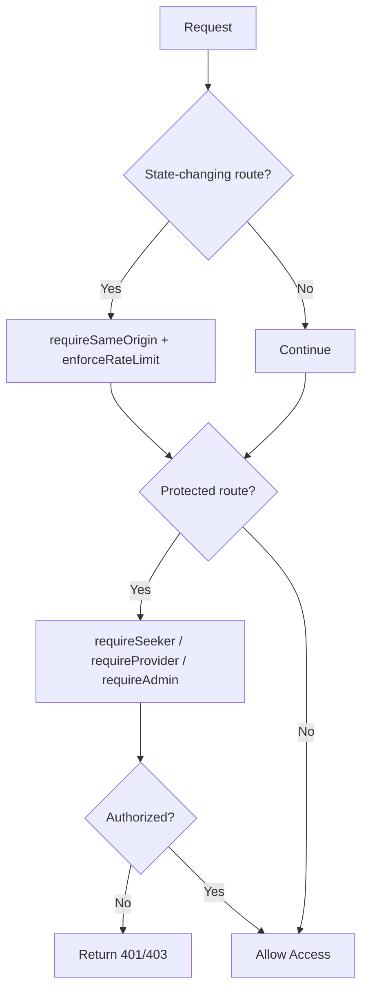
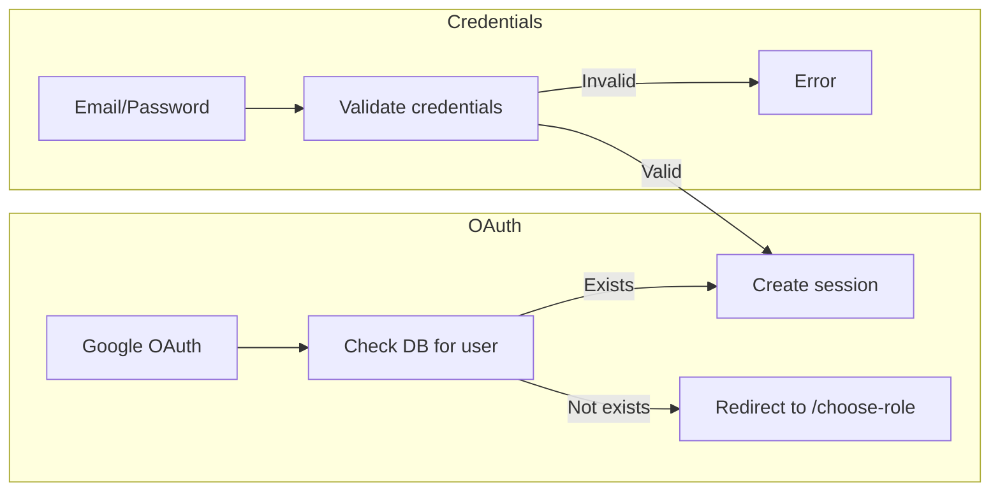
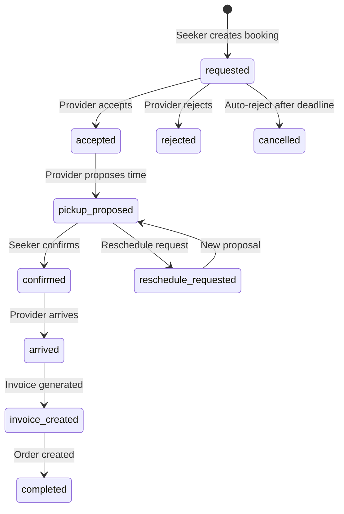
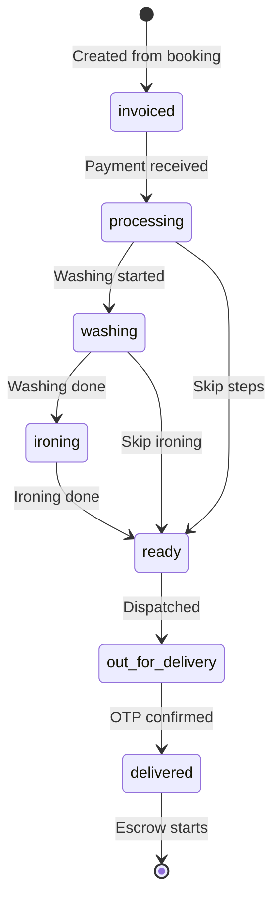
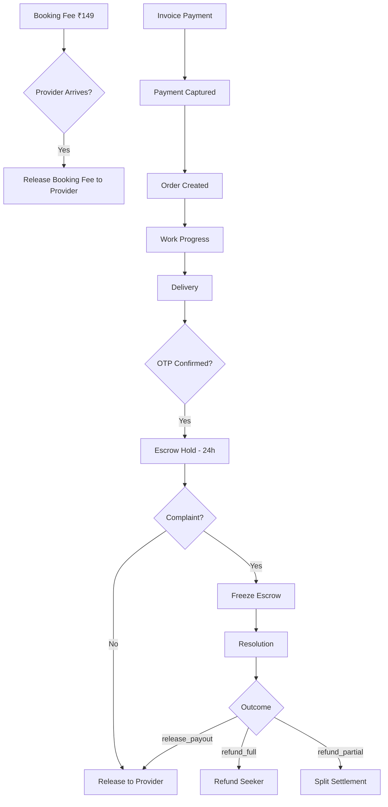
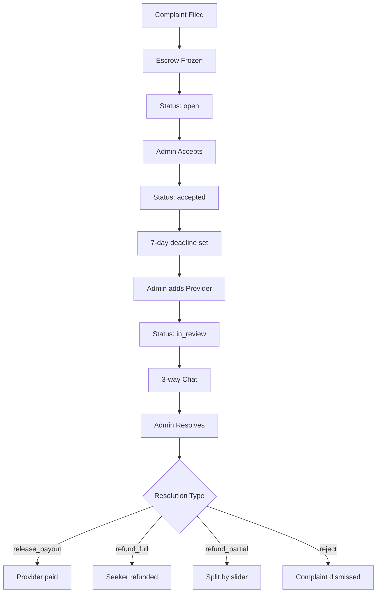

# LaundryEase - Complete Codebase Understanding

## Executive Summary

LaundryEase is a **Next.js 16.1.6** full-stack marketplace application that connects laundry service seekers with providers. The platform is distinguished by its **escrow-backed workflow system** that ensures trust between parties through verified payments, tracked order states, and delivery confirmation via OTP.

---

## 1. Technology Stack

### Frontend

| Technology      | Version | Purpose                                     |
| --------------- | ------- | ------------------------------------------- |
| Next.js         | 16.1.6  | Full-stack React framework with App Router  |
| React           | 19.2.4  | UI library                                  |
| TypeScript      | 5.x     | Type safety                                 |
| Tailwind CSS    | 4.1.18  | Styling                                     |
| Framer Motion   | 12.29.2 | Animations                                  |
| Radix UI        | Latest  | Accessible UI primitives                    |
| shadcn/ui       | 3.8.1   | Component library                           |
| React Hook Form | 7.71.1  | Form handling                               |
| Zod             | 4.3.6   | Schema validation                           |
| SWR             | Latest  | Client-side data fetching with revalidation |

### Backend

| Technology      | Purpose                                        |
| --------------- | ---------------------------------------------- |
| MongoDB 6.21    | Primary database (native driver)               |
| NextAuth.js     | Authentication (Google OAuth + credentials)    |
| Razorpay        | Payment gateway                                |
| RazorpayX       | Escrow & provider payouts                      |
| Twilio          | SMS OTP delivery                               |
| Nodemailer      | Email notifications (via outbox queue)         |
| Cloudinary      | Image uploads (CDN-backed)                     |
| Google Maps API | Location services (Places, Geocoding, Maps JS) |
| Pino            | Structured JSON logging with secret redaction  |
| decimal.js      | Precise monetary calculations (no float drift) |

### Testing & Quality

| Tool       | Purpose       |
| ---------- | ------------- |
| Vitest     | Unit testing  |
| Playwright | E2E testing   |
| ESLint     | Code linting  |
| TypeScript | Type checking |

---

## 2. Project Architecture

### Directory Structure

```text
laundry-ease/
├── app/                          # Next.js App Router
│   ├── (auth)/                   # Auth route group
│   │   ├── verify-email/         # Email verification
│   │   └── verify-phone/         # Phone verification
│   ├── (dashboard)/              # Protected dashboard routes
│   │   ├── admin/                # Admin panel
│   │   ├── provider/             # Provider dashboard
│   │   └── seeker/               # Seeker dashboard
│   ├── actions/                  # Server actions
│   └── api/                      # API routes
├── components/                   # React components
│   ├── ui/                       # Generic UI components
│   ├── navigation/               # Sidebar/navbar components
│   ├── bookings/                 # Booking components
│   ├── orders/                   # Order components
│   ├── provider/                 # Provider-specific
│   ├── seeker/                   # Seeker-specific
│   └── providers/                # Context providers
├── hooks/                        # Custom React hooks
│   └── use-booking-actions.ts    # Booking action handlers
├── lib/                          # Core business logic
│   ├── api/                      # API utilities (errors, auth, schemas, security/rate-limiting)
│   ├── auth/                     # Auth helpers
│   ├── audit/                    # Data integrity auditing
│   │   └── integrity.ts          # Order/payment/booking consistency checks
│   ├── bookings/                 # Booking logic (cancellation)
│   ├── complaints/               # Complaint access control
│   ├── data/                     # Data access helpers
│   │   └── bookings.ts           # Booking data queries
│   ├── db/                       # Database operations (bookings, orders, users)
│   ├── ops/                      # Operations/alerting
│   │   ├── ack-sla.ts            # Alert acknowledgement SLA tracking
│   │   ├── alert-channels.ts     # Email/webhook alert delivery
│   │   ├── alert-delivery.ts     # Delivery plan builder (notify + escalate)
│   │   ├── alerts-analytics.ts   # 7-day trend, burn-rate, MTTR
│   │   ├── health.ts             # Operational signal evaluation
│   │   └── owner-routing.ts      # SLA-based alert owner assignment
│   ├── orders/                   # Order state machine & compensation
│   ├── payouts/                  # Payout calculation logic
│   ├── security/                 # CSP and origin checks
│   ├── constants.ts              # Centralized business constants
│   ├── cron-tracking.ts          # Cron job run observability
│   ├── db-indexes.ts             # Database index bootstrap
│   ├── email-outbox.ts           # Queued email delivery with retry/backoff
│   ├── env.ts                    # Environment variable validation (Zod)
│   ├── logger.ts                 # Structured Pino logging with secret redaction
│   ├── mongodb.ts                # Database connection
│   ├── payouts.ts                # Payout orchestration engine
│   └── razorpay.ts               # Payment gateway integration
├── types/                        # TypeScript types
├── cron/                         # Cron job scripts
├── e2e/                          # E2E tests (Playwright)
├── scripts/                      # CI/dev utility scripts
├── .github/workflows/            # CI/CD workflows
│   ├── quality-gates.yml         # Lint/test/build/E2E on every push
│   ├── real-gateway-smoke.yml    # Live Razorpay connectivity checks
│   └── governance-audit.yml      # Branch-protection drift detection
└── docs/                         # Documentation
```

### Route Protection Architecture

The application uses route-level server-side guards (not Next.js middleware) for protection:



---

## 3. Data Models

### User Types

```typescript
// Three user roles defined in types/enums.ts
enum Role {
  SEEKER = "seeker", // Customers seeking laundry services
  PROVIDER = "provider", // Laundry service providers
  ADMIN = "admin", // Platform administrators
}
```

### Core Entities

#### Booking ([`types/bookings.ts`](types/bookings.ts:1))

A booking represents the initial handshake between seeker and provider.

```typescript
type BookingStatus =
  | "requested" // Initial request from seeker
  | "accepted" // Provider accepted
  | "rejected" // Provider rejected
  | "pickup_proposed" // Pickup time proposed
  | "reschedule_requested" // Reschedule in progress
  | "confirmed" // Pickup confirmed
  | "invoice_created" // Invoice generated after inspection
  | "cancelled" // Booking cancelled
  | "completed"; // Booking completed
```

Key fields:

- `bookingFee` - Upfront fee (₹50)
- `bookingFeeStatus` - pending/paid/refunded/forfeited/applied
- `pickupSlot` - Proposed/confirmed pickup time
- `reschedule` - Reschedule metadata
- `arrivedAt` - Provider arrival timestamp

#### Order ([`types/orders.ts`](types/orders.ts:1))

An order is created after invoice payment, representing the actual laundry work.

```typescript
type PaymentStatus =
  | "unpaid" // Invoice not paid
  | "paid" // Payment captured
  | "held" // In escrow after delivery
  | "released" // Paid to provider
  | "refunded"; // Refunded to seeker

type OrderProcessStatus =
  | "invoiced" // Just created from invoice
  | "processing" // Work started
  | "washing" // Washing in progress
  | "ironing" // Ironing in progress
  | "ready" // Ready for delivery
  | "out_for_delivery" // Out for delivery
  | "delivered"; // Delivered & confirmed
```

#### Complaint ([`types/complaints.ts`](types/complaints.ts:1))

Dispute resolution workflow for post-delivery issues.

```typescript
type ComplaintStatus =
  | "open" // Seeker raised, escrow frozen
  | "accepted" // Admin acknowledged
  | "in_review" // Provider added to chat
  | "resolved" // Admin decided
  | "rejected"; // Invalid complaint
```

---

## 4. Authentication & Authorization

### Authentication Flow



### Session Management

- **Strategy**: JWT-based sessions
- **Max Age**: 7 days ([`lib/constants.ts`](lib/constants.ts:71))
- **Provider**: NextAuth.js with MongoDB adapter

### Authorization Middleware ([`lib/api/auth.ts`](lib/api/auth.ts:1))

```typescript
// Role-specific helpers
requireSeeker(); // Requires SEEKER role
requireProvider(); // Requires PROVIDER role
requireAdmin(); // Requires ADMIN role
requireAdminWithDbCheck(); // Extra validation for sensitive operations
```

---

## 5. Business Workflows

### 5.1 Booking Lifecycle



### 5.2 Order Lifecycle



### 5.3 Payment & Escrow Flow



### 5.4 Complaint Resolution



---

## 6. API Architecture

### API Route Structure

```text
app/api/
├── admin/              # Admin-only endpoints
│   ├── complaints/     # Complaint management
│   ├── dashboard-stats/# Dashboard statistics
│   ├── orders/         # Order admin actions (extend-complaint)
│   ├── payments/       # Payment management
│   ├── refund/         # Refund processing
│   ├── system-alerts/  # System alert management
│   └── users/          # User management
├── auth/               # Authentication
│   └── [...nextauth]/  # NextAuth handler
├── bookings/           # Booking CRUD
│   └── [id]/
│       ├── accept/     # Accept booking
│       ├── arrive/     # Mark arrival
│       ├── cancel/     # Cancel booking
│       ├── chat/       # Booking chat
│       ├── dispute/    # Create dispute
│       ├── invoice/    # Generate invoice
│       ├── pay/        # Pay booking fee
│       ├── pay-invoice/# Pay invoice
│       ├── reject/     # Reject booking
│       └── reschedule/ # Reschedule
├── complaints/         # Complaint endpoints
├── cron/               # Cron job endpoints
├── escrow/             # Escrow management
├── orders/             # Order management
├── payments/           # Payment webhooks
├── providers/          # Provider search
├── reviews/            # Review system
├── signup/             # Registration
└── webhooks/           # Razorpay webhooks
```

### API Security

1. **Origin Validation** ([`lib/security/origin.ts`](lib/security/origin.ts:1))
   - CSRF protection for unsafe methods
   - Allowed origins validation

2. **CSP Headers** ([`lib/security/csp.ts`](lib/security/csp.ts:1))
   - Content-Security-Policy in Report-Only mode
   - Report endpoint at `/api/security/csp-report`
   - Enforceable via `CSP_ENFORCE` env var

3. **Role-Based Access Control**
   - Middleware-level route protection
   - API-level role validation

4. **Rate Limiting** ([`lib/api/security.ts`](lib/api/security.ts:1))
   - MongoDB-backed per-IP/actor rate limiting
   - TTL auto-cleanup on rate limit counters
   - Protected endpoints: admin actions, signup, password reset, cron

5. **Structured Log Redaction**
   - Pino logger natively redacts `password`, `token`, `otp`, `apiKey`, `secret` fields
   - Prevents credential leakage in log output

6. **Proxy Trust Model**
   - Secure IP extraction via `x-vercel-forwarded-for`, `x-real-ip`, `cf-connecting-ip`
   - Configurable via `TRUST_PROXY` env var

7. **Admin IP Allowlist**
   - `ADMIN_ALLOWLIST_IPS` env var restricts admin API access to specific IPs
   - Validated in `lib/env.ts` via Zod schema

---

## 7. Cron Jobs

Defined in [`vercel.json`](vercel.json:1):

| Endpoint                               | Schedule     | Purpose                                        |
| -------------------------------------- | ------------ | ---------------------------------------------- |
| `/api/cron/auto-reject-bookings`       | Every 5 min  | Auto-reject expired booking requests           |
| `/api/cron/no-show`                    | Every 5 min  | Detect provider no-shows                       |
| `/api/cron/process-payouts`            | Every 15 min | Unified escrow release + payout engine         |
| `/api/cron/notify-system-alerts`       | Every 15 min | Alert delivery with escalation                 |
| `/api/cron/process-email-outbox`       | Every 2 min  | Claim-and-dispatch queued transactional emails |
| `/api/cron/audit-integrity`            | Every 30 min | Verify order/payment/booking consistency       |
| `/api/cron/reconciliation`             | Every 30 min | Reconcile Razorpay records vs internal state   |
| `/api/cron/monitor-operational-health` | Hourly       | Generate system alerts from health checks      |
| `/api/cron/monitor-abuse`              | Daily 2 AM   | Detect excessive cancellation patterns         |
| `/api/cron/webhook-cleanup`            | Daily        | Purge processed webhook events older than 30 days |

All cron runs are tracked in `cron_runs` collection via `lib/cron-tracking.ts` with job name, start time, duration, status, and result.

---

## 8. Database Schema

### Collections

| Collection              | Purpose                                          |
| ----------------------- | ------------------------------------------------ |
| `seekers`               | Seeker user profiles                             |
| `providers`             | Provider user profiles (with location, capacity) |
| `admins`                | Admin user profiles                              |
| `bookings`              | Booking records                                  |
| `orders`                | Order records                                    |
| `complaints`            | Complaint records with chat messages             |
| `reviews`               | Provider reviews                                 |
| `payments`              | Payment records                                  |
| `refunds`               | Refund records (Razorpay)                        |
| `audit_logs`            | Full history of state changes                    |
| `webhook_events`        | Idempotent webhook tracking (by event_id)        |
| `email_outbox`          | Queued emails with retry/backoff tracking        |
| `system_alerts`         | Operational alerts (health, payout, complaint)   |
| `cron_runs`             | Cron job execution history                       |
| `otp_codes`             | OTP verification codes (TTL auto-expired)        |
| `password_reset_tokens` | Password reset tokens (TTL auto-expired)         |
| `api_rate_limits`       | Rate limit counters (TTL auto-expired)           |

### Key Indexes ([`lib/db-indexes.ts`](lib/db-indexes.ts:1))

**Unique Constraints:**

- `orders.booking_id` - One order per booking
- `orders.razorpay_order_id` - Payment tracking
- `complaints.order_id` - One complaint per order
- `seekers.email`, `providers.email`, `admins.email` - Unique emails
- `webhook_events.event_id` - Idempotent webhooks

**Geospatial:**

- `providers.locationGeoJSON` - 2dsphere index for location queries

**Operational Query Optimization:**

- `orders.payment_status` - Speeds up escrow aggregations
- `system_alerts.status_severity` - Speeds up dashboard alerts monitoring
- `api_rate_limits.key_window` - Speeds up rate limit lookups

**TTL:**

- `otp_codes.expiresAt` - Auto-expire OTPs
- `password_reset_tokens.expiresAt` - Auto-expire tokens

---

## 9. Key Business Constants

From [`lib/constants.ts`](lib/constants.ts:1):

| Constant                              | Value      | Purpose                            |
| ------------------------------------- | ---------- | ---------------------------------- |
| `DEFAULT_PLATFORM_COMMISSION_RATE`    | 5%         | Platform fee                       |
| `BOOKING_FEE_INR`                     | ₹50        | Upfront booking fee                |
| `ESCROW_RELEASE_WINDOW_MS`            | 24 hours   | Escrow hold period                 |
| `STALE_PAYOUT_CUTOFF_MS`              | 15 minutes | Stale payout processing threshold  |
| `MIN_PICKUP_ADVANCE_MS`               | 2 hours    | Minimum pickup notice              |
| `DELIVERY_OTP_TTL_MS`                 | 10 minutes | OTP validity                       |
| `COMPLAINT_FILING_WINDOW_MS`          | 24 hours   | Complaint deadline                 |
| `SESSION_MAX_AGE_SECONDS`             | 7 days     | Session duration                   |
| `ABUSE_LOOKBACK_DAYS`                 | 30 days    | Cancellation monitoring window     |
| `EXCESSIVE_CANCELLATION_THRESHOLD`    | 3          | Cancellation abuse trigger         |
| `OVERDUE_HELD_ORDERS_ALERT_THRESHOLD` | 3          | Held order alert trigger           |
| `PAYOUT_FAILURE_ALERT_THRESHOLD`      | 3          | Payout failure alert trigger       |
| `OVERDUE_COMPLAINTS_ALERT_THRESHOLD`  | 2          | Overdue complaint alert trigger    |
| `CRITICAL_ALERT_ACK_SLA_MS`           | 15 minutes | Critical alert acknowledgement SLA |
| `HIGH_ALERT_ACK_SLA_MS`               | 60 minutes | High alert acknowledgement SLA     |
| `ALERT_NOTIFICATION_DEDUPE_MS`        | 1 hour     | Alert notification spacing         |

---

## 10. Frontend Architecture

### Component Hierarchy

```text
RootLayout (app/layout.tsx)
├── SessionProvider
├── GoogleMapsProvider
├── ThemeProvider
├── InteractiveGridPattern (Background)
├── ToastProvider
│   └── {children}
└── GlobalFooter
```

### Dashboard Layouts

Each role has its own layout:

- [`app/(dashboard)/admin/layout.tsx`](<app/(dashboard)/admin/layout.tsx:1>) - Admin sidebar
- [`app/(dashboard)/provider/layout.tsx`](<app/(dashboard)/provider/layout.tsx:1>) - Provider sidebar
- [`app/(dashboard)/seeker/layout.tsx`](<app/(dashboard)/seeker/layout.tsx:1>) - Seeker topnav

### Key Components

| Component            | Purpose                         |
| -------------------- | ------------------------------- |
| `booking-modal.tsx`  | Create new booking              |
| `chat-interface.tsx` | Booking chat with dispute modal |
| `complaint-chat.tsx` | 3-way complaint chat            |
| `provider-card.tsx`  | Provider search result card     |
| `invoice-form.tsx`   | Invoice generation form         |
| `order-actions.tsx`  | Order status actions            |
| `payment-button.tsx` | Razorpay payment integration    |

---

## 11. External Integrations

### Razorpay Integration ([`lib/razorpay.ts`](lib/razorpay.ts:1))

1. **Order Creation** - Create payment orders
2. **Payment Verification** - Verify signatures
3. **Contact Creation** - Create provider contacts
4. **Fund Account Creation** - Link bank accounts
5. **Payout Processing** - Transfer funds to providers

### Google Maps Integration

- **Places Autocomplete** - Location search
- **Geocoding** - Address to coordinates
- **Distance Calculation** - Provider proximity

### Twilio Integration

- SMS OTP for phone verification
- Delivery OTP notifications

### Cloudinary Integration

- Image uploads for:
  - Provider profile/banner
  - Invoice photos
  - Complaint evidence

---

## 12. Security Features

1. **Authentication**
   - Google OAuth
   - Email/password with bcrypt hashing
   - Session-based JWT tokens

2. **Authorization**
   - Role-based route protection
   - API-level role validation
   - Resource ownership checks

3. **Data Protection**
   - CSP headers
   - HSTS in production
   - X-Frame-Options: DENY
   - X-Content-Type-Options: nosniff

4. **Payment Security**
   - Razorpay signature verification
   - Idempotent webhook processing
   - Escrow hold before release

5. **Rate Limiting**
   - MongoDB-backed per-IP/actor rate limiting ([`lib/api/security.ts`](lib/api/security.ts:1))
   - TTL auto-cleanup on `api_rate_limits` collection
   - Protected: admin actions, signup, password reset, cron endpoints

6. **Log Redaction**
   - Pino logger natively redacts sensitive fields (`password`, `token`, `otp`, `apiKey`, `secret`)
   - Pretty-printing in dev, structured JSON in production

---

## 13. Testing Strategy

### Unit Tests (Vitest)

- Located alongside source files as `*.test.ts`
- Coverage for business logic, API handlers, utilities, ops modules, rate limiting

### E2E Tests (Playwright)

- Located in `e2e/` directory
- Critical user journeys:
  - Role-based authentication
  - Complaint workflows
  - Settlement flows

### Test Commands

```bash
npm run test          # Run unit tests
npm run test:e2e      # Run E2E tests
npm run typecheck     # Type checking
npm run lint          # Linting
```

---

## 14. Deployment

### Vercel Configuration

- **Cron Jobs**: Configured in `vercel.json`
- **Headers**: Security headers in `next.config.ts`
- **Images**: Cloudinary remote patterns

### Environment Variables

Required variables (see [`.env.example`](.env.example:1)):

- `GOOGLE_ID`, `GOOGLE_SECRET` - OAuth
- `MONGODB_URI`, `MONGODB_DB` - Database
- `RAZORPAY_KEY_ID`, `RAZORPAY_KEY_SECRET` - Payments
- `TWILIO_ACCOUNT_SID`, `TWILIO_AUTH_TOKEN` - SMS
- `NEXT_PUBLIC_GOOGLE_MAPS_API_KEY` - Maps
- `NEXTAUTH_SECRET` - Session security
- `CRON_SECRET` - Cron endpoint protection

---

## 15. Key Files Reference

| File                                                             | Purpose                                       |
| ---------------------------------------------------------------- | --------------------------------------------- |
| [`lib/mongodb.ts`](lib/mongodb.ts:1)                             | Database connection                           |
| [`lib/env.ts`](lib/env.ts:1)                                     | Environment validation (Zod)                  |
| [`lib/constants.ts`](lib/constants.ts:1)                         | Centralized business constants                |
| [`lib/logger.ts`](lib/logger.ts:1)                               | Structured Pino logging with secret redaction |
| [`lib/payouts.ts`](lib/payouts.ts:1)                             | Payout orchestration engine                   |
| [`lib/razorpay.ts`](lib/razorpay.ts:1)                           | Payment gateway integration                   |
| [`lib/email-outbox.ts`](lib/email-outbox.ts:1)                   | Queued email delivery with retry/backoff      |
| [`lib/cron-tracking.ts`](lib/cron-tracking.ts:1)                 | Cron job run observability                    |
| [`lib/db-indexes.ts`](lib/db-indexes.ts:1)                       | Database index bootstrap                      |
| [`lib/api/security.ts`](lib/api/security.ts:1)                   | Rate limiting and origin checks               |
| [`lib/api/schemas.ts`](lib/api/schemas.ts:1)                     | Centralized Zod validation schemas            |
| [`lib/orders/status-machine.ts`](lib/orders/status-machine.ts:1) | Order state machine                           |
| [`lib/complaints/access.ts`](lib/complaints/access.ts:1)         | Complaint access control                      |
| [`lib/ops/health.ts`](lib/ops/health.ts:1)                       | Operational signal evaluation                 |
| [`lib/ops/alert-delivery.ts`](lib/ops/alert-delivery.ts:1)       | Alert delivery plan builder                   |
| [`lib/ops/alert-channels.ts`](lib/ops/alert-channels.ts:1)       | Email/webhook alert delivery channels         |
| [`lib/ops/ack-sla.ts`](lib/ops/ack-sla.ts:1)                     | Alert acknowledgement SLA tracking            |
| [`lib/ops/owner-routing.ts`](lib/ops/owner-routing.ts:1)         | SLA-based alert owner assignment              |
| [`lib/ops/alerts-analytics.ts`](lib/ops/alerts-analytics.ts:1)   | 7-day trend, burn-rate, MTTR analytics        |

---

## 16. Current Project Status

**Quality Snapshot (2026-03-01):**

- 104 test files, 506 tests passing (100% core route coverage)
- 3 Playwright E2E specs, 7 critical journeys passing
- All quality gates passing (typecheck, lint, test, build, e2e)
- Strict escrow paise precision enforced
- System webhooks fully mutex-locked
- Zero production type casts

**Stable Features:**

- Role-based flows (seeker/provider/admin)
- Location-based provider discovery with geospatial indexes
- Booking → invoicing → payment → delivery → escrow loop
- Canonical payment APIs with backward-compatible legacy aliases
- Complaint system with admin workflow (accept → add provider → resolve)
- Split-settlement support with commission-aware slider
- Operational health monitoring with configurable thresholds
- Alert delivery with escalation, dedup, and multi-channel fan-out
- Alert acknowledgement with SLA tracking and owner routing
- Alert analytics dashboard (7-day trend, burn-rate, MTTR)
- Email outbox with retry/backoff for transactional emails
- MongoDB-backed rate limiting on sensitive endpoints
- Structured Pino logging with secret redaction
- Financial precision with decimal.js
- SWR data fetching for responsive dashboards
- Abuse monitoring (excessive cancellation detection)
- Data integrity auditing (order/payment/booking consistency)
- Cron run tracking for operational observability
- GitHub CI: Quality Gates, Real Gateway Smoke, Governance Audit

**Remaining Opportunities:**

- CSP enforcement mode (currently report-only)
- Password-recovery anti-abuse hardening (captcha strategy)
- Team calendar/on-call integration for dynamic owner pools
- Split-settlement reconciliation tooling for rare one-leg failures
- Webhook payload archival policy

---

## Summary

LaundryEase is a well-architected laundry marketplace with:

1. **Trust-First Design** - Escrow payments, OTP verification, tracked states
2. **Clear Role Separation** - Seeker, Provider, Admin with distinct workflows
3. **Robust State Machines** - Booking and Order lifecycles with explicit transitions
4. **Comprehensive Dispute Resolution** - 3-way chat, split settlements, deadline tracking
5. **Production-Ready Infrastructure** - 10 cron jobs, operational alerting with SLA/escalation, email outbox, rate limiting, structured logging
6. **Quality Assurance** - 104 test files (506 tests), E2E browser tests, type safety, CI quality gates

The codebase follows modern Next.js patterns with App Router, Server Actions, and a clear separation of concerns between frontend components and backend business logic.
