# LaundryEase - Complete Codebase Understanding

**Last Updated:** 2026-04-04 (Rev 18)

## Executive Summary

LaundryEase is an escrow-backed laundry marketplace built with Next.js 16.2.2, React 19.2.4, TypeScript 6.0.2, and MongoDB 7.1. It connects seekers with laundry providers through a clear flow: find a provider by area, create a booking, inspect items, create an invoice, pay into escrow, track the order, confirm delivery with OTP, and release payout. The platform includes live chat for orders and complaints, split refund or payout decisions in complaints, system health monitoring, custom in-app confirmation dialogs, secure password reset with session invalidation, provider capacity management, and user ban enforcement. The current test suite passes with **616 tests across 116 unit test files** and 6 Playwright E2E specs, with only 2 justified `eslint-disable` comments in CommonJS files.


---

## 1. Technology Stack

### Frontend

| Technology              | Version | Purpose                                     |
| ----------------------- | ------- | ------------------------------------------- |
| React                   | 19.2.4  | UI framework with React Compiler enabled    |
| TypeScript              | 6.0.2   | Type safety across entire codebase          |
| Tailwind CSS            | 4       | Utility-first styling                       |
| shadcn/ui               | Latest  | Accessible component primitives (Radix UI)  |
| Framer Motion           | 12.38.0 | Page and element animations                 |
| React Hook Form         | 7.72.1  | Performant form state management            |
| SWR                     | 2.4.1   | Client-side data fetching with revalidation |
| Lucide React            | 1.7.0   | Icon library                                |
| next-themes             | 0.4.6   | Dark/light mode theming                     |
| use-places-autocomplete | 4.0.1   | Google Places address autocomplete          |
| @react-google-maps/api  | 2.20.8  | Google Maps integration                     |

### Backend

| Technology               | Version               | Purpose                                           |
| ------------------------ | --------------------- | ------------------------------------------------- |
| Next.js                  | 16.2.2                | Full-stack framework (App Router, Server Actions) |
| MongoDB                  | 7.1.1 (native driver) | Document database with geospatial + transactions  |
| Auth.js (`next-auth`)    | 5.0.0-beta.30         | Authentication (Google OAuth + credentials)       |
| Razorpay                 | 2.9.6                 | Payment capture, escrow, refunds                  |
| RazorpayX                | —                     | Provider payouts (contacts + fund accounts)       |
| Zod                      | 4.3.6                 | Runtime schema validation                         |
| decimal.js               | 10.6.0                | Precise monetary calculations                     |
| Pino                     | 10.3.1                | Structured logging with secret redaction          |
| Nodemailer               | 8.0.4                 | Email delivery (SMTP)                             |
| Twilio                   | 5.13.1                | SMS OTP delivery                                  |
| Cloudinary               | 2.9.0                 | CDN-backed image uploads                          |
| pdf-lib                  | 1.17.1                | Native PDF invoice generation                     |
| bcrypt                   | 6.0.0                 | Password hashing                                  |
| jose                     | 6.2.2                 | JWT operations                                    |
| dd-trace                 | 5.94.0                | Datadog APM tracing                               |
| socket.io                | 4.8.3                 | Real-time WebSocket server                        |
| socket.io-client         | 4.8.3                 | Real-time WebSocket client                        |
| hot-shots                | 14.3.0                | DogStatsD metrics                                 |
| class-variance-authority | 0.7.1                 | Component variant management                      |
| date-fns                 | 4.1.0                 | Date manipulation                                 |

### Testing & Quality

| Technology            | Version | Purpose                     |
| --------------------- | ------- | --------------------------- |
| Vitest                | 4.1.2   | Unit test runner            |
| shadcn                | 4.1.2   | UI component CLI            |
| @vitest/coverage-v8   | 4.1.2   | Code coverage               |
| Playwright            | 1.59.1  | Browser E2E testing         |
| mongodb-memory-server | 11.0.1  | In-memory MongoDB for tests |
| ESLint                | 9.39.4  | Code linting                |
| eslint-config-next    | 16.2.2  | Next.js-specific lint rules |

### Infrastructure & CI

| Tool                    | Purpose                                 |
| ----------------------- | --------------------------------------- |
| Vercel                  | Serverless deployment + cron scheduling |
| GitHub Actions          | CI/CD (3 workflows)                     |
| `verify-gates` script   | Local release parity check              |
| `check-doc-sync` script | Documentation sync guardrails           |

---

## 2. Project Architecture

### Directory Structure

```text
=== app ===
├── app
│   ├── robots.ts
│   ├── favicon.ico
│   ├── unauthorized.tsx
│   ├── forbidden.tsx
│   ├── sitemap.ts
│   ├── layout.tsx
│   ├── loading.tsx
│   ├── page.tsx
│   ├── globals.css
│   ├── global-error.tsx
│   ├── not-found.tsx
│   ├── (root)
│   │   ├── layout.tsx
│   │   ├── error.tsx
│   │   ├── terms
│   │   │   ├── provider
│   │   │   │   ├── page.tsx
│   │   │   ├── seeker
│   │   │   │   ├── page.tsx
│   ├── auth
│   │   ├── page.tsx
│   ├── signup
│   │   ├── provider
│   │   │   ├── page.tsx
│   │   ├── seeker
│   │   │   ├── page.tsx
│   ├── complete-signup
│   │   ├── provider
│   │   │   ├── page.tsx
│   │   ├── seeker
│   │   │   ├── page.tsx
│   ├── banned
│   │   ├── page.tsx
│   ├── actions
│   │   ├── booking-actions.ts
│   │   ├── profile-actions.ts
│   │   ├── order-actions.ts
│   ├── api
│   │   ├── payments
│   │   │   ├── create-order
│   │   │   │   ├── route.test.ts
│   │   │   │   ├── route.ts
│   │   ├── complaints
│   │   │   ├── route.test.ts
│   │   │   ├── route.ts
│   │   │   ├── lifecycle.test.ts
│   │   │   ├── [id]
│   │   │   │   ├── route.test.ts
│   │   │   │   ├── route.ts
│   │   ├── bookings
│   │   │   ├── route.test.ts
│   │   │   ├── route.ts
│   │   │   ├── payment
│   │   │   ├── provider
│   │   │   │   ├── route.test.ts
│   │   │   │   ├── route.ts
│   │   │   ├── [id]
│   │   │   │   ├── route.test.ts
│   │   │   │   ├── route.ts
│   │   │   ├── seeker
│   │   │   │   ├── route.test.ts
│   │   │   │   ├── route.ts
│   │   ├── invoices
│   │   │   ├── [id]
│   │   │   │   ├── route.test.ts
│   │   │   │   ├── route.ts
│   │   ├── security
│   │   │   ├── csp-report
│   │   │   │   ├── route.test.ts
│   │   │   │   ├── route.ts
│   │   ├── auth
│   │   │   ├── send-magic-link
│   │   │   │   ├── route.test.ts
│   │   │   │   ├── route.ts
│   │   │   ├── verify-email
│   │   │   │   ├── route.test.ts
│   │   │   │   ├── route.ts
│   │   │   ├── [...nextauth]
│   │   │   │   ├── route.test.ts
│   │   │   │   ├── route.ts
│   │   ├── otp
│   │   │   ├── verify
│   │   │   │   ├── route.test.ts
│   │   │   │   ├── route.ts
│   │   │   ├── request
│   │   │   │   ├── route.test.ts
│   │   │   │   ├── route.ts
│   │   ├── signup
│   │   │   ├── provider
│   │   │   │   ├── route.test.ts
│   │   │   │   ├── route.ts
│   │   │   ├── seeker
│   │   │   │   ├── route.test.ts
│   │   │   │   ├── route.ts
│   │   ├── providers
│   │   │   ├── route.test.ts
│   │   │   ├── route.ts
│   │   │   ├── bank-details
│   │   │   │   ├── route.test.ts
│   │   │   │   ├── route.ts
│   │   │   ├── [id]
│   │   │   │   ├── route.test.ts
│   │   │   │   ├── route.ts
│   │   ├── admin
│   │   │   ├── demo
│   │   │   ├── payments
│   │   │   │   ├── route.test.ts
│   │   │   │   ├── route.ts
│   │   │   ├── complaints
│   │   │   │   ├── route.test.ts
│   │   │   │   ├── route.ts
│   │   │   ├── system-alerts
│   │   │   ├── users
│   │   │   │   ├── route.test.ts
│   │   │   │   ├── route.ts
│   │   │   ├── dashboard-stats
│   │   │   │   ├── route.test.ts
│   │   │   │   ├── route.ts
│   │   │   ├── orders
│   │   │   ├── refund
│   │   │   │   ├── route.test.ts
│   │   │   │   ├── route.integration.test.ts
│   │   │   │   ├── route.ts
│   │   ├── provider
│   │   │   ├── chats
│   │   │   │   ├── route.test.ts
│   │   │   │   ├── route.ts
│   │   │   ├── dashboard-stats
│   │   │   │   ├── route.test.ts
│   │   │   │   ├── route.ts
│   │   ├── profile
│   │   │   ├── provider
│   │   │   │   ├── route.test.ts
│   │   │   │   ├── route.ts
│   │   │   ├── seeker
│   │   │   │   ├── route.test.ts
│   │   │   │   ├── route.ts
│   │   ├── forgot-password
│   │   │   ├── route.test.ts
│   │   │   ├── route.ts
│   │   ├── escrow
│   │   │   ├── release
│   │   │   │   ├── route.test.ts
│   │   │   │   ├── route.ts
│   │   ├── reset-password
│   │   │   ├── route.test.ts
│   │   │   ├── route.ts
│   │   ├── orders
│   │   │   ├── route.test.ts
│   │   │   ├── route.ts
│   │   │   ├── provider
│   │   │   │   ├── route.test.ts
│   │   │   │   ├── route.ts
│   │   │   ├── [id]
│   │   │   ├── seeker
│   │   │   │   ├── route.test.ts
│   │   │   │   ├── route.ts
│   │   ├── webhooks
│   │   │   ├── razorpay
│   │   │   │   ├── route.test.ts
│   │   │   │   ├── route.ts
│   │   ├── e2e
│   │   │   ├── runtime
│   │   │   │   ├── route.test.ts
│   │   │   │   ├── route.ts
│   │   ├── upload
│   │   │   ├── route.test.ts
│   │   │   ├── route.ts
│   │   │   ├── image
│   │   │   │   ├── route.test.ts
│   │   │   │   ├── route.ts
│   │   │   ├── audio
│   │   │   │   ├── route.test.ts
│   │   │   │   ├── route.ts
│   │   ├── cron
│   │   │   ├── no-show
│   │   │   │   ├── route.test.ts
│   │   │   │   ├── route.ts
│   │   │   ├── reconciliation
│   │   │   │   ├── route.test.ts
│   │   │   │   ├── route.ts
│   │   │   ├── monitor-abuse
│   │   │   │   ├── route.test.ts
│   │   │   │   ├── route.ts
│   │   │   ├── auto-reject-bookings
│   │   │   │   ├── route.test.ts
│   │   │   │   ├── route.ts
│   │   │   ├── notify-system-alerts
│   │   │   │   ├── route.test.ts
│   │   │   │   ├── route.ts
│   │   │   ├── audit-integrity
│   │   │   │   ├── route.test.ts
│   │   │   │   ├── route.ts
│   │   │   ├── webhook-cleanup
│   │   │   │   ├── route.test.ts
│   │   │   │   ├── route.ts
│   │   │   ├── process-email-outbox
│   │   │   │   ├── route.test.ts
│   │   │   │   ├── route.ts
│   │   │   ├── process-payouts
│   │   │   │   ├── route.test.ts
│   │   │   │   ├── route.ts
│   │   │   ├── monitor-operational-health
│   │   │   │   ├── route.test.ts
│   │   │   │   ├── route.ts
│   │   ├── reviews
│   │   │   ├── route.test.ts
│   │   │   ├── route.ts
│   ├── reset-password
│   │   ├── page.tsx
│   ├── (auth)
│   │   ├── verify-email
│   │   │   ├── page.tsx
│   │   ├── verify-phone
│   │   │   ├── page.tsx
│   ├── choose-role
│   │   ├── page.tsx
│   ├── (dashboard)
│   │   ├── admin
│   │   │   ├── layout.tsx
│   │   │   ├── error.tsx
│   │   │   ├── loading.tsx
│   │   │   ├── page.tsx
│   │   │   ├── complaints
│   │   │   │   ├── page.tsx
│   │   │   ├── payment-management
│   │   │   │   ├── page.tsx
│   │   │   ├── user-management
│   │   │   │   ├── page.tsx
│   │   ├── provider
│   │   │   ├── layout.tsx
│   │   │   ├── error.tsx
│   │   │   ├── loading.tsx
│   │   │   ├── page.tsx
│   │   │   ├── messages
│   │   │   │   ├── page.tsx
│   │   │   ├── manage-booking
│   │   │   │   ├── booking-list.tsx
│   │   │   │   ├── booking-card.tsx
│   │   │   │   ├── loading.tsx
│   │   │   │   ├── page.tsx
│   │   │   │   ├── booking-status-badge.tsx
│   │   │   ├── reviews-manage
│   │   │   │   ├── page.tsx
│   │   │   ├── bookings
│   │   │   │   ├── page.tsx
│   │   │   ├── order-status
│   │   │   │   ├── page.tsx
│   │   │   ├── invoice-generation
│   │   │   │   ├── page.tsx
│   │   │   ├── disputes
│   │   │   │   ├── page.tsx
│   │   │   ├── profile
│   │   │   │   ├── page.tsx
│   │   ├── seeker
│   │   │   ├── layout.tsx
│   │   │   ├── error.tsx
│   │   │   ├── loading.tsx
│   │   │   ├── page.tsx
│   │   │   ├── bookings
│   │   │   │   ├── seeker-booking-list.tsx
│   │   │   │   ├── seeker-booking-card.tsx
│   │   │   │   ├── page.tsx
│   │   │   ├── invoices
│   │   │   │   ├── page.tsx
│   │   │   ├── view-orders
│   │   │   │   ├── page.tsx
│   │   │   ├── disputes
│   │   │   │   ├── page.tsx
│   │   │   ├── provider
│   │   │   ├── profile
│   │   │   │   ├── page.tsx
│   │   │   ├── orders


=== components ===
├── components
│   ├── complaint-chat.tsx
│   ├── order-chat.tsx
│   ├── landing-page-client.tsx
│   ├── ui
│   │   ├── theme-provider.tsx
│   │   ├── image-upload.tsx
│   │   ├── confirm-dialog.tsx
│   │   ├── settlement-summary-modal.tsx
│   │   ├── error-boundary.tsx
│   │   ├── interactive-grid.tsx
│   │   ├── spotlight-card.tsx
│   │   ├── chat-delete-menu.tsx
│   │   ├── voice-message-bubble.tsx
│   │   ├── evidence-upload.tsx
│   │   ├── voice-message-bubble.test.ts
│   │   ├── text-generate-effect.tsx
│   │   ├── password-input.tsx
│   │   ├── feature-card.tsx
│   │   ├── go-back-button.tsx
│   │   ├── workflow-step.tsx
│   │   ├── app-header.tsx
│   │   ├── global-footer.tsx
│   │   ├── image-crop-modal.tsx
│   │   ├── toast.tsx
│   │   ├── theme-toggle.tsx
│   │   ├── select.tsx
│   │   ├── skeleton.tsx
│   │   ├── location-autocomplete.tsx
│   ├── providers
│   │   ├── invoice-form.tsx
│   │   ├── socket-provider.tsx
│   │   ├── google-maps-provider.tsx
│   │   ├── session-provider.tsx
│   │   ├── provider-booking-list.tsx
│   ├── provider
│   │   ├── provider-header.tsx
│   │   ├── reviews-list.tsx
│   ├── navigation
│   │   ├── provider-sidebar.tsx
│   │   ├── admin-sidebar.tsx
│   │   ├── seeker-topnav.tsx
│   ├── orders
│   │   ├── post-delivery-actions.tsx
│   │   ├── payment-button.tsx
│   │   ├── live-status-refresh.tsx
│   │   ├── order-actions.tsx
│   ├── seo
│   │   ├── breadcrumb-json-ld.tsx
│   │   ├── json-ld.tsx
│   ├── seeker
│   │   ├── delivery-otp-form.tsx
│   │   ├── invoice-review-form.tsx


=== hooks ===
├── hooks
│   ├── use-voice-recorder.ts
│   ├── use-booking-actions.ts
│   ├── use-live-data.ts
│   ├── use-voice-recorder.test.ts
│   ├── use-places-autocomplete-custom.ts


=== lib ===
├── lib
│   ├── otp-code-email.ts
│   ├── local-cron.js
│   ├── cron-tracking.ts
│   ├── password-changed-email.ts
│   ├── cloudinary.ts
│   ├── crop-image.ts
│   ├── db.test.ts
│   ├── db-indexes.test.ts
│   ├── geocoding.ts
│   ├── utils.ts
│   ├── email-outbox.test.ts
│   ├── distance.ts
│   ├── db-indexes.ts
│   ├── logger.ts
│   ├── telemetry.ts
│   ├── constants.ts
│   ├── mongodb.ts
│   ├── client-api.ts
│   ├── payouts.ts
│   ├── otp.ts
│   ├── magic-link-email.ts
│   ├── client-error.ts
│   ├── delivery-otp-email.ts
│   ├── theme.ts
│   ├── email-transporter.ts
│   ├── env.ts
│   ├── audit.ts
│   ├── env.normalize.test.ts
│   ├── password-reset-email.ts
│   ├── razorpay.ts
│   ├── email-outbox.ts
│   ├── demo
│   │   ├── cron-dispatch.ts
│   ├── complaints
│   │   ├── access.test.ts
│   │   ├── access.ts
│   ├── bookings
│   │   ├── cancellation-policy.test.ts
│   │   ├── cancellation-policy.ts
│   │   ├── arrive-handler.ts
│   │   ├── mark-arrived.ts
│   ├── security
│   │   ├── origin.ts
│   │   ├── csp.test.ts
│   │   ├── origin.test.ts
│   │   ├── csp.ts
│   ├── auth
│   │   ├── request-token.js
│   │   ├── password-policy.ts
│   ├── utils
│   │   ├── monetary.ts
│   │   ├── delivery-charge.ts
│   ├── realtime
│   │   ├── emitter.ts
│   │   ├── socket-auth.test.ts
│   │   ├── chat-state.test.ts
│   │   ├── contracts.d.ts
│   │   ├── chat-state.ts
│   │   ├── emitter.test.ts
│   │   ├── contracts.js
│   │   ├── socket-auth.js
│   ├── audit
│   │   ├── integrity.ts
│   │   ├── integrity.test.ts
│   ├── db
│   │   ├── complaints.ts
│   │   ├── escrow.ts
│   │   ├── orders.ts
│   │   ├── bookings.ts
│   │   ├── transaction.ts
│   │   ├── users.ts
│   │   ├── index.ts
│   ├── api
│   │   ├── security.test.ts
│   │   ├── schemas.contract.test.ts
│   │   ├── auth.test.ts
│   │   ├── errors.ts
│   │   ├── schemas.ts
│   │   ├── response.ts
│   │   ├── cron-auth.ts
│   │   ├── security.ts
│   │   ├── auth.ts
│   ├── ops
│   │   ├── alert-channels.ts
│   │   ├── alerts-analytics.test.ts
│   │   ├── owner-routing.ts
│   │   ├── ack-sla.test.ts
│   │   ├── alerts-analytics.ts
│   │   ├── health.ts
│   │   ├── alert-lifecycle.ts
│   │   ├── ack-sla.ts
│   │   ├── alert-delivery.test.ts
│   │   ├── alert-delivery.ts
│   │   ├── owner-routing.test.ts
│   │   ├── health.test.ts
│   ├── orders
│   │   ├── deadline-compensation.test.ts
│   │   ├── deadline-compensation.ts
│   │   ├── status-machine.test.ts
│   │   ├── status-machine.ts
│   │   ├── confirm-delivery-core.ts
│   ├── webhooks
│   │   ├── razorpay-handlers.ts
│   ├── e2e
│   │   ├── runtime.ts
│   ├── data
│   │   ├── bookings.ts
│   ├── payouts
│   │   ├── amounts.ts
│   │   ├── amounts.test.ts
│   ├── services
│   │   ├── system-alerts.ts
│   │   ├── refund-lock.ts
│   │   ├── provider-password.ts
│   │   ├── invoice-finalization.ts
│   │   ├── provider-bank-sync.ts
│   │   ├── admin-stats.ts
│   │   ├── provider-search.ts
│   │   ├── complaint-resolution.ts


=== types ===
├── types
│   ├── complaints.ts
│   ├── next-auth.d.ts
│   ├── razorpay.d.ts
│   ├── orders.ts
│   ├── bookings.ts
│   ├── css.d.ts
│   ├── users.ts
│   ├── reviews.ts
│   ├── enums.ts


```

### Seeker Booking UI

The seeker bookings page (`app/(dashboard)/seeker/bookings/`) now has:

- **Four tabs**: All, Pending, Active, and **Reschedule**
- **Live countdown badge**: On booking cards within the 2-hour free-cancel window — updates every 10 seconds and changes wording/color after expiry
- **Reschedule context**: `reschedule_requested` cards show who requested (You / Provider), the reason, the previously confirmed slot, and the reschedule count
- **Confirm dialog**: Cancellation uses `ConfirmDialog` — wording changes dynamically based on whether the free-cancel window has expired, and shows a distinct "Cancel & Reject Invoice" confirmation when the booking is at the `invoice_created` stage
- **Cancel at invoice stage**: When `booking.status === "invoice_created"`, the cancel button label changes to **"Cancel & Reject Invoice"** and the confirm dialog warns that the booking fee will be forfeited (provider has already collected the items)

### Route Protection Architecture

The application uses a layered protection model:

1. **Session Layer** (NextAuth): JWT-based session tokens with 7-day max age (`SESSION_MAX_AGE_SECONDS`)
2. **Role Guards** (`lib/api/auth.ts`): `requireSeeker()`, `requireProvider()`, `requireAdmin()`, `requireAdminWithDbCheck()`, `optionalAuth()`
3. **Origin Validation** (`lib/api/security.ts`): Same-origin enforcement on unsafe HTTP methods via `requireSameOrigin()`
4. **Rate Limiting** (`lib/api/security.ts`): MongoDB-backed per-IP rate limiting with 3 tiers
5. **Cron Auth** (`lib/api/cron-auth.ts`): Bearer token validation with `CRON_SECRET`

---

## 3. Data Models

### User Types

```typescript
// types/enums.ts
enum Role {
  SEEKER = "seeker",
  PROVIDER = "provider",
  ADMIN = "admin",
}
```

**Seeker** (`types/users.ts`): BaseUser + address, coordinates, outstanding_fees, blocked_until, blocked_reason, isFlagged, flagReason, flaggedAt, cancellationCount

**Provider** (`types/users.ts`): BaseUser + services, pricing, location, coordinates, locationGeoJSON, documents, radius_km, per_km_rate, covers_beyond_radius, businessName, bio, description, pricingRates, free_radius_km, capacity, bankDetails (accountNumber, ifsc, accountHolderName, upiId), razorpay_fund_account_id, razorpay_contact_id, profilePicture, bannerImage, rating, ratingTotal, reviewCount, blocked_until, blocked_reason

**Admin** (`types/users.ts`): BaseUser only

### Core Entities

#### Booking (`types/bookings.ts`)

```typescript
type BookingStatus =
  | "requested" // Seeker submitted booking request
  | "accepted" // Provider accepted (booking fee must be paid)
  | "rejected" // Provider rejected or auto-rejected
  | "pickup_proposed" // Provider proposed pickup slot
  | "reschedule_requested" // Either party requested reschedule
  | "confirmed" // Pickup slot confirmed by both
  | "invoice_created" // Provider created invoice after inspection
  | "cancelled" // Cancelled by seeker or provider
  | "completed"; // Order created from paid invoice
```

Key fields: seeker_id, provider_id, status, bookingFee, bookingFeeStatus (`pending`/`paid`/`refunded`/`forfeited`/`applied`), pickupSlot, reschedule (requestedBy, count, reason, previousPickupSlot), arrivedAt, cancelledAt, cancelledBy, cancellation_reason, invoice (InvoiceData), seeker_coordinates, noShowStatus, deadline, platform_commission, provider_payout_amount, razorpay_order_id, razorpay_payment_id, payout_status, payout_id, payout_lock_at, payout_failure_reason, refund_in_progress_at, booking_fee_released_at, booking_fee_applied_at, refundProcessedAt, booking_fee_refund_id

#### Order (`types/orders.ts`)

```typescript
type PaymentStatus =
  | "unpaid" // Order created, awaiting payment
  | "paid" // Payment captured by Razorpay
  | "held" // In escrow after delivery confirmation
  | "released" // Escrow released, payout eligible
  | "refunded"; // Fully refunded to seeker

type OrderProcessStatus =
  | "invoiced" // Initial state
  | "processing" // Provider started work
  | "washing" // In wash cycle
  | "ironing" // Being ironed
  | "ready" // Ready for delivery
  | "out_for_delivery" // In transit
  | "delivered"; // Delivery confirmed via OTP
```

Key fields: booking_id, seeker_id, provider_id, items (OrderItem[]), subtotal, discount, delivery_charge, delivery_distance_km, total_price, payment_status, process_status, payment_made_at, escrow_started_at, escrow_release_at, escrow_released_at, otp_confirmed_at, deadline, cancellation_status, extended_complaint_window_until, latePenalty, deadline_breached_at, deadline_compensated_at, deadline_compensation_mode (`full_refund`/`no_charge`), refund_amount, refund_reason, razorpay_refund_id, platform_commission, provider_payout_amount, payout_status, payout_id, payout_lock_at, payout_failure_reason, delivery_otp (hashed), delivery_otp_sent_at, delivery_otp_expires_at, delivery_otp_resend_count, deliverySlot, razorpay_order_id, razorpay_payment_id

#### Complaint (`types/complaints.ts`)

```typescript
type ComplaintStatus =
  | "open" // Filed by seeker; escrow frozen
  | "accepted" // Admin acknowledged; deadline set
  | "in_review" // Provider added to chat; active mediation
  | "resolved" // Admin decided; financial action executed
  | "rejected"; // Invalid; escrow released to provider
```

Key fields: order_id, booking_id, seeker_id, provider_id, complaint_type, title, description, photos, status, resolution_outcome (`refund_full`/`refund_partial`/`release_payout`/`no_action`), acceptedAt, response_deadline, participants, provider_access_granted, resolvedAt

**ComplaintMessage**: complaint_id, sender_id, sender_role (`seeker`/`provider`/`admin`/`system`), message_type (`TEXT`/`IMAGE`/`VOICE`/`SYSTEM`), content, attachments, voiceMessage (Cloudinary URL), deletedForEveryone, deletedBy (Map of userId→date for per-user soft-delete)

#### Review (`types/reviews.ts`)

Fields: order_id, seeker_id, provider_id, seeker_name, rating (1-5), comment

---

## 4. Authentication & Authorization

### Authentication Flow

1. **Google OAuth**: NextAuth Google provider → callback → session creation
2. **Email/Password**: Signup with OTP verification → bcrypt password hash → NextAuth credentials provider

4. **Session**: JWT token stored in cookie, 7-day max age
5. **User Ban Verification**: `signIn` callback checks `blocked_until`; if active, sign-in is denied and user is redirected with ban details.

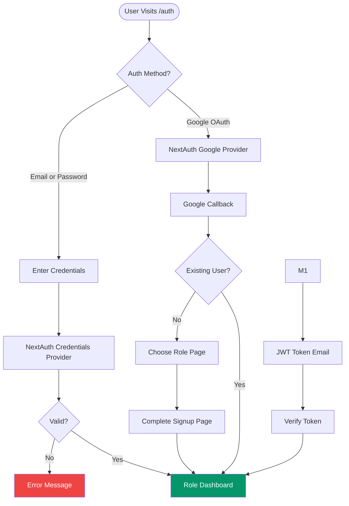

### Post-Auth Flow

- New OAuth users → `/choose-role` → role selection → `/complete-signup/{seeker|provider}` → profile completion (including T&C acceptance)
- New credential users → `/signup/{seeker|provider}` → OTP verification (email + phone) + T&C acceptance → account creation

### Image Cropping & Profile Management

To ensure profile images are formatted properly without distortion:
- **`ImageCropModal`**: Integrates `react-easy-crop` inside dashboards.
- Seeker and Provider dashboards automatically trigger this modal upon file picker selection, allowing users to zoom, pan, and crop before Base64 upload to Cloudinary.

### Session Management

- JWT-based via Auth.js v5 (`next-auth` beta)
- Session includes: `id`, `email`, `name`, `role`
- `SESSION_MAX_AGE_SECONDS` = 7 days
- Role resolved from DB if session data incomplete (`isLikelyDbObjectId` check)
- **Periodic DB re-check** (every 5 minutes via `JWT_DB_RECHECK_INTERVAL_S`) to detect password changes and invalidate stale tokens

### Session Invalidation & Account Soft-Deletion

### Account/Profile Soft-Deletion Flow

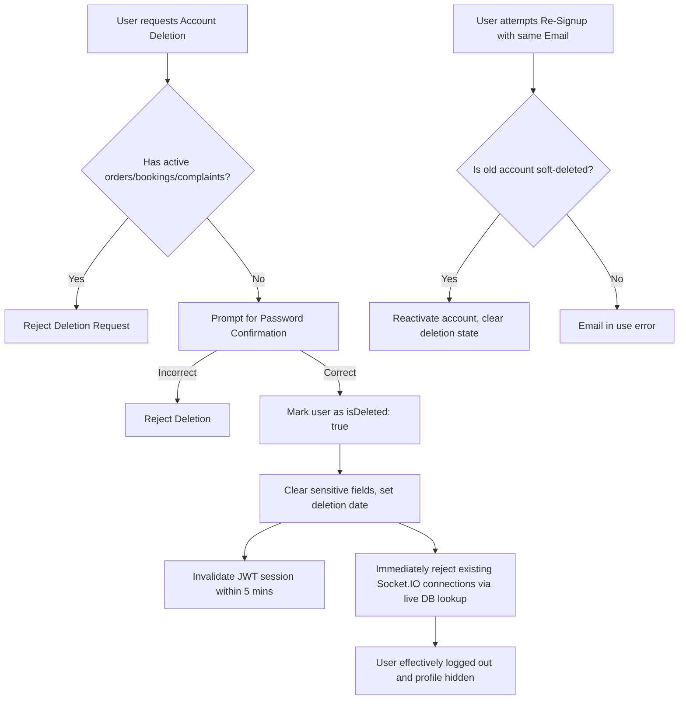

The JWT callback periodically re-checks the database (every 5 mins) to enforce session invalidation when a user changes their password, is banned, or soft-deletes their account. Live DB lookups are also performed during the socket handshake to prevent "zombie" connections from deleted or banned users:

1. Every 5 minutes, the JWT callback queries the user document for `passwordChangedAt`
2. If `passwordChangedAt` is later than the token's `iat` (issued-at), the token is invalidated
3. NextAuth reports `unauthenticated`, forcing re-sign-in on the client

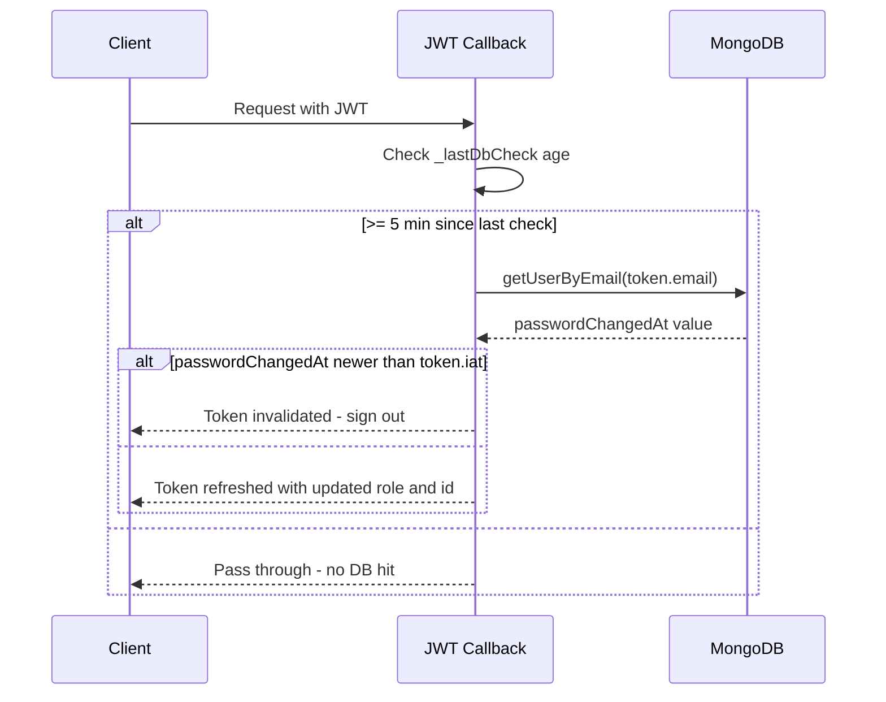

### Authorization Middleware (`lib/api/auth.ts`)

| Function                     | Purpose                                        |
| ---------------------------- | ---------------------------------------------- |
| `requireAuth(allowedRoles?)` | Generic auth + optional role check             |
| `requireSeeker()`            | Seeker-only endpoints                          |
| `requireProvider()`          | Provider-only endpoints                        |
| `requireAdmin()`             | Admin-only endpoints                           |
| `requireAdminWithDbCheck()`  | Admin + fresh DB validation (high-risk routes) |
| `optionalAuth()`             | Returns user or null (no throw)                |

### Password Policy (`lib/auth/password-policy.ts`)

- Minimum 8 characters
- At least one uppercase letter
- At least one number
- At least one special character
- Enforced on signup, profile update, and password reset

### Password Reset Flow (Forgot Password)

A professional, secure password reset system with anti-enumeration protections:

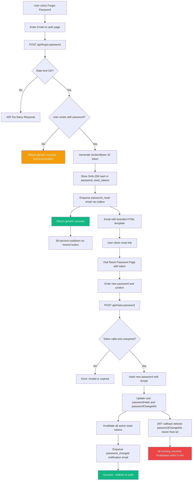

**Security measures:**

- **Token storage**: Only SHA-256 hash stored in DB; raw token never persisted
- **Token expiry**: 1-hour TTL with MongoDB TTL index auto-cleanup
- **Anti-enumeration**: Generic "If an account exists, a reset link has been sent" response regardless of email existence
- **Rate limiting**: Per-IP (10/15min) and per-email (4/hour) buckets
- **Same-origin enforcement**: `requireSameOrigin()` on all unsafe methods
- **Zod validation**: Input validated via `forgotPasswordSchema` / `resetPasswordSchema`
- **Session invalidation**: `passwordChangedAt` written on reset triggers JWT invalidation within 5 minutes
- **Token invalidation**: All active reset tokens for the user are marked used on successful reset
- **Notification email**: Branded "password changed" security alert sent to user after both reset and profile-driven changes

### In-App Password Change (Profile)

Both seeker (`PUT /api/profile/seeker`) and provider (`PATCH /api/profile/provider`) support changing password while signed in:

1. User provides `currentPassword` + `newPassword`
2. Current password verified against stored bcrypt hash
3. New password validated against password policy
4. `passwordHash`, `passwordChangedAt`, and `updatedAt` updated atomically
5. `password_changed` notification email enqueued via outbox
6. All existing sessions invalidated within 5 minutes (JWT re-check detects `passwordChangedAt`)

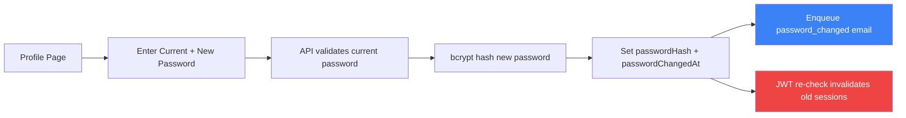

---

## 5. Business Workflows

### 5.1 Booking Lifecycle

```text
Seeker                          Provider                         System
  │                                │                                │
  ├── POST /api/bookings ──────────┤ (status: requested)            │
  │                                │                                │
  │                                ├── POST .../accept ─────────────┤ (checks capacity, requires paid fee)
  │                                │   status → accepted            │
  │                                │                                │
  │                                ├── POST .../schedule ───────────┤ (propose pickup slot)
  │                                │   status → pickup_proposed     │
  │                                │                                │
  ├── POST .../schedule ───────────┤ (confirm pickup slot)          │
  │   status → confirmed           │                                │
  │                                │                                │
  │                    [Either side can POST .../reschedule/request] │
  │                    [status → reschedule_requested → re-propose] │
  │                                │                                │
  │                                ├── POST .../arrive ─────────────┤ (geofence check ≤ 200m)
  │                                │   bookingFeeStatus → applied   │
  │                                │                                │
  │                                ├── POST .../invoice ────────────┤ (create invoice with items)
  │                                │   status → invoice_created     │
  │                                │                                │
  ├── POST /api/bookings/[id]/cancel (invoice_created stage)        │
  │   status → cancelled           │                                │
  │   bookingFeeStatus → forfeited │                                │
  │   [seeker chose to cancel      │                                │
  │    after provider collected    │                                │
  │    items — fee always lost]    │                                │
  │                OR              │                                │
  ├── POST /api/invoices/[id]/review (approve/reject)               │
  │   [if approved: proceed to pay]│                                │
  │   [if rejected: cancelled +    │                                │
  │    bookingFee forfeited]       │                                │
  │                                │                                │
  ├── POST .../pay or pay-invoice ─┤ (Razorpay payment)             │
  │   status → completed           │                                │
  │   Order created atomically     │                                │
  └────────────────────────────────┴────────────────────────────────┘
```

**Cancellation Policy** (`lib/bookings/cancellation-policy.ts`):

The policy is a pure function `evaluateCancellationPolicy()` that returns `{ allowed, refundAction, withinFreeCancelWindow }`. It is the single source of truth — the cancel route, seeker UI badge, and all unit tests reference `SEEKER_FREE_CANCEL_WINDOW_MS` from `lib/constants.ts`. The optional `bookingStatus` field forces the `invoice_created` forfeiture rule regardless of timing.

| Condition                                             | Outcome                                                                                             |
| ----------------------------------------------------- | --------------------------------------------------------------------------------------------------- |
| Seeker cancels within 2 hours of booking creation     | Allowed; booking fee **refunded**                                                                   |
| Seeker cancels after 2-hour window (before slot time) | Allowed; booking fee **forfeited**                                                                  |
| Seeker cancels at or after scheduled pickup slot time | **Blocked** at API level (except `invoice_created`)                                                 |
| **Seeker cancels at `invoice_created` stage**         | **Always allowed; booking fee forfeited** (provider has collected items — bypasses slot-time guard) |
| Provider cancels at any point before arrival          | Allowed; booking fee **refunded** to seeker                                                         |
| Booking fee already `applied`                         | **Blocked** for all actors                                                                          |
| Booking fee `unpaid` (either actor)                   | Allowed; refund action `none`                                                                       |

**Booking Fee**: ₹50 (`BOOKING_FEE_INR`), collected upfront, released to provider on arrival, refunded on auto-reject/no-show/provider-cancel within the free-cancel window.

**Reschedule Flow** (`app/api/bookings/[id]/reschedule/request/route.ts` + `app/api/bookings/[id]/schedule/route.ts`):

- `reschedule/request`: sets `status: reschedule_requested`, stores `reschedule.requestedBy` / `reason` / `previousPickupSlot`, and uses `$unset: { "pickupSlot.confirmedAt": "" }` to reliably clear the previously confirmed timestamp (avoids the `$set: undefined` MongoDB anti-pattern that silently no-ops)
- `schedule` propose path: atomic write guards `provider_id` + `{ status: { $in: ["accepted","reschedule_requested"] } }` to prevent TOCTOU races; `$unset confirmedAt`; sets `updatedAt`
- `schedule` confirm path: atomic write guards `seeker_id` + `{ status: "pickup_proposed" }`; sets `pickupSlot.confirmedAt` and `updatedAt`
- `updateBookingPickupSlot` in `lib/db/bookings.ts` includes atomic status filter `{ status: { $in: ["accepted","reschedule_requested"] } }` + `$unset confirmedAt` to prevent silent stale writes

### 5.2 Order Lifecycle

**State Machine** (`lib/orders/status-machine.ts`):

```text
invoiced → processing → washing → ironing → ready → out_for_delivery → delivered
                     ↘ ready (shortcut)
          washing ───↘ ready (shortcut)
```

Valid transitions are enforced by `isValidTransition()`. The `delivered` state can only be set via OTP confirmation endpoints, not via the generic status update route.

**Process Flow:**

1. Provider advances status through UI actions
2. Provider proposes delivery slot → seeker confirms
3. Provider generates delivery OTP → sent via email outbox (bcrypt-hashed, 10-min TTL)
4. At handoff: OTP verified → `process_status: delivered`, `payment_status: held`
5. Escrow holds 24 hours → payout cron releases if no complaint

### 5.3 Payment & Escrow Flow

```text
┌─────────────────────────────────────────────────────────────┐
│                      PAYMENT FLOW                            │
├─────────────────────────────────────────────────────────────┤
│                                                              │
│  1. Seeker pays invoice                                      │
│     └── Razorpay order created → checkout → payment captured │
│     └── payment_status: unpaid → paid                        │
│     └── Order created (via finalizeInvoiceOrder)             │
│                                                              │
│  2. Delivery confirmed (OTP)                                 │
│     └── payment_status: paid → held                          │
│     └── escrow_started_at = now                              │
│     └── escrow_release_at = now + 24h                        │
│     └── Deadline compensation check (auto-refund if late)    │
│                                                              │
│  3. Escrow release (cron or manual)                          │
│     └── Check: no open complaint                             │
│     └── payment_status: held → released                      │
│     └── Payout initiated to provider                         │
│                                                              │
│  4. Payout execution                                         │
│     └── 5% platform commission deducted (decimal.js)         │
│     └── Provider receives (total - commission) via RazorpayX │
│     └── payout_status: pending → processing → paid           │
│                                                              │
└─────────────────────────────────────────────────────────────┘
```

**Financial Precision:**

- `decimal.js` used for all payout calculations (`lib/payouts/amounts.ts`)
- All Razorpay amounts in paise (integer)
- `round2()`, `toPaise()`, `formatInr()` in `lib/utils/monetary.ts`
- `MONEY_EPSILON = 0.01` for floating-point comparison tolerance
- Platform commission: 5% (`PLATFORM_COMMISSION_RATE`)

**Payout Calculation** (`lib/payouts/amounts.ts`):

1. If `provider_payout_amount` stored → use it directly
2. If `platform_commission` stored → derive payout from total - commission
3. Fallback → compute commission as 5% of subtotal (or total if no subtotal)

**Delivery Charge** (`lib/utils/delivery-charge.ts`):

- Haversine distance calculation between seeker and provider coordinates
- Free within `free_radius_km` (default 5km)
- `per_km_rate` (default ₹10/km) applied beyond free radius

**Deadline Compensation** (`lib/orders/deadline-compensation.ts`):

- Evaluated at delivery confirmation (OTP verify)
- If deadline breached and payment is `paid`: full Razorpay refund issued
- Idempotent: checks `deadline_compensated_at`, `razorpay_refund_id`, and payment status

### 5.4 Complaint Resolution

```text
┌────────────────────────────────────────────────────────────────┐
│                    COMPLAINT LIFECYCLE                          │
├────────────────────────────────────────────────────────────────┤
│                                                                │
│  1. Seeker files complaint (within 24h of delivery)            │
│     └── Escrow frozen (release blocked by open complaint)      │
│     └── status: open                                           │
│     └── One complaint per order (enforced by unique index)     │
│                                                                │
│  2. Admin accepts complaint                                    │
│     └── Response deadline set (1-14 days, default 7)           │
│     └── status: accepted                                       │
│                                                                │
│  3. Admin adds provider to chat                                │
│     └── provider_access_granted = true                         │
│     └── status: in_review                                      │
│                                                                │
│  4. Admin resolves with outcome                                │
│     └── refund_full: full distributable → seeker               │
│     └── refund_partial: split → seeker refund + provider payout│
│     └── release_payout: full distributable → provider          │
│     └── reject: provider receives payout, case hidden          │
│                                                                │
│  Settlement Math:                                              │
│     total_price - platform_commission = distributable          │
│     distributable = seeker_refund + provider_payout            │
│                                                                │
│  5. Chat archived; no further messages accepted                │
│                                                                │
└────────────────────────────────────────────────────────────────┘
```

**Settlement Engine** (`lib/services/complaint-resolution.ts`):

- `normalizeRefundAmount()`: Validates and normalizes refund amounts
- `resolveDbOutcome()`: Maps request outcome to DB status
- `executeSettlementActions()`: Performs Razorpay refund + RazorpayX payout
- `fetchManualTransferDetails()`: Provides bank/payment details when auto-actions fail
- `buildComplaintRevertUpdate()`: Reverts complaint state on settlement failure

**Access Control** (`lib/complaints/access.ts`):

- Provider can only view/message in complaint after admin grants access
- Seeker/provider navigation only shows active complaints (`open`, `accepted`, `in_review`)
- Resolved/rejected complaints are hidden from seeker/provider navigation

---

## 6. API Architecture

### API Route Structure

**Booking API:**

| Route                                   | Method   | Purpose                        |
| --------------------------------------- | -------- | ------------------------------ |
| `/api/bookings`                         | GET/POST | List/create bookings           |
| `/api/bookings/[id]`                    | GET      | Get booking details            |
| `/api/bookings/[id]/accept`             | POST     | Provider accepts booking       |
| `/api/bookings/[id]/reject`             | POST     | Provider rejects booking       |
| `/api/bookings/[id]/cancel`             | POST     | Cancel booking                 |
| `/api/bookings/[id]/arrive`             | POST     | Provider marks arrival         |
| `/api/bookings/[id]/schedule`           | POST     | Propose/confirm pickup slot    |
| `/api/bookings/[id]/reschedule/request` | POST     | Request reschedule             |
| `/api/bookings/[id]/dispute`            | POST     | File dispute on booking        |
| `/api/bookings/[id]/invoice`            | POST     | Create invoice                 |
| `/api/bookings/[id]/pay`                | POST     | Pay booking fee                |
| `/api/bookings/[id]/pay-invoice`        | POST     | Pay invoice amount             |
| `/api/bookings/payment/init`            | POST     | Initialize booking fee payment |
| `/api/bookings/payment/verify`          | POST     | Verify booking fee payment     |
| `/api/bookings/provider`                | GET      | Provider's bookings            |
| `/api/bookings/seeker`                  | GET      | Seeker's bookings              |

**Order API:**

| Route                                | Method   | Purpose                                |
| ------------------------------------ | -------- | -------------------------------------- |
| `/api/orders`                        | GET      | List orders                            |
| `/api/orders/[id]/chat`              | GET/POST | Order chat messages (real-time)        |
| `/api/orders/[id]/chat/[messageId]`  | DELETE   | Delete message (for_me / for_everyone) |
| `/api/orders/[id]/status`            | PATCH    | Update order process status            |
| `/api/orders/[id]/payment`           | POST     | Initialize/verify order payment        |
| `/api/orders/[id]/pay`               | POST     | Legacy payment alias                   |
| `/api/orders/[id]/confirm-delivery`  | POST     | Seeker confirms delivery (OTP)         |
| `/api/orders/[id]/otp`               | POST     | Generate/resend delivery OTP           |
| `/api/orders/[id]/otp/verify`        | POST     | Provider verifies delivery OTP         |
| `/api/orders/[id]/schedule-delivery` | POST     | Propose/confirm delivery slot          |
| `/api/orders/[id]/cancel`            | POST     | Cancel order                           |
| `/api/orders/provider`               | GET      | Provider's orders                      |
| `/api/orders/seeker`                 | GET      | Seeker's orders                        |

**Admin API:**

| Route                                       | Method           | Purpose                    |
| ------------------------------------------- | ---------------- | -------------------------- |
| `/api/admin/complaints`                     | GET              | List all complaints        |
| `/api/admin/complaints/[id]`                | GET              | Get complaint details      |
| `/api/admin/complaints/[id]/accept`         | PATCH            | Accept complaint           |
| `/api/admin/complaints/[id]/access`         | PATCH            | Toggle provider access     |
| `/api/admin/complaints/[id]/add-provider`   | PATCH            | Add provider to chat       |
| `/api/admin/complaints/[id]/resolve`        | PATCH            | Resolve with outcome       |
| `/api/admin/dashboard-stats`                | GET              | Dashboard statistics       |
| `/api/admin/orders/[id]/extend-complaint`   | POST             | Extend complaint window    |
| `/api/admin/payments`                       | GET              | Payment management         |
| `/api/admin/refund`                         | POST             | Manual refund              |
| `/api/admin/system-alerts/[id]/acknowledge` | PATCH            | Acknowledge alert          |
| `/api/admin/users`                          | GET              | User management            |
| `/api/admin/users/[id]`                     | GET/PATCH/DELETE | User details/update/delete |
| `/api/admin/users/[id]/ban`                 | POST             | Ban user                   |

**Other API Routes:**

| Route                                       | Method    | Purpose                                                    |
| ------------------------------------------- | --------- | ---------------------------------------------------------- |
| `/api/complaints`                           | POST      | Create complaint                                           |
| `/api/complaints/[id]`                      | GET       | Get complaint details                                      |
| `/api/complaints/[id]/messages`             | GET/POST  | Chat messages                                              |
| `/api/complaints/[id]/messages/[messageId]` | DELETE    | Delete message (for_me / for_everyone / admin_hard_delete) |
| `/api/escrow/release`                       | POST      | Manual escrow release                                      |
| `/api/invoices/[id]`                        | GET/POST  | Invoice review                                             |
| `/api/providers`                            | GET       | Provider search                                            |
| `/api/reviews`                              | POST      | Submit review                                              |
| `/api/upload`                               | POST      | Image upload                                               |
| `/api/webhooks/razorpay`                    | POST      | Payment webhook                                            |
| `/api/security/csp-report`                  | POST      | CSP violation reports                                      |
| `/api/profile`                              | GET/PATCH | User profile                                               |
| `/api/otp`                                  | POST      | Send/verify OTP                                            |
| `/api/auth/[...nextauth]`                   | \*        | NextAuth handler                                           |

| `/api/auth/verify-email`                    | POST      | Email verification                                         |
| `/api/signup/seeker`                        | POST      | Seeker registration                                        |
| `/api/signup/provider`                      | POST      | Provider registration                                      |
| `/api/forgot-password`                      | POST      | Password reset request                                     |
| `/api/reset-password`                       | POST      | Password reset execution                                   |
| `/api/payments/create-order`                | POST      | Razorpay order creation                                    |
| `/api/provider/[id]/stats`                  | GET       | Provider dashboard stats                                   |

### API Security

1. **Standardized Error Handling** (`lib/api/errors.ts`):
   - `AppError` class with `code`, `statusCode`, `message`, `details`
   - 20+ error codes covering auth, validation, resource, conflict, business logic, rate limiting
   - `Errors` factory: `unauthorized()`, `forbidden()`, `notFound()`, `validation()`, `conflict()`, `invalidState()`, `internal()`, `rateLimited()`

2. **Response Format** (`lib/api/response.ts`):
   - `successResponse(data, status)` → `{ success: true, ok: true, data }`
   - `errorResponse(error)` → handles AppError, ZodError, unknown errors
   - `withErrorHandling(handler)` → wraps async handlers with consistent error catching
   - Zod validation errors return field-level error details

3. **Same-Origin Enforcement** (`lib/api/security.ts`):
   - `requireSameOrigin(req)` validates Origin/Referer headers on unsafe methods (POST, PUT, PATCH, DELETE)
   - Falls back to `sec-fetch-site: same-origin` header when Origin is missing
   - Allowed origins collected from request URL + env vars

4. **Rate Limiting** (`lib/api/security.ts`):
   - MongoDB-backed with atomic upsert counters and TTL cleanup
   - Three tiers: default (1 min), strict (5 min), auth (15 min)
   - Configurable per-endpoint via `enforceRateLimit(req, { bucket, max, windowMs })`
   - Client IP extraction with proxy trust model (`TRUST_PROXY` env var)
   - Handles Vercel, Cloudflare, and standard proxy headers

5. **Validation Schemas** (`lib/api/schemas.ts`):
   - 30+ Zod schemas for all API inputs (Zod v4)
   - Centralized: booking, order, complaint, review, profile, admin, auth schemas
   - Type exports for use in components

---

## 7. Cron Jobs

| Endpoint                               | Schedule     | Job Name                     | Purpose                                                                                      |
| -------------------------------------- | ------------ | ---------------------------- | -------------------------------------------------------------------------------------------- |
| `/api/cron/auto-reject-bookings`       | Every 5 min  | `auto-reject-bookings`       | Auto-reject bookings not accepted within 2 hours; refund booking fee                         |
| `/api/cron/no-show`                    | Every 5 min  | `no-show`                    | Detect provider no-shows (30 min after confirmed pickup with no order); auto-cancel + refund |
| `/api/cron/process-payouts`            | Every 15 min | `process-payouts`            | Unified escrow release + RazorpayX payout engine with batch processing                       |
| `/api/cron/notify-system-alerts`       | Every 15 min | `notify-system-alerts`       | Alert delivery with dedup + escalation + owner routing                                       |
| `/api/cron/process-email-outbox`       | Every 2 min  | `process-email-outbox`       | Claim-and-dispatch queued transactional emails                                               |
| `/api/cron/audit-integrity`            | Every 30 min | `audit-integrity`            | Verify order/payment/booking data consistency                                                |
| `/api/cron/reconciliation`             | Every 30 min | `reconciliation`             | Reconcile Razorpay records vs internal state                                                 |
| `/api/cron/monitor-operational-health` | Hourly       | `monitor-operational-health` | Evaluate overdue held orders, payout failures, overdue complaints → system_alerts            |
| `/api/cron/monitor-abuse`              | Daily 2 AM   | `monitor-abuse`              | Flag seekers with excessive cancellations (30-day lookback, threshold: 3)                    |
| `/api/cron/webhook-cleanup`            | Daily 1 AM   | `webhook-cleanup`            | Purge processed webhook events older than 30 days                                            |

All crons:

- Authenticated via `CRON_SECRET` bearer token (`lib/api/cron-auth.ts`)
- Tracked in `cron_runs` collection via `startCronRun()` / `completeCronRun()` (`lib/cron-tracking.ts`)
- Have idempotent processing (safe to retry)
- Configured in `vercel.json`

---

## 8. Database Schema

### Collections

| Collection              | Purpose                                   | Documents                                 |
| ----------------------- | ----------------------------------------- | ----------------------------------------- |
| `seekers`               | Seeker profiles                           | Seeker type                               |
| `providers`             | Provider profiles with geo/bank/capacity  | Provider type                             |
| `admins`                | Admin accounts                            | Admin type                                |
| `bookings`              | Booking lifecycle records                 | Booking type                              |
| `orders`                | Order lifecycle with financials           | Order type                                |
| `order_chats`           | Order chat messages (seeker ↔ provider)   | OrderChatMessage documents                |
| `complaints`            | Dispute records                           | Complaint type                            |
| `complaint_messages`    | Complaint chat messages                   | ComplaintMessage type                     |
| `reviews`               | Seeker reviews of providers               | Review type                               |
| `audit_logs`            | State change audit trail                  | AuditLogEntry type (TTL: 30 days)         |
| `system_alerts`         | Operational health alerts                 | Alert documents                           |
| `cron_runs`             | Cron job execution tracking               | CronRunDocument type (TTL: 7 days)        |
| `email_outbox`          | Queued transactional emails               | EmailOutboxJob type                       |
| `api_rate_limits`       | Rate limit counters                       | RateLimitDocument type (TTL auto-cleanup) |
| `otp_codes`             | OTP tokens                                | OTP documents (TTL auto-cleanup)          |
| `password_reset_tokens` | Password reset tokens                     | Token documents (TTL auto-cleanup)        |
| `webhook_events`        | Razorpay webhook events                   | Event documents                           |
| `payments`              | Payment records                           | Payment documents                         |
| `refunds`               | Refund records                            | Refund documents                          |
| `chats`                 | Legacy booking chat messages (deprecated) | Chat documents                            |

### Key Indexes (`lib/db-indexes.ts`)

**Critical Integrity Indexes (unique):**

- `orders.booking_id` — One order per booking
- `orders.razorpay_order_id` — Unique Razorpay order reference
- `orders.razorpay_payment_id` — Unique payment reference
- `orders.payout_id` — Unique payout reference
- `complaints.order_id` — One complaint per order
- `bookings.razorpay_order_id` — Unique booking payment reference
- `bookings.razorpay_payment_id` — Unique booking payment ID
- `password_reset_tokens.tokenHash` — Unique token lookup
- `seekers.email`, `providers.email`, `admins.email` — Unique email per role
- `webhook_events.event_id` — payment callback processing that is safe to retry without duplicates
- `payments.razorpay_payment_id` — Unique payment tracking
- `refunds.razorpay_refund_id` — Unique refund tracking

**Geospatial:**

- `providers.locationGeoJSON` (2dsphere) — Geo-near provider search

**Query Performance:**

- `orders.payment_status + escrow_release_at` — Payout cron
- `system_alerts.status + severity + firstSeenAt` — Alert queries
- `bookings.provider_id + status + createdAt` — Provider booking list
- `bookings.seeker_id + createdAt` — Seeker booking list
- `orders.provider_id + process_status + createdAt` — Provider order list
- `orders.seeker_id + createdAt` — Seeker order list
- `complaints.status + response_deadline` — Overdue complaint detection
- `email_outbox.status + nextAttemptAt + createdAt` — Outbox processing
- `email_outbox.status + lockedAt` — Stale lock detection

**TTL Cleanup:**

- `otp_codes.expiresAt` — Auto-delete expired OTPs
- `password_reset_tokens.expiresAt` — Auto-delete expired tokens
- `audit_logs.timestamp` — 30-day retention
- `cron_runs.startedAt` — 7-day retention

**Startup Behavior:**

- All indexes created on first DB access via `ensureDbIndexes()`
- Critical index failures in production cause startup refusal (unless `ALLOW_START_WITH_INDEX_ERRORS=1`)
- Non-critical failures are logged + alert created via `triggerSystemAlertWithDb()`

---

## 9. Key Business Constants (`lib/constants.ts`)

| Constant                             | Value     | Purpose                                            |
| ------------------------------------ | --------- | -------------------------------------------------- |
| `PLATFORM_COMMISSION_RATE`           | 0.05 (5%) | Platform commission                                |
| `BOOKING_FEE_INR`                    | 50        | Upfront booking fee                                |
| `SEEKER_FREE_CANCEL_WINDOW_MS`       | 2h        | Window after creation for free seeker cancellation |
| `BCRYPT_SALT_ROUNDS`                 | 10        | Password hashing cost                              |
| `MAX_ARRIVAL_DISTANCE_METERS`        | 200       | Geofence for provider arrival                      |
| `ESCROW_RELEASE_WINDOW_MS`           | 24h       | Escrow hold duration                               |
| `DELIVERY_OTP_TTL_MS`                | 10 min    | OTP validity                                       |
| `COMPLAINT_FILING_WINDOW_MS`         | 24h       | Post-delivery complaint window                     |
| `SEEKER_CANCELLATION_BLOCK_MS`       | 30 days   | Block after paid-order cancel                      |
| `MIN_PICKUP_ADVANCE_MS`              | 2h        | Minimum advance for pickup scheduling              |
| `SESSION_MAX_AGE_SECONDS`            | 7 days    | JWT session duration                               |
| `STALE_PAYOUT_CUTOFF_MS`             | 15 min    | Stale payout detection                             |
| `HELD_ORDER_ALERT_GRACE_MS`          | 1h        | Extra grace before alert                           |
| `PAYOUT_FAILURE_ALERT_LOOKBACK_MS`   | 24h       | Failure counting window                            |
| `ALERT_NOTIFICATION_DEDUPE_MS`       | 1h        | Minimum between notifications                      |
| `ALERT_ESCALATION_REPEAT_MS`         | 6h        | Minimum between escalations                        |
| `CRITICAL_ALERT_ESCALATION_MS`       | 30 min    | Critical escalation threshold                      |
| `HIGH_ALERT_ESCALATION_MS`           | 2h        | High escalation threshold                          |
| `CRITICAL_ALERT_ACK_SLA_MS`          | 15 min    | Critical ack SLA                                   |
| `HIGH_ALERT_ACK_SLA_MS`              | 60 min    | High ack SLA                                       |
| `CRITICAL_ALERT_PERSISTENT_ROUTE_MS` | 60 min    | Persistent critical → tech_lead                    |
| `HIGH_ALERT_PERSISTENT_ROUTE_MS`     | 4h        | Persistent high → tech_lead                        |
| `ABUSE_LOOKBACK_DAYS`                | 30        | Cancellation abuse window                          |
| `EXCESSIVE_CANCELLATION_THRESHOLD`   | 3         | Abuse trigger count                                |
| `RATE_LIMIT_DEFAULT_WINDOW_MS`       | 1 min     | Default rate limit window                          |
| `RATE_LIMIT_STRICT_WINDOW_MS`        | 5 min     | Strict rate limit window                           |
| `RATE_LIMIT_AUTH_WINDOW_MS`          | 15 min    | Auth rate limit window                             |
| `REFUND_LOCK_TIMEOUT_MS`             | 5 min     | Stale refund lock timeout                          |
| `PAYOUT_LOCK_TTL_MS`                 | 5 min     | Stale payout lock timeout                          |
| `DELETE_FOR_EVERYONE_WINDOW_MS`      | 1 hour    | Window for sender to delete message for everyone   |
| `MAX_PROFILE_IMAGE_BYTES`            | 2 MB      | Profile image size limit                           |
| `MAX_UPLOAD_FILE_BYTES`              | 5 MB      | General upload size limit                          |
| `MAX_EVIDENCE_FILES`                 | 5         | Max complaint evidence photos                      |
| `ALERT_ANALYTICS_WINDOW_MS`          | 8 days    | Dashboard analytics lookback                       |

**Laundry Service Categories** (`LAUNDRY_SERVICES`):
Wash, Fold, Dry Cleaning, Ironing, Shoe Cleaning, Stain Removal, Bedding & Linen, Curtains & Drapes, Premium Laundry, Express Service

---

## 10. Frontend Architecture

### Component Hierarchy

```text
RootLayout (app/layout.tsx)
├── SessionProvider (NextAuth)
├── SocketProvider (Socket.IO — single shared connection)
├── ThemeProvider (next-themes)
├── GoogleMapsProvider
└── Route Groups
    ├── (root) → Landing page
    ├── (auth) → Verification flows
    ├── banned/ → Account suspension info page
    └── (dashboard) → Protected dashboards
        ├── admin/layout.tsx → AdminSidebar
        ├── provider/layout.tsx → ProviderSidebar + ProviderHeader
        └── seeker/layout.tsx → SeekerTopnav
```

### Dashboard Layouts

- **Admin**: Sidebar navigation (complaints, users, payments, system alerts) + dashboard stats (complaints, escrow balance, revenue, providers, alerts with SLA)
- **Provider**: Sidebar navigation (bookings, orders, invoices, messages, reviews, profile, disputes) + provider-specific stats
- **Seeker**: Top navigation bar (bookings, providers, orders, invoices, profile, disputes)

### Key Components

| Component                       | Purpose                                                                                                                                                                                                                               |
| ------------------------------- | ------------------------------------------------------------------------------------------------------------------------------------------------------------------------------------------------------------------------------------- |
| `landing-page-client.tsx`       | Animated landing with spotlight cards, text-generate effect                                                                                                                                                                           |
| `order-chat.tsx`                | Real-time order chat (seeker ↔ provider) — uses `useSocket()` for live message push via `order:message:created` events, typing indicators, photo attachments, voice notes, and WhatsApp-style message deletion                        |
| `complaint-chat.tsx`            | 3-way complaint chat (seeker/provider/admin) — uses `useSocket()` for live message push, complaint state updates, voice notes, and message deletion                                                                                   |
| `socket-provider.tsx`           | `SocketProvider` context + `useSocket()` hook — maintains one Socket.IO connection per authenticated session, exposes `{ socket, isConnected, isReconnecting }`                                                                       |
| `invoice-form.tsx`              | Provider invoice creation with line items and photos                                                                                                                                                                                  |
| `invoice-review-form.tsx`       | Seeker invoice approval/rejection                                                                                                                                                                                                     |
| `delivery-otp-form.tsx`         | OTP entry for delivery confirmation                                                                                                                                                                                                   |
| `payment-button.tsx`            | Razorpay checkout integration                                                                                                                                                                                                         |
| `live-status-refresh.tsx`       | Auto-refreshing order status display                                                                                                                                                                                                  |
| `post-delivery-actions.tsx`     | Review/complaint buttons after delivery                                                                                                                                                                                               |
| `order-actions.tsx`             | Provider order state advancement                                                                                                                                                                                                      |
| `location-autocomplete.tsx`     | Google Places address autocomplete                                                                                                                                                                                                    |
| `evidence-upload.tsx`           | Complaint photo evidence upload                                                                                                                                                                                                       |
| `image-upload.tsx`              | General image upload component                                                                                                                                                                                                        |
| `provider-booking-list.tsx`     | Provider's booking list with actions                                                                                                                                                                                                  |
| `confirm-dialog.tsx`            | `ConfirmDialog` component + `useConfirmDialog` hook — keyboard accessible (Escape/Enter), Framer Motion animated, dark-mode aware, 3 variants (danger/warning/info). Replaces all `window.confirm()` usage                            |
| `settlement-summary-modal.tsx`  | `SettlementSummaryModal` — shows provider payout and seeker refund details (UPI, bank, card) with manual-transfer warnings. Replaces `alert()` dumps in admin complaint resolution                                                    |
| `error-boundary.tsx`            | React error boundary wrapper                                                                                                                                                                                                          |
| `theme-toggle.tsx`              | Dark/light mode toggle                                                                                                                                                                                                                |
| `password-input.tsx`            | Password field with visibility toggle                                                                                                                                                                                                 |
| `skeleton.tsx`                  | Loading skeleton components                                                                                                                                                                                                           |
| `toast.tsx`                     | Toast notification system                                                                                                                                                                                                             |
| `json-ld.tsx`                   | SEO structured data — 5 JSON-LD schemas (SoftwareApplication, LocalBusiness, Service, Organization, FAQPage), injected at root layout                                                                                                 |
| `breadcrumb-json-ld.tsx`        | SEO breadcrumb structured data — Schema.org BreadcrumbList, used on provider profile pages with dynamic breadcrumb items                                                                                                              |
| `use-booking-actions.ts` (hook) | Headless booking actions — `handleCancelBooking` accepts optional `requestConfirm` callback so caller owns the confirmation UI while the hook owns the network call. `executeCancelBooking` extracted as a separate internal callback |
| `interactive-grid.tsx`          | Animated grid background                                                                                                                                                                                                              |
| `spotlight-card.tsx`            | Animated spotlight card                                                                                                                                                                                                               |
| `text-generate-effect.tsx`      | Character-by-character text animation                                                                                                                                                                                                 |

### Data Fetching Pattern

- **Server Components**: Direct DB queries via `getDb()` for initial page loads
- **Client Components**: SWR for reactive data fetching with automatic revalidation
- **Server Actions**: `app/actions/` for form submissions and mutations
- **API Routes**: RESTful endpoints for complex operations

---

## 11. External Integrations

### Razorpay Integration (`lib/razorpay.ts`)

| Function                        | Purpose                                          |
| ------------------------------- | ------------------------------------------------ |
| `createRazorpayOrder()`         | Create payment order                             |
| `verifyPaymentSignature()`      | HMAC signature verification                      |
| `refundRazorpayPayment()`       | Issue full/partial refund                        |
| `fetchRazorpayPaymentDetails()` | Get payment details (for manual refund fallback) |
| `createRazorpayContact()`       | Create provider contact in RazorpayX             |
| `createRazorpayFundAccount()`   | Link bank account to contact                     |
| `createRazorpayPayout()`        | Initiate payout to provider                      |

Client-side: Razorpay checkout script (`RAZORPAY_CHECKOUT_SCRIPT_URL`) loaded dynamically, types in `types/razorpay.d.ts`.

### Google Maps Integration

- `@react-google-maps/api` for map display
- `use-places-autocomplete` for address autocomplete
- `lib/geocoding.ts` for server-side geocoding
- `lib/distance.ts` for Haversine distance calculation
- `providers.locationGeoJSON` 2dsphere index for geo-near queries

### Twilio Integration

- SMS OTP delivery via Twilio API
- Phone number verification during signup
- Configured via `TWILIO_ACCOUNT_SID`, `TWILIO_AUTH_TOKEN`, `TWILIO_PHONE_NUMBER`

### Cloudinary Integration (`lib/cloudinary.ts`)

- CDN-backed image uploads for profile pictures, banners, invoices, evidence
- Remote image patterns configured in `next.config.ts` for `res.cloudinary.com`
- Base64 fallback available via `ALLOW_BASE64_UPLOAD_FALLBACK=1`

### Nodemailer (`lib/email-transporter.ts`)

- SMTP email transport
- Used by email outbox dispatch functions
- Templates for: delivery OTP, password reset, password changed notification, OTP code

### Email Outbox System (`lib/email-outbox.ts`)

The email outbox is a transactional email queue with claim-lock-dispatch pattern:

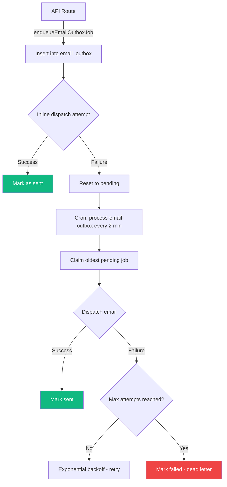

**5 email types supported:**

| Kind               | Template File                   | Purpose                                      |
| ------------------ | ------------------------------- | -------------------------------------------- |
| `delivery_otp`     | `lib/delivery-otp-email.ts`     | OTP code for delivery confirmation           |
| `password_reset`   | `lib/password-reset-email.ts`   | Branded reset link with 1-hour expiry notice |
| `password_changed` | `lib/password-changed-email.ts` | Security notification after password change  |
| `magic_link`       | `lib/magic-link-email.ts`       | Passwordless login verification link         |
| `otp_email`        | `lib/otp-code-email.ts`         | Email OTP code for signup verification       |

---

## 12. Security Features

### Account Security & Lifecycle
- **Self-Service Account Deletion**: Users (Seekers/Providers) can soft-delete their accounts via settings. Requires password confirmation. Blocked if there are active bookings, orders, or unresolved complaints.
- **Re-signup allowed**: A soft-deleted user can re-register with the same email immediately without encountering "email already exists"; the system seamlessly reactivates the account and clears old profile data.
- **Session & Socket Annihilation**: Soft-deleting cuts off real-time access via live DB checks during WebSocket connection authorization.

### Transport Security (`next.config.ts`)

| Header                      | Value                                                            |
| --------------------------- | ---------------------------------------------------------------- |
| `X-Frame-Options`           | `DENY`                                                           |
| `X-Content-Type-Options`    | `nosniff`                                                        |
| `Referrer-Policy`           | `strict-origin-when-cross-origin`                                |
| `Permissions-Policy`        | `camera=(), microphone=(), geolocation=(self)`                   |
| `Strict-Transport-Security` | `max-age=31536000; includeSubDomains; preload` (production only) |
| `Content-Security-Policy`   | Report-Only by default; enforced via `CSP_ENFORCE=true`          |

### CSP Policy (`lib/security/csp.ts`)

- Whitelisted domains: Razorpay checkout, Google Maps, Cloudinary
- `unsafe-inline` for scripts and styles (Next.js requirement)
- `unsafe-eval` included in report-only mode, removed in enforce mode (unless `CSP_ALLOW_UNSAFE_EVAL=true`)
- **`connect-src` includes `ws:` and `wss:`** — required for Socket.IO WebSocket transport; CORS on the Socket.IO server provides the actual origin restriction
- **`upgrade-insecure-requests` is production-only** — omitted on `NODE_ENV !== "production"` so that Socket.IO polling over plain HTTP works correctly on localhost without the browser silently rewriting `http:` requests to `https:`
- Violations reported to `/api/security/csp-report`

### Authentication Security

- Bcrypt password hashing (10 salt rounds)
- Email + phone OTP verification required before account creation
- Strong password policy enforced on all password-setting endpoints
- JWT session tokens with 7-day expiry
- Google OAuth as alternative auth flow
- **Secure password reset**: Token-based with SHA-256 hashing (raw token never stored), 1-hour expiry, TTL auto-cleanup
- **Session invalidation on password change**: JWT callback re-checks `passwordChangedAt` every 5 minutes; stale tokens invalidated automatically
- **User Ban Enforcement**: Sign-in verification flow blocks users with `blocked_until` > now, displaying reason and expiry feedback to prevent platform abuse
- **Anti-enumeration**: Forgot-password endpoint returns generic responses regardless of email existence
- **Password change notifications**: Branded security emails sent on both reset and profile-driven password changes

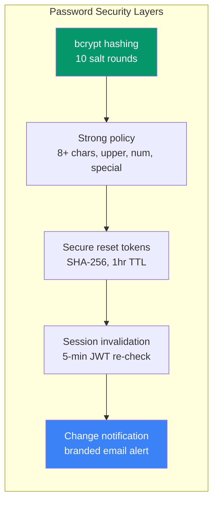

### Payment Security

- Razorpay HMAC-SHA256 signature verification
- Server-side order creation (client never sets amounts)
- Payment callback processing with duplicate-event protection
- Escrow hold with complaint-gated release
- Distributed refund locks (`lib/services/refund-lock.ts`)
- Distributed payout locks with stale-lock recovery
- Financial precision with `decimal.js` and paise integers

### Rate Limiting (`lib/api/security.ts`)

- MongoDB-backed counters with atomic upserts
- Fixed-window algorithm with TTL auto-cleanup
- Three configurable tiers
- Client IP extraction with proxy trust model
- Duplicate-key retry handling for burst traffic

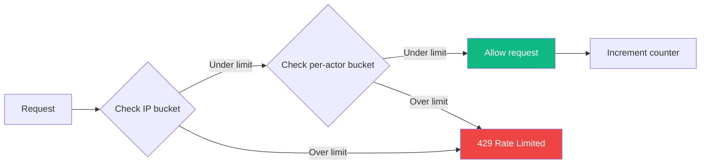

### Logging Security (`lib/logger.ts`)

- Pino native redaction paths: `password`, `passwordHash`, `token`, `secret`, `apiKey`, `otp`, `code`, `codeHash`, `authToken`, `accessToken`
- Both nested (`*.password`) and root-level redaction
- Pretty-printing in dev, structured JSON in production

---

## 13. Testing Strategy

### Unit Tests (Vitest)

- The current full unit test suite is passing
- Located alongside source files as `*.test.ts`
- In-memory MongoDB via `mongodb-memory-server`
- Coverage areas:
  - All API route handlers
  - Business logic modules:
    - Cancellation policy — **11 tests** (both actors, boundary 2-hour window, `invoice_created` forced-forfeit, all `bookingFeeStatus` values)
    - Reschedule route — atomic `$unset` and race-condition-safe status guard scenarios
    - Schedule route — propose/confirm TOCTOU guards, `updatedAt` correctness
    - Deadline compensation, status machine, payout amounts
  - **Real-time modules** — `lib/realtime/`: socket-auth room authorization, emitter dispatch, chat-state serialization
  - Security modules (rate limiting, origin checks, CSP)
  - Ops modules (health signals, alert delivery, SLA tracking, owner routing, analytics)
  - Data integrity (audit integrity checks)
  - Email outbox (dispatch, retry, backoff, dead-letter)
  - Database indexes (creation, failure handling)
  - Schema contracts (Zod schema validation)
  - **Password management**: `passwordChangedAt` set on profile password change (seeker + provider), password-changed email enqueued
  - **Forgot/reset password**: Token generation, validation, expiry, rate limiting, anti-enumeration

### E2E Tests (Playwright)

- **6 spec files** in `e2e/`:
  - `smoke-role-journeys.spec.ts` — Role-based authentication flows
  - `complaint-chat-journey.spec.ts` — Complaint filing and chat
  - `settlement-chain-journey.spec.ts` — Split, reject, and full-refund outcomes
  - `booking-lifecycle-journey.spec.ts` — Complete booking flow
  - `booking-negative-journeys.spec.ts` — Edge cases and error paths
  - `invoice-download.spec.ts` — Invoice PDF download and print flow
- Support utilities in `e2e/support/`
- Playwright runner with env sanitization (`scripts/run-playwright.mjs`)

### Test Commands

```bash
npm run test              # Run unit tests (Vitest)
npm run test:watch        # Run unit tests in watch mode
npm run test:e2e          # Run E2E tests (Playwright)
npm run test:e2e:headed   # Run E2E with browser visible
npm run test:e2e:ui       # Playwright UI mode
npm run typecheck         # TypeScript type checking
npm run typecheck:strict  # Strict mode (unused locals/params)
npm run lint              # ESLint
npm run verify:gates      # Full quality gate (typecheck + lint + test + build)
npm run check:docs-sync   # Documentation sync checker
```

---

## 14. Deployment

### Vercel Configuration

- **Cron Jobs**: 10 cron schedules configured in `vercel.json`
- **Security Headers**: Configured in `next.config.ts` `headers()` function
- **Images**: Cloudinary remote patterns whitelisted
- **React Compiler**: Enabled via `reactCompiler: true` in `next.config.ts`

### CI/CD Workflows (GitHub Actions)

| Workflow                 | Trigger            | Steps                                       |
| ------------------------ | ------------------ | ------------------------------------------- |
| `quality-gates.yml`      | Every push         | typecheck → lint → test → build → smoke E2E |
| `real-gateway-smoke.yml` | Scheduled + manual | Live Razorpay API connectivity checks       |
| `governance-audit.yml`   | Scheduled          | Branch protection required-check detection  |

### Environment Variables

All are checked at startup with a Zod schema in `lib/env.ts`.

**Required**:
`AUTH_GOOGLE_ID`, `AUTH_GOOGLE_SECRET`, `MONGODB_URI`, `MONGODB_DB`, `EMAIL_USER`, `EMAIL_PASS`, `TWILIO_ACCOUNT_SID`, `TWILIO_AUTH_TOKEN`, `TWILIO_PHONE_NUMBER`, `RAZORPAY_KEY_ID`, `RAZORPAY_KEY_SECRET`, `NEXT_PUBLIC_RAZORPAY_KEY_ID`, `NEXT_PUBLIC_GOOGLE_MAPS_API_KEY`, `CRON_SECRET`, `AUTH_SECRET`

**Optional**:
`AUTH_URL`, `NEXT_PUBLIC_BASE_URL`, `NEXT_PUBLIC_APP_URL`, `RAZORPAYX_ACCOUNT_NUMBER`, `CLOUDINARY_CLOUD_NAME`, `CLOUDINARY_API_KEY`, `CLOUDINARY_API_SECRET`, `DATADOG_API_KEY`, `DD_API_KEY`, `OPS_ALERT_EMAIL_TO`, `OPS_ALERT_WEBHOOK_URL`, `OPS_ALERT_WEBHOOK_BEARER`, `OPS_PAGERDUTY_ROUTING_KEY`, `CSP_ENFORCE`, `CSP_ALLOW_UNSAFE_EVAL`, `ADMIN_ALLOWLIST_IPS`, `TRUST_PROXY`, `DEBUG_LOGGING`, `E2E_FAKE_PAYMENTS`, `PROVIDER_SEARCH_DEBUG`, `ALLOW_BASE64_UPLOAD_FALLBACK`, `ALLOW_START_WITH_INDEX_ERRORS`

Legacy aliases are still accepted for compatibility: `GOOGLE_ID`, `GOOGLE_SECRET`, `NEXTAUTH_SECRET`, and `NEXTAUTH_URL`.

---

## 15. Key Files Reference

| File                                       | Purpose                                                                                                                                                                                  |
| ------------------------------------------ | ---------------------------------------------------------------------------------------------------------------------------------------------------------------------------------------- |
| `server.js`                                | Custom Node.js server — HTTP + Socket.IO + Next.js                                                                                                                                       |
| `lib/realtime/contracts.js`                | Shared event names, room helpers, message serializers (CommonJS)                                                                                                                         |
| `lib/realtime/contracts.d.ts`              | TypeScript declarations for contracts                                                                                                                                                    |
| `lib/realtime/socket-auth.js`              | `authorizeBookingRoom()`, `authorizeComplaintRoom()`, `authorizeOrderRoom()`, `resolveRealtimeUserFromToken()`                                                                           |
| `lib/realtime/emitter.ts`                  | `emitOrderMessageCreated()`, `emitComplaintMessageCreated()`, `emitComplaintStateUpdated()`, `emitOrderMessageDeleted()`, `emitComplaintMessageDeleted()` — API route → Socket.IO bridge |
| `lib/realtime/chat-state.ts`               | Chat message state helpers (sort, dedup, archive detection, `applyMessageDeletion()`, `removeMessageLocally()`)                                                                          |
| `components/order-chat.tsx`                | Real-time order chat component (Socket.IO push, voice, photos, delete)                                                                                                                   |
| `components/complaint-chat.tsx`            | 3-way complaint chat component (Socket.IO push, voice, delete)                                                                                                                           |
| `components/providers/socket-provider.tsx` | `SocketProvider` context + `useSocket()` hook                                                                                                                                            |
| `app/api/orders/[id]/chat/route.ts`        | Order chat REST endpoint (GET history + POST message)                                                                                                                                    |
| `lib/mongodb.ts`                           | Database connection + index bootstrap                                                                                                                                                    |
| `lib/env.ts`                               | Zod environment validation (lazy singleton)                                                                                                                                              |
| `lib/constants.ts`                         | All business constants and thresholds                                                                                                                                                    |
| `lib/logger.ts`                            | Structured Pino logging with secret redaction                                                                                                                                            |
| `lib/payouts.ts`                           | Payout orchestration engine (batch + lock)                                                                                                                                               |
| `lib/razorpay.ts`                          | Razorpay SDK wrapper (payments, refunds, payouts, contacts, fund accounts)                                                                                                               |
| `lib/email-outbox.ts`                      | Queued email system (5 types, claim-lock-dispatch, inline + cron, backoff)                                                                                                               |
| `lib/cron-tracking.ts`                     | Cron job run observability                                                                                                                                                               |
| `lib/db-indexes.ts`                        | 30+ database index bootstrap with failure alerting                                                                                                                                       |
| `lib/audit.ts`                             | Audit log creation (booking, order, escrow, payment, complaint)                                                                                                                          |
| `lib/telemetry.ts`                         | DogStatsD metrics client                                                                                                                                                                 |
| `instrumentation.ts`                       | Datadog APM init hook (dd-trace)                                                                                                                                                         |
| `lib/api/auth.ts`                          | Role-based auth guards + JWT session invalidation                                                                                                                                        |
| `lib/api/errors.ts`                        | AppError class + 20+ error codes                                                                                                                                                         |
| `lib/api/response.ts`                      | Standardized API response helpers                                                                                                                                                        |
| `lib/api/schemas.ts`                       | 30+ centralized Zod validation schemas                                                                                                                                                   |
| `lib/api/security.ts`                      | Rate limiting + origin enforcement                                                                                                                                                       |
| `lib/api/cron-auth.ts`                     | Cron secret verification                                                                                                                                                                 |
| `lib/orders/status-machine.ts`             | Order state machine transitions                                                                                                                                                          |
| `lib/orders/confirm-delivery-core.ts`      | Shared OTP verification + deadline compensation                                                                                                                                          |
| `lib/orders/deadline-compensation.ts`      | Deadline breach evaluation logic                                                                                                                                                         |
| `lib/bookings/cancellation-policy.ts`      | Cancellation rules engine                                                                                                                                                                |
| `lib/bookings/arrive-handler.ts`           | Provider arrival request handler                                                                                                                                                         |
| `lib/bookings/mark-arrived.ts`             | Arrival marking with geofence                                                                                                                                                            |
| `lib/complaints/access.ts`                 | Complaint access control                                                                                                                                                                 |
| `lib/services/complaint-resolution.ts`     | Settlement logic + financial actions                                                                                                                                                     |
| `lib/services/invoice-finalization.ts`     | Transaction + compensating-write order creation                                                                                                                                          |
| `lib/services/provider-search.ts`          | Geo search engine ($geoNear + bounding-box fallback)                                                                                                                                     |
| `lib/services/provider-bank-sync.ts`       | Razorpay contact/fund account sync                                                                                                                                                       |
| `lib/services/provider-password.ts`        | Secure provider password change (verify + hash)                                                                                                                                          |
| `lib/services/admin-stats.ts`              | Admin dashboard statistics (alerts, complaints, escrow, providers, orders)                                                                                                               |
| `lib/services/refund-lock.ts`              | Distributed refund lock                                                                                                                                                                  |
| `lib/services/system-alerts.ts`            | System alert trigger helpers                                                                                                                                                             |
| `lib/payouts/amounts.ts`                   | Commission/payout calculation with decimal.js                                                                                                                                            |
| `lib/utils/monetary.ts`                    | round2, toPaise, formatInr, MONEY_EPSILON                                                                                                                                                |
| `lib/utils/delivery-charge.ts`             | Distance-based delivery fee calculation                                                                                                                                                  |
| `lib/security/csp.ts`                      | CSP policy builder                                                                                                                                                                       |
| `lib/security/origin.ts`                   | Origin validation helpers                                                                                                                                                                |
| `lib/ops/health.ts`                        | Operational signal evaluation                                                                                                                                                            |
| `lib/ops/alert-delivery.ts`                | Delivery plan builder (notify + escalate)                                                                                                                                                |
| `lib/ops/alert-channels.ts`                | Email/webhook/PagerDuty delivery                                                                                                                                                         |
| `lib/ops/alert-lifecycle.ts`               | Alert state management                                                                                                                                                                   |
| `lib/ops/alerts-analytics.ts`              | 7-day trend, burn-rate, MTTR                                                                                                                                                             |
| `lib/ops/ack-sla.ts`                       | Alert acknowledgement SLA tracking                                                                                                                                                       |
| `lib/ops/owner-routing.ts`                 | SLA-based alert owner assignment with load balancing                                                                                                                                     |
| `lib/audit/integrity.ts`                   | Order/payment/booking consistency checks                                                                                                                                                 |
| `lib/auth/password-policy.ts`              | Password strength rules                                                                                                                                                                  |
| `lib/password-reset-email.ts`              | Branded password reset email template (HTML + plain text)                                                                                                                                |
| `lib/password-changed-email.ts`            | Security notification email for password changes                                                                                                                                         |
| `lib/db/escrow.ts`                         | Escrow hold/release with transactions                                                                                                                                                    |
| `lib/db/transaction.ts`                    | MongoDB transaction wrapper                                                                                                                                                              |
| `lib/webhooks/razorpay-handlers.ts`        | Razorpay event processing                                                                                                                                                                |
| `app/api/forgot-password/route.ts`         | Token-based password reset request with anti-enumeration                                                                                                                                 |
| `app/api/reset-password/route.ts`          | Password reset execution with session invalidation                                                                                                                                       |
| `app/reset-password/page.tsx`              | Client-side reset form with show/hide toggle                                                                                                                                             |
| `cron/auto-reject-bookings.ts`             | Auto-reject expired bookings logic                                                                                                                                                       |
| `cron/no-show-check.ts`                    | No-show detection + refund logic                                                                                                                                                         |
| `next.config.ts`                           | Next.js config (React Compiler, CSP headers, HSTS)                                                                                                                                       |
| `vercel.json`                              | Vercel config + 10 cron schedules                                                                                                                                                        |

---

## 16. SEO Implementation (Rev 15)

LaundryEase implements comprehensive SEO with Next.js App Router metadata API and Schema.org structured data.

### Root Layout Metadata (`app/layout.tsx`)

The root layout defines comprehensive metadata that applies site-wide:

- **Title**: `LaundryEase - Doorstep Laundry Service Marketplace | India` with template `%s | LaundryEase`
- **Description**: "LaundryEase connects busy professionals with trusted laundry providers. Book doorstep pickups, track orders in real-time, and pay securely with escrow protection. Deadline-guaranteed laundry service across India."
- **Keywords** (13): laundry service, doorstep pickup, dry cleaning, wash and fold, laundry delivery, online laundry, laundry app, escrow payment, laundry near me, ironing service, premium laundry, express laundry, India
- **OpenGraph**: Type `website`, locale `en_IN`, branded OG image (1200×630), site name, description
- **Twitter Card**: `summary_large_image`, @laundryease handle, branded image
- **Alternate Languages**: Canonical URL + en-IN, en, hi-IN language alternates
- **Robots**: Index/follow enabled, googleBot max-snippet/-1, max-video-preview/-1, max-image-preview:large
- **Verification**: Google site verification tag
- **Manifest**: PWA manifest at `/manifest.json`
- **Icons**: favicon.ico (48x48, 32x32, 16x16), icon.svg (SVG), apple-touch-icon.png (180x180), mask-icon with color
- **Viewport**: Device-width, initial-scale 1, maximum-scale 5, theme-color meta tags
- **Other**: MSApplication tile config, apple-mobile-web-app-capable, mobile-web-app-capable

### Dynamic Per-Page Metadata

Provider profile pages use `generateMetadata()` API for dynamic SEO:

```typescript
// app/(dashboard)/seeker/provider/[id]/page.tsx
export async function generateMetadata(
  { params }: Props,
  _parent: ResolvingMetadata,
): Promise<Metadata>;
```

Generates unique:

- Title: `{businessName || name} - Laundry Service Provider | {location}`
- Description: Provider bio/services/pricing
- Keywords: Location-based + provider-specific terms
- OpenGraph type: `profile` with provider profile picture or fallback OG image
- Twitter card with provider image
- Canonical URL: `{APP_URL}/seeker/provider/{id}`

### JSON-LD Structured Data (`components/seo/json-ld.tsx`)

Injected at root layout level via `<JsonLd />` component — **5 Schema.org schemas**:

1. **SoftwareApplication**: Main app schema with name, description, category (LifestyleApplication), operating systems (Web/Android/iOS), publisher (Organization), offers (free), search action potential, aggregate rating (4.5/5 from 1000 reviews), feature list (5 features), version 1.0

2. **LocalBusiness**: Service area coverage (India), service types (Laundry, Dry Cleaning, Wash and Fold, Ironing), price range $$

3. **Service**: Laundry service catalog with offer catalog (Wash and Fold, Dry Cleaning, Ironing) — each with descriptions

4. **Organization**: Logo, sameAs social links (empty array ready for Facebook/Twitter/Instagram), contact point (customer support, English/Hindi languages)

5. **FAQPage**: 3 FAQ questions with answers (How it works, Payment security, Service areas)

All schemas use `https://laundryease.in` as base URL (from `NEXT_PUBLIC_APP_URL`).

### Breadcrumb Structured Data (`components/seo/breadcrumb-json-ld.tsx`)

Client component generating Schema.org `BreadcrumbList` JSON-LD:

```typescript
<BreadcrumbJsonLd items={[
  { name: "Home", item: "https://laundryease.in" },
  { name: "Find Providers", item: "https://laundryease.in/seeker/search" },
  { name: "Provider Name", item: "https://laundryease.in/seeker/provider/{id}" },
]} />
```

Predefined breadcrumb paths exported for common routes (home, seeker dashboard, search, bookings, orders, invoices, profile, provider dashboard, admin, auth, signup, terms pages).

Used on provider profile pages (`app/(dashboard)/seeker/provider/[id]/page.tsx`) with dynamic breadcrumb items based on provider business name.

### Sitemap (`app/sitemap.ts`)

Comprehensive XML sitemap with 34 defined routes:

- **Static routes**: Landing page, auth, choose-role, complete-signup (seeker/provider), reset-password, terms (seeker/provider)
- **Seeker dashboard**: Search, bookings, invoices, orders, disputes, profile, provider detail (`/seeker/provider/{id}`)
- **Provider dashboard**: Bookings, manage-booking, order-status, invoice-generation, profile, reviews-manage, disputes, messages
- **Admin dashboard**: Dashboard, complaints, user-management, payment-management
- **Priority levels**: 1.0 (landing), 0.8 (auth/dashboard pages), 0.6 (terms)
- **Change frequency**: Daily (landing/auth), weekly (dashboards), monthly (terms)
- **Last modified**: BUILD_DATE = `2026-03-15T00:00:00.000Z`

Sitemap accessible at `{APP_URL}/sitemap.xml`.

### Robots Configuration (`app/robots.ts`)

```typescript
export default function robots(): MetadataRoute.Robots {
  const baseUrl = process.env.NEXT_PUBLIC_APP_URL || "https://laundryease.in";

  return {
    rules: [
      {
        userAgent: "*",
        allow: ["/"],
        disallow: ["/admin/", "/api/", "/complete-signup/", "/choose-role/"],
      },
    ],
    sitemap: `${baseUrl}/sitemap.xml`,
    host: baseUrl,
  };
}
```

Disallow rules:

- `/admin/` — Admin dashboard (authenticated only)
- `/api/` — All API endpoints
- `/complete-signup/` — Profile completion flow
- `/choose-role/` — Role selection page

Allowed:

- Landing page, auth pages, terms pages, all seeker/provider dashboards

### Key Features

| Feature                       | Implementation                                             |
| ----------------------------- | ---------------------------------------------------------- |
| **Dynamic metadata per page** | `generateMetadata()` API on provider profile pages         |
| **Structured data injection** | 5 JSON-LD schemas at root layout level                     |
| **Breadcrumb navigation**     | Schema.org BreadcrumbList for provider pages               |
| **Sitemap generation**        | 34 routes with priority + changeFrequency                  |
| **Robots directives**         | Disallow authenticated/admin routes                        |
| **OG/Twitter cards**          | Branded images (1200×630), profile type for provider pages |
| **Multi-language support**    | Alternate URLs for en-IN, en, hi-IN                        |
| **PWA support**               | Manifest, icons, viewport, theme-color                     |

---

## 17. Current Project Status (Rev 15)

**Quality Snapshot (2026-03-15):**

- The current test suite is passing (110+ unit test files + 6 E2E spec files)
- 6 Playwright E2E specs covering role journeys, complaints, settlements, booking lifecycle, negative paths, and invoice download
- All quality gates passing (typecheck, lint, test, build, e2e)
- Strict escrow paise precision enforced via decimal.js
- System webhooks fully mutex-locked with idempotent processing
- Zero production type casts
- React Compiler enabled for automatic optimizations
- Only 2 `eslint-disable` comments remaining (both `@typescript-eslint/no-require-imports` in CommonJS files: `server.js`, `lib/local-cron.js`)
- 10 Vercel cron jobs configured with comprehensive tracking

**Stable Features:**

- Role-based flows (seeker/provider/admin) with complete dashboards (38 component files)
- Location-based provider discovery ($geoNear + bounding-box fallback)
- Full booking → invoicing → payment → delivery → escrow loop
- Canonical payment APIs with backward-compatible legacy aliases
- Booking reschedule requests during pickup scheduling
- Complaint system with admin workflow (accept → add provider → resolve)
- Split-settlement support with commission-aware allocation
- Unified payout orchestration with concurrent batch processing
- Booking cancellation rules with enforced refund/forfeiture policy — including `invoice_created` stage cancel (always forfeits fee)
- Geofenced provider arrival checks before booking-fee payout release
- 24-hour complaint window enforcement at API level
- Deadline compensation (auto full-refund on late delivery at OTP confirmation)
- Payment callback reconciliation that is safe to retry without double-processing
- Invoice finalization with transaction + compensating-write fallback
- Startup DB index bootstrap for 30+ integrity/query/TTL indexes
- CSP telemetry pipeline (Report-Only + `/api/security/csp-report`)
- Operational health monitoring with configurable alert thresholds
- Alert delivery + escalation with email/webhook/PagerDuty fan-out
- Alert acknowledgement with SLA tracking and owner routing
- Alert analytics dashboard (7-day trend, burn-rate, MTTR)
- Email outbox with retry/backoff (delivery OTP, password reset, password changed, email OTP) — 4 email types
- **Real-time Socket.IO chat** — custom Node.js server (`server.js`) attaches Socket.IO to the Next.js HTTP server; `SocketProvider` keeps one authenticated connection per session; **order chat** and **complaint chat** rooms use signed login token checks and per-socket rate limiting (20 joins/min); both support voice notes (recorded via `use-voice-recorder.ts` hook with `MediaRecorder` API, uploaded to Cloudinary) and photos; order chat supports `for_me` and `for_everyone` message deletion, while complaint chat additionally supports `admin_hard_delete`; deletion events propagated in real-time via `emitOrderMessageDeleted()` / `emitComplaintMessageDeleted()` and handled client-side by `applyMessageDeletion()` / `removeMessageLocally()` in `chat-state.ts`
- **Demo cron dispatcher** (`lib/demo/cron-dispatch.ts`) — `DEMO_MODE=1` enables in-process cron invocation for local testing without external scheduler
- MongoDB-backed rate limiting on sensitive endpoints (3 tiers)
- Structured Pino logging with native secret redaction
- Financial precision with decimal.js and paise integers
- SWR data fetching for responsive client-side dashboards
- Abuse monitoring (excessive cancellation patterns, 30-day lookback)
- Data integrity auditing (order/payment/booking consistency, every 30 min)
- Cron run tracking for operational observability
- Distributed refund locks with stale-lock recovery
- Datadog APM + DogStatsD telemetry (optional)
- GitHub CI: Quality Gates, Real Gateway Smoke, Governance Audit
- **Professional password reset flow**: Secure token-based (SHA-256, 1hr TTL), branded email templates, anti-enumeration, rate-limited
- **Session invalidation on password change**: JWT re-check every 5 min detects `passwordChangedAt` and forces re-auth
- **Password change notifications**: Branded security emails on both reset and profile-driven password changes
- **Password show/hide toggles**: On reset page and both seeker/provider profile pages

**Remaining Hardening Opportunities:**

- Promote CSP from report-only to enforce mode after violation cleanup
- Password-recovery anti-abuse hardening (captcha strategy for production)
- Team calendar/on-call integration for dynamic owner pools
- Split-settlement reconciliation tooling for rare one-leg failures
- Webhook payload archival policy
- Reschedule abuse prevention (caps, cooldowns, or admin escalation)
- Tighten CSP `connect-src` to specific `wss://<domain>` in production (currently `wss:` is broad)
- Provider capacity analytics dashboard for admin visibility

---

**Known Minor Issues (P3):**

- 3 `console.log` debug statements in `components/seeker/invoice-review-form.tsx` (payment debugging logs — should be removed or converted to logger calls before production)
- 1 `@ts-expect-error` in reconciliation cron (Razorpay SDK type gap — justified)
- `proxy.ts` duplicates IP extraction logic from `lib/api/security.ts` (Edge vs Node runtime constraint — intentional)

---

## 18. Architecture Diagrams

### High-Level System Architecture

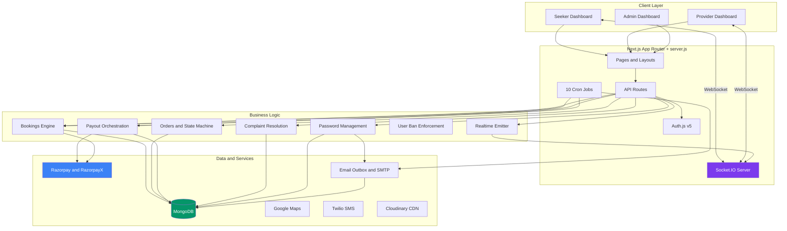

### Booking → Order → Settlement Lifecycle

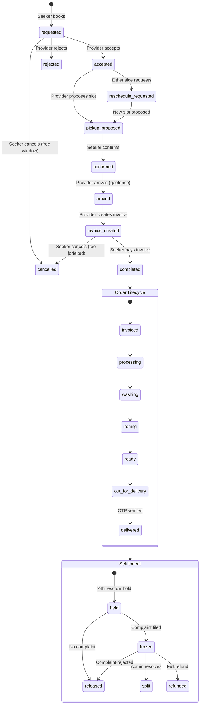

### Data Flow: Payment & Escrow

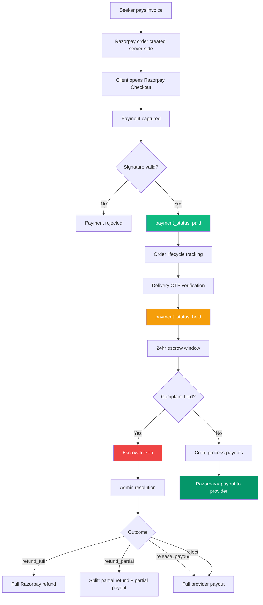

### Cron Job Schedule Map

```mermaid
gantt
    title Cron Job Frequency (per hour)
    dateFormat X
    axisFormat %M min

    section Every 2 min
    process-email-outbox :0, 2

    section Every 5 min
    auto-reject-bookings :0, 5
    no-show :0, 5

    section Every 15 min
    process-payouts :0, 15
    notify-system-alerts :0, 15

    section Every 30 min
    audit-integrity :0, 30
    reconciliation :0, 30

    section Hourly
    monitor-operational-health :0, 60

    section Daily
    monitor-abuse (2 AM) :0, 60
    webhook-cleanup (1 AM) :0, 60
```

### Real-Time Chat System Architecture

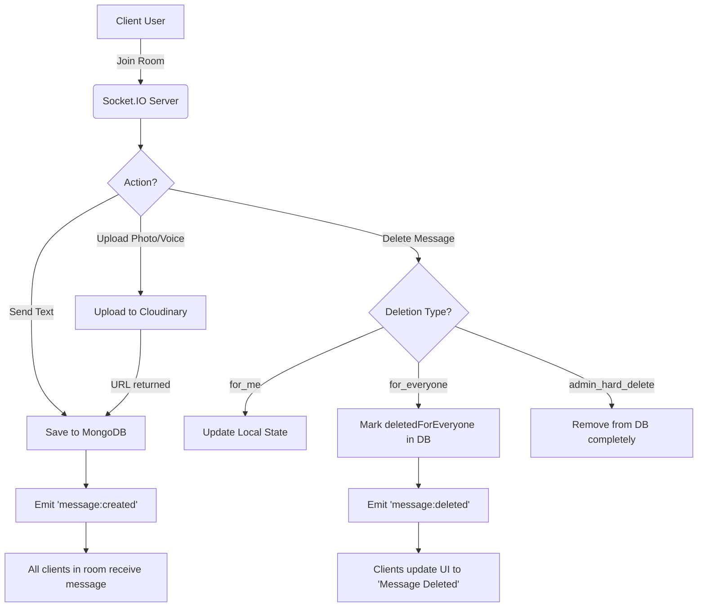

### Database Collection Relationships

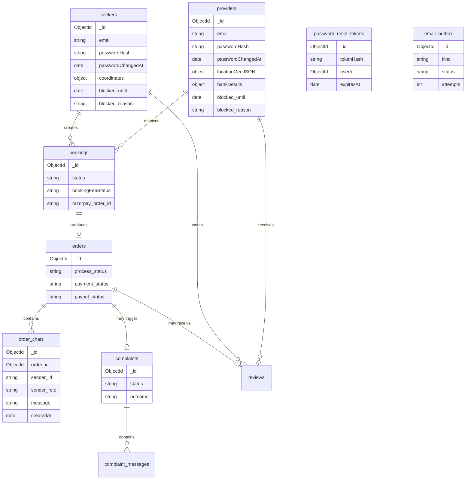

---

## Summary (Rev 15)

LaundryEase is a production-grade laundry marketplace built with:

1. **Trust-First Design** — Escrow payments, OTP-verified delivery, tracked state transitions
2. **Clear Role Separation** — Seeker, Provider, Admin with distinct workflows and dashboards
3. **Robust State Machines** — Booking (10 states, including cancel-at-invoice) and Order (7 process states × 5 payment states) with explicit, enforced transitions
4. **Comprehensive Dispute Resolution** — 3-way real-time Socket.IO complaint chat, commission-aware split settlements, manual fallback for failed auto-actions
5. **Financial Precision** — decimal.js for calculations, paise integers for Razorpay, distributed locks for concurrent safety
6. **Production-Ready Infrastructure** — 10 cron jobs (+ in-process demo runner), operational alerting with clear response targets and owner routing, email outbox with retry (5 types), MongoDB-backed rate limiting, structured logging with secret redaction, and Datadog monitoring
7. **Professional Password Management** — Secure token-based reset (SHA-256, 1-hour expiry), anti-enumeration, branded email notifications, automatic invalidation of old login sessions after a password change (5-minute re-check), and password show/hide controls
8. **Quality Assurance** — 110+ unit test files + 6 end-to-end browser specs, React Compiler, strict TypeScript, 3 CI workflows, only 2 `eslint-disable` comments
9. **Operational Visibility** — Cron run tracking, data integrity checks, abuse monitoring, alert analytics (trend, alert growth, average fix time), and browser security policy reports
10. **Comprehensive SEO** — Next.js App Router metadata API, dynamic per-page metadata (`generateMetadata`), 5 JSON-LD schemas (SoftwareApplication, LocalBusiness, Service, Organization, FAQPage), Schema.org BreadcrumbList for provider pages, XML sitemap (34 routes), robots.txt configuration, OG/Twitter cards, multi-language support
11. **User Ban Enforcement** — Strict authentication-level blocking with descriptive feedback (reason, expiry date) for banned accounts, preventing unauthorized access and enforcing platform guidelines
12. **Real-Time Layer** — Socket.IO server co-hosted with Next.js via `server.js`; JWT-authenticated room joins for **order chat** (`order:<id>`) and **complaint chat** (`complaint:<id>`); supports voice notes, photo uploads, and WhatsApp-style message deletion; per-socket rate limiting; `SocketProvider` context with `useSocket()` hook
13. **Provider Capacity Management** — Atomic capacity checks during booking creation and acceptance, configurable max concurrent bookings per provider
