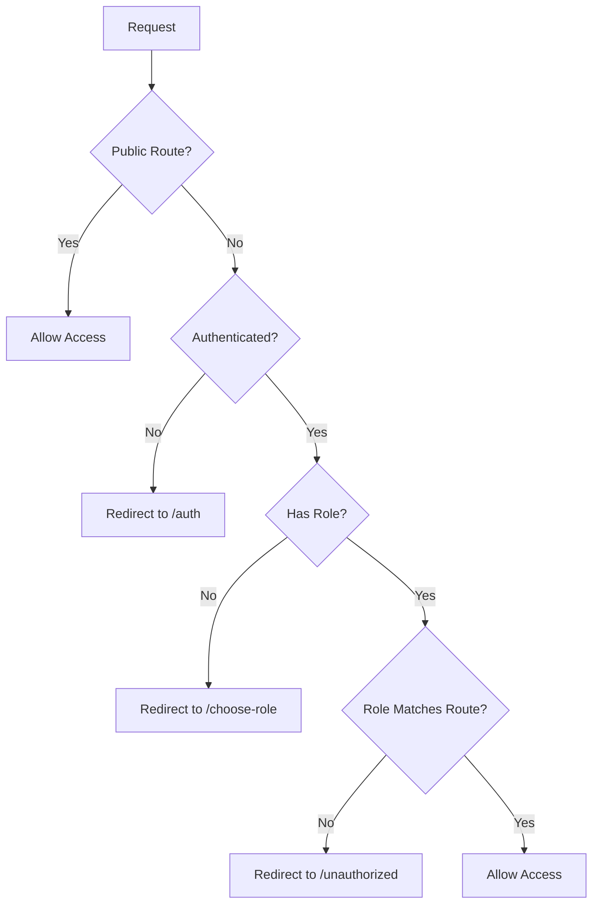
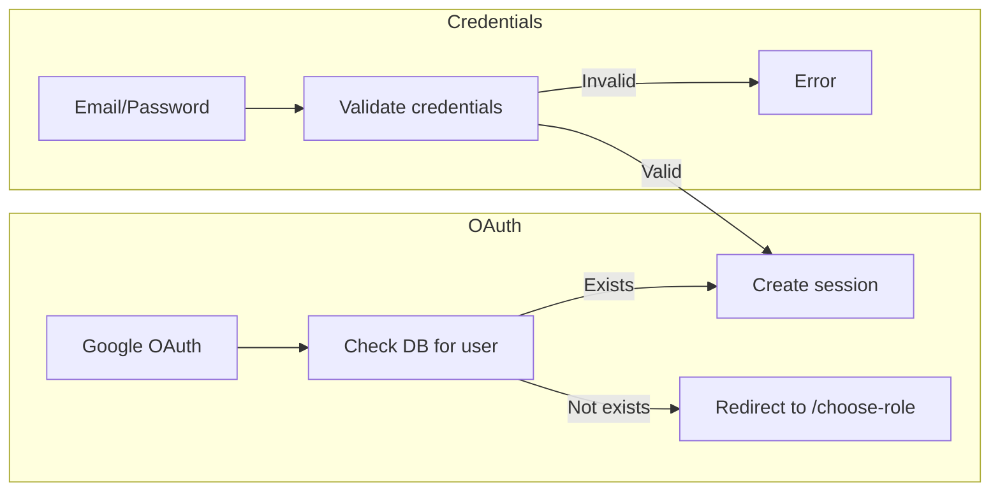
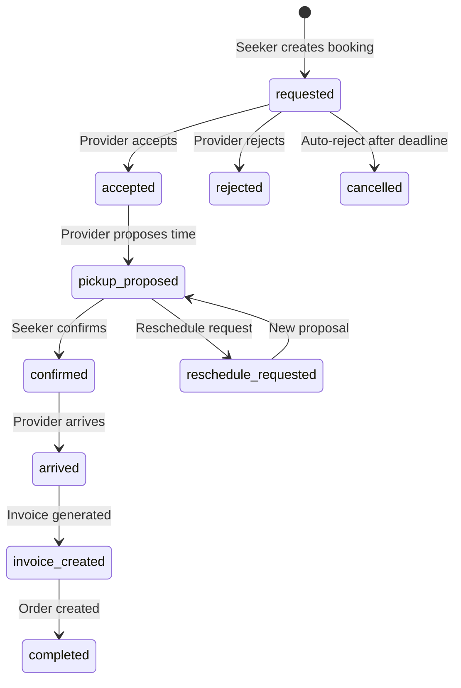
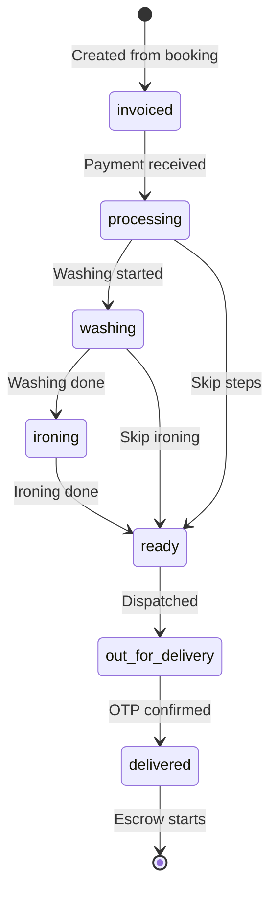
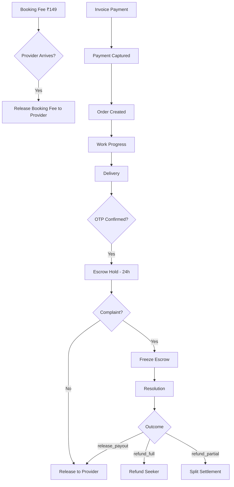
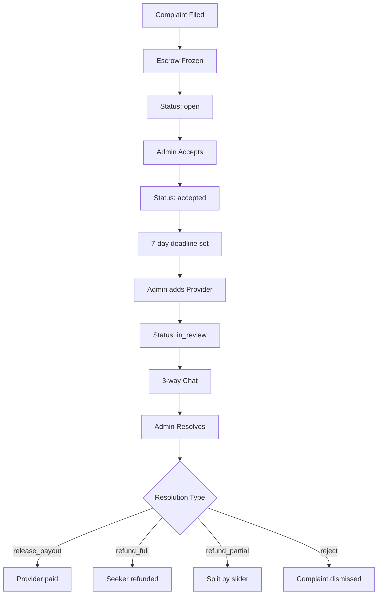

# LaundryEase - Complete Codebase Understanding

## Executive Summary

LaundryEase is a **Next.js 16** full-stack marketplace application that connects laundry service seekers with providers. The platform is distinguished by its **escrow-backed workflow system** that ensures trust between parties through verified payments, tracked order states, and delivery confirmation via OTP.

---

## 1. Technology Stack

### Frontend

| Technology      | Version | Purpose                                    |
| --------------- | ------- | ------------------------------------------ |
| Next.js         | 16.1.6  | Full-stack React framework with App Router |
| React           | 19.2.4  | UI library                                 |
| TypeScript      | 5.x     | Type safety                                |
| Tailwind CSS    | 4.1.18  | Styling                                    |
| Framer Motion   | 12.29.2 | Animations                                 |
| Radix UI        | Latest  | Accessible UI primitives                   |
| shadcn/ui       | 3.8.1   | Component library                          |
| React Hook Form | 7.71.1  | Form handling                              |
| Zod             | 4.3.6   | Schema validation                          |

### Backend

| Technology      | Purpose             |
| --------------- | ------------------- |
| MongoDB         | Primary database    |
| NextAuth.js     | Authentication      |
| Razorpay        | Payment gateway     |
| RazorpayX       | Escrow & payouts    |
| Twilio          | SMS OTP             |
| Nodemailer      | Email notifications |
| Cloudinary      | Image uploads       |
| Google Maps API | Location services   |

### Testing & Quality

| Tool       | Purpose       |
| ---------- | ------------- |
| Vitest     | Unit testing  |
| Playwright | E2E testing   |
| ESLint     | Code linting  |
| TypeScript | Type checking |

---

## 2. Project Architecture

### Directory Structure

```
laundry-ease/
├── app/                          # Next.js App Router
│   ├── (auth)/                   # Auth route group
│   │   ├── verify-email/         # Email verification
│   │   └── verify-phone/         # Phone verification
│   ├── (dashboard)/              # Protected dashboard routes
│   │   ├── admin/                # Admin panel
│   │   ├── provider/             # Provider dashboard
│   │   └── seeker/               # Seeker dashboard
│   ├── (root)/                   # Public landing page
│   ├── actions/                  # Server actions
│   └── api/                      # API routes
├── components/                   # React components
│   ├── ui/                       # Generic UI components
│   ├── navigation/               # Sidebar/navbar components
│   ├── bookings/                 # Booking components
│   ├── orders/                   # Order components
│   ├── provider/                 # Provider-specific
│   ├── seeker/                   # Seeker-specific
│   └── providers/                # Context providers
├── lib/                          # Core business logic
│   ├── api/                      # API utilities
│   ├── auth/                     # Auth helpers
│   ├── bookings/                 # Booking logic
│   ├── complaints/               # Complaint logic
│   ├── db/                       # Database operations
│   ├── ops/                      # Operations/alerting
│   ├── orders/                   # Order logic
│   ├── payouts/                  # Payout logic
│   └── security/                 # Security utilities
├── types/                        # TypeScript types
├── cron/                         # Cron job scripts
├── e2e/                          # E2E tests
└── docs/                         # Documentation
```

### Route Protection Architecture

The application uses a custom proxy middleware ([`proxy.ts`](proxy.ts:1)) for route protection:



---

## 3. Data Models

### User Types

```typescript
// Three user roles defined in types/enums.ts
enum Role {
  SEEKER = "seeker", // Customers seeking laundry services
  PROVIDER = "provider", // Laundry service providers
  ADMIN = "admin", // Platform administrators
}
```

### Core Entities

#### Booking ([`types/bookings.ts`](types/bookings.ts:1))

A booking represents the initial handshake between seeker and provider.

```typescript
type BookingStatus =
  | "requested" // Initial request from seeker
  | "accepted" // Provider accepted
  | "rejected" // Provider rejected
  | "pickup_proposed" // Pickup time proposed
  | "reschedule_requested" // Reschedule in progress
  | "confirmed" // Pickup confirmed
  | "invoice_created" // Invoice generated after inspection
  | "cancelled" // Booking cancelled
  | "completed"; // Booking completed
```

Key fields:

- `bookingFee` - Upfront fee (₹149)
- `bookingFeeStatus` - pending/paid/refunded/forfeited/applied
- `pickupSlot` - Proposed/confirmed pickup time
- `reschedule` - Reschedule metadata
- `arrivedAt` - Provider arrival timestamp

#### Order ([`types/orders.ts`](types/orders.ts:1))

An order is created after invoice payment, representing the actual laundry work.

```typescript
type PaymentStatus =
  | "unpaid" // Invoice not paid
  | "paid" // Payment captured
  | "held" // In escrow after delivery
  | "released" // Paid to provider
  | "refunded"; // Refunded to seeker

type OrderProcessStatus =
  | "invoiced" // Just created from invoice
  | "processing" // Work started
  | "washing" // Washing in progress
  | "ironing" // Ironing in progress
  | "ready" // Ready for delivery
  | "out_for_delivery" // Out for delivery
  | "delivered"; // Delivered & confirmed
```

#### Complaint ([`types/complaints.ts`](types/complaints.ts:1))

Dispute resolution workflow for post-delivery issues.

```typescript
type ComplaintStatus =
  | "open" // Seeker raised, escrow frozen
  | "accepted" // Admin acknowledged
  | "in_review" // Provider added to chat
  | "resolved" // Admin decided
  | "rejected"; // Invalid complaint
```

---

## 4. Authentication & Authorization

### Authentication Flow



### Session Management

- **Strategy**: JWT-based sessions
- **Max Age**: 7 days ([`lib/constants.ts`](lib/constants.ts:71))
- **Provider**: NextAuth.js with MongoDB adapter

### Authorization Middleware ([`lib/api/auth.ts`](lib/api/auth.ts:1))

```typescript
// Role-specific helpers
requireSeeker(); // Requires SEEKER role
requireProvider(); // Requires PROVIDER role
requireAdmin(); // Requires ADMIN role
requireAdminWithDbCheck(); // Extra validation for sensitive operations
```

---

## 5. Business Workflows

### 5.1 Booking Lifecycle



### 5.2 Order Lifecycle



### 5.3 Payment & Escrow Flow



### 5.4 Complaint Resolution



---

## 6. API Architecture

### API Route Structure

```
app/api/
├── admin/              # Admin-only endpoints
│   ├── complaints/     # Complaint management
│   ├── dashboard-stats/# Dashboard statistics
│   ├── payments/       # Payment management
│   ├── refund/         # Refund processing
│   ├── system-alerts/  # System alert management
│   └── users/          # User management
├── auth/               # Authentication
│   └── [...nextauth]/  # NextAuth handler
├── bookings/           # Booking CRUD
│   └── [id]/
│       ├── accept/     # Accept booking
│       ├── arrive/     # Mark arrival
│       ├── cancel/     # Cancel booking
│       ├── chat/       # Booking chat
│       ├── dispute/    # Create dispute
│       ├── invoice/    # Generate invoice
│       ├── pay/        # Pay booking fee
│       ├── pay-invoice/# Pay invoice
│       ├── reject/     # Reject booking
│       └── reschedule/ # Reschedule
├── complaints/         # Complaint endpoints
├── cron/               # Cron job endpoints
├── escrow/             # Escrow management
├── orders/             # Order management
├── payments/           # Payment webhooks
├── providers/          # Provider search
├── reviews/            # Review system
├── signup/             # Registration
└── webhooks/           # Razorpay webhooks
```

### API Security

1. **Origin Validation** ([`lib/security/origin.ts`](lib/security/origin.ts:1))
   - CSRF protection for unsafe methods
   - Allowed origins validation

2. **CSP Headers** ([`lib/security/csp.ts`](lib/security/csp.ts:1))
   - Content-Security-Policy in Report-Only mode
   - Report endpoint at `/api/security/csp-report`

3. **Role-Based Access Control**
   - Middleware-level route protection
   - API-level role validation

---

## 7. Cron Jobs

Defined in [`vercel.json`](vercel.json:1):

| Endpoint                               | Schedule     | Purpose                      |
| -------------------------------------- | ------------ | ---------------------------- |
| `/api/cron/auto-reject-bookings`       | Every 5 min  | Auto-reject expired bookings |
| `/api/cron/no-show`                    | Every 5 min  | Detect no-shows              |
| `/api/cron/process-payouts`            | Every 15 min | Process pending payouts      |
| `/api/cron/audit-integrity`            | Every 30 min | Data integrity checks        |
| `/api/cron/monitor-abuse`              | Daily 2 AM   | Abuse monitoring             |
| `/api/cron/monitor-operational-health` | Hourly       | Health monitoring            |
| `/api/cron/notify-system-alerts`       | Every 15 min | Alert notifications          |

---

## 8. Database Schema

### Collections

| Collection              | Purpose                     |
| ----------------------- | --------------------------- |
| `seekers`               | Seeker user profiles        |
| `providers`             | Provider user profiles      |
| `admins`                | Admin user profiles         |
| `bookings`              | Booking records             |
| `orders`                | Order records               |
| `complaints`            | Complaint records           |
| `reviews`               | Provider reviews            |
| `otp_codes`             | OTP verification codes      |
| `password_reset_tokens` | Password reset tokens       |
| `webhook_events`        | Idempotent webhook tracking |
| `payments`              | Payment records             |
| `refunds`               | Refund records              |
| `email_outbox`          | Email queue                 |
| `system_alerts`         | Operational alerts          |

### Key Indexes ([`lib/db-indexes.ts`](lib/db-indexes.ts:1))

**Unique Constraints:**

- `orders.booking_id` - One order per booking
- `orders.razorpay_order_id` - Payment tracking
- `complaints.order_id` - One complaint per order
- `seekers.email`, `providers.email`, `admins.email` - Unique emails
- `webhook_events.event_id` - Idempotent webhooks

**Geospatial:**

- `providers.locationGeoJSON` - 2dsphere index for location queries

**Operational Query Optimization:**

- `orders.payment_status` - Speeds up escrow aggregations
- `system_alerts.status_severity` - Speeds up dashboard alerts monitoring

**TTL:**

- `otp_codes.expiresAt` - Auto-expire OTPs
- `password_reset_tokens.expiresAt` - Auto-expire tokens

---

## 9. Key Business Constants

From [`lib/constants.ts`](lib/constants.ts:1):

| Constant                           | Value      | Purpose               |
| ---------------------------------- | ---------- | --------------------- |
| `DEFAULT_PLATFORM_COMMISSION_RATE` | 5%         | Platform fee          |
| `BOOKING_FEE_INR`                  | ₹149       | Upfront booking fee   |
| `ESCROW_RELEASE_WINDOW_MS`         | 24 hours   | Escrow hold period    |
| `MIN_PICKUP_ADVANCE_MS`            | 48 hours   | Minimum pickup notice |
| `DELIVERY_OTP_TTL_MS`              | 10 minutes | OTP validity          |
| `COMPLAINT_FILING_WINDOW_MS`       | 24 hours   | Complaint deadline    |
| `SESSION_MAX_AGE_SECONDS`          | 7 days     | Session duration      |

---

## 10. Frontend Architecture

### Component Hierarchy

```
RootLayout (app/layout.tsx)
├── SessionProvider
├── GoogleMapsProvider
├── ThemeProvider
├── InteractiveGridPattern (Background)
├── ToastProvider
│   └── {children}
└── GlobalFooter
```

### Dashboard Layouts

Each role has its own layout:

- [`app/(dashboard)/admin/layout.tsx`](<app/(dashboard)/admin/layout.tsx:1>) - Admin sidebar
- [`app/(dashboard)/provider/layout.tsx`](<app/(dashboard)/provider/layout.tsx:1>) - Provider sidebar
- [`app/(dashboard)/seeker/layout.tsx`](<app/(dashboard)/seeker/layout.tsx:1>) - Seeker topnav

### Key Components

| Component            | Purpose                         |
| -------------------- | ------------------------------- |
| `booking-modal.tsx`  | Create new booking              |
| `chat-interface.tsx` | Booking chat with dispute modal |
| `complaint-chat.tsx` | 3-way complaint chat            |
| `provider-card.tsx`  | Provider search result card     |
| `invoice-form.tsx`   | Invoice generation form         |
| `order-actions.tsx`  | Order status actions            |
| `payment-button.tsx` | Razorpay payment integration    |

---

## 11. External Integrations

### Razorpay Integration ([`lib/razorpay.ts`](lib/razorpay.ts:1))

1. **Order Creation** - Create payment orders
2. **Payment Verification** - Verify signatures
3. **Contact Creation** - Create provider contacts
4. **Fund Account Creation** - Link bank accounts
5. **Payout Processing** - Transfer funds to providers

### Google Maps Integration

- **Places Autocomplete** - Location search
- **Geocoding** - Address to coordinates
- **Distance Calculation** - Provider proximity

### Twilio Integration

- SMS OTP for phone verification
- Delivery OTP notifications

### Cloudinary Integration

- Image uploads for:
  - Provider profile/banner
  - Invoice photos
  - Complaint evidence

---

## 12. Security Features

1. **Authentication**
   - Google OAuth
   - Email/password with bcrypt hashing
   - Session-based JWT tokens

2. **Authorization**
   - Role-based route protection
   - API-level role validation
   - Resource ownership checks

3. **Data Protection**
   - CSP headers
   - HSTS in production
   - X-Frame-Options: DENY
   - X-Content-Type-Options: nosniff

4. **Payment Security**
   - Razorpay signature verification
   - Idempotent webhook processing
   - Escrow hold before release

---

## 13. Testing Strategy

### Unit Tests (Vitest)

- Located alongside source files as `*.test.ts`
- Coverage for business logic, API handlers, utilities

### E2E Tests (Playwright)

- Located in `e2e/` directory
- Critical user journeys:
  - Role-based authentication
  - Complaint workflows
  - Settlement flows

### Test Commands

```bash
npm run test          # Run unit tests
npm run test:e2e      # Run E2E tests
npm run typecheck     # Type checking
npm run lint          # Linting
```

---

## 14. Deployment

### Vercel Configuration

- **Cron Jobs**: Configured in `vercel.json`
- **Headers**: Security headers in `next.config.ts`
- **Images**: Cloudinary remote patterns

### Environment Variables

Required variables (see [`.env.example`](.env.example:1)):

- `GOOGLE_ID`, `GOOGLE_SECRET` - OAuth
- `MONGODB_URI`, `MONGODB_DB` - Database
- `RAZORPAY_KEY_ID`, `RAZORPAY_KEY_SECRET` - Payments
- `TWILIO_ACCOUNT_SID`, `TWILIO_AUTH_TOKEN` - SMS
- `NEXT_PUBLIC_GOOGLE_MAPS_API_KEY` - Maps
- `NEXTAUTH_SECRET` - Session security
- `CRON_SECRET` - Cron endpoint protection

---

## 15. Key Files Reference

| File                                                             | Purpose                     |
| ---------------------------------------------------------------- | --------------------------- |
| [`proxy.ts`](proxy.ts:1)                                         | Route protection middleware |
| [`lib/mongodb.ts`](lib/mongodb.ts:1)                             | Database connection         |
| [`lib/env.ts`](lib/env.ts:1)                                     | Environment validation      |
| [`lib/constants.ts`](lib/constants.ts:1)                         | Business constants          |
| [`lib/payouts.ts`](lib/payouts.ts:1)                             | Payout orchestration        |
| [`lib/razorpay.ts`](lib/razorpay.ts:1)                           | Payment integration         |
| [`lib/orders/status-machine.ts`](lib/orders/status-machine.ts:1) | Order state machine         |
| [`lib/complaints/access.ts`](lib/complaints/access.ts:1)         | Complaint access control    |
| [`lib/db-indexes.ts`](lib/db-indexes.ts:1)                       | Database indexes            |

---

## 16. Current Project Status

From [`README.md`](README.md:319):

**Quality Snapshot (2026-02-21):**

- 99 test files, 468 tests passing (100% Core Route Coverage)
- 3 Playwright E2E specs, 7 critical journeys passing
- All quality gates passing (typecheck, lint, test, build, e2e)
- Strict Escrow Paise Precision Enforced
- System Webhooks fully Mutex-Locked

**Stable Features:**

- Role-based flows (seeker/provider/admin)
- Location-based provider discovery
- Booking → invoicing → payment → delivery → escrow loop
- Complaint system with admin workflow
- Split-settlement support
- Operational health monitoring
- Alert delivery with escalation

**Remaining Opportunities:**

- CSP enforcement mode
- Password-recovery anti-abuse
- Team calendar/on-call integration
- Complaint window extension requests

---

## Summary

LaundryEase is a well-architected laundry marketplace with:

1. **Trust-First Design** - Escrow payments, OTP verification, tracked states
2. **Clear Role Separation** - Seeker, Provider, Admin with distinct workflows
3. **Robust State Machines** - Booking and Order lifecycles with explicit transitions
4. **Comprehensive Dispute Resolution** - 3-way chat, split settlements, deadline tracking
5. **Production-Ready Infrastructure** - Cron jobs, alerting, audit logging, security headers
6. **Quality Assurance** - Unit tests, E2E tests, type safety, linting

The codebase follows modern Next.js patterns with App Router, Server Actions, and a clear separation of concerns between frontend components and backend business logic.
