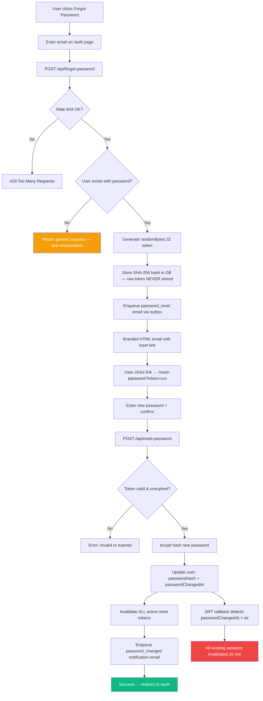
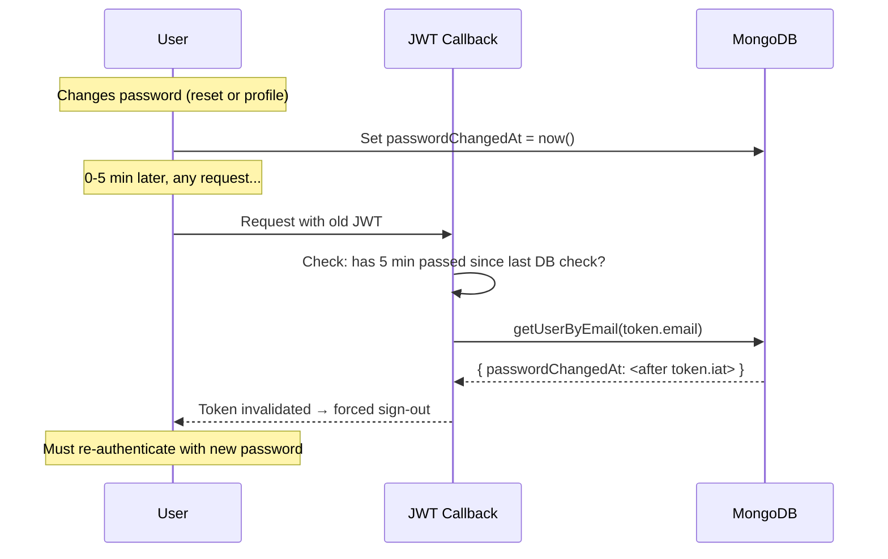

# LaundryEase — Presentation Q&A Helper (Rev 11)

> **Purpose**: This document helps you answer any question your HODs and teachers may ask about your project. Read it fully before your mock presentation.

---

## Table of Contents

1. [Project Overview Questions](#1-project-overview-questions)
2. [Technology Stack Questions](#2-technology-stack-questions)
3. [Architecture & Design Questions](#3-architecture--design-questions)
   - [3B. Code Location Questions](#3b-code-location-questions-where-is-x-written)
4. [Database Questions](#4-database-questions)
5. [Authentication & Security Questions](#5-authentication--security-questions)
6. [Payment & Escrow Questions](#6-payment--escrow-questions)
   - [6B. Location Tracking Questions](#6b-location-tracking-questions)
7. [Core Features Questions](#7-core-features-questions)
8. [API & Backend Questions](#8-api--backend-questions)
9. [Frontend & UI Questions](#9-frontend--ui-questions)
10. [Deployment & DevOps Questions](#10-deployment--devops-questions)
11. [Testing & Quality Questions](#11-testing--quality-questions)
12. [Challenges & Solutions](#12-challenges--solutions)
13. [Future Scope](#13-future-scope)
14. [Quick Technical Terms Glossary](#14-quick-technical-terms-glossary)
15. [Operational Monitoring & Reliability Questions](#15-operational-monitoring--reliability-questions)
16. [Known Gaps vs PRD](#known-gaps-vs-prd-be-honest)
17. [Key Features Implemented](#key-features-implemented-full-system--2026-03-04)

---

## 1. Project Overview Questions

### Q: What is LaundryEase?

**Answer**: LaundryEase is a full-stack web app that connects people who need laundry done (seekers) with people who do laundry (providers). It turns informal laundry deals into clear contracts with safe escrow payments, so both sides are protected.

### Q: What problem does it solve?

**Answer**: It solves three main problems:

1. **Payment worry for providers**: Providers always get paid after they finish the work
2. **Order confusion for seekers**: Seekers see a clear order timeline, not messy chat threads
3. **Trust problems**: The escrow system holds money safely until the service is done and confirmed with OTP

### Q: Who are the target users?

**Answer**: Three types of users:

- **Seekers**: People who need laundry services
- **Providers**: People or small businesses who do laundry work
- **Admins**: People who run the platform, handle problems, and manage the system

### Q: What makes this project different from other solutions?

**Answer**:

1. **Escrow-based payment**: Unlike informal deals, money is locked until delivery is confirmed with OTP
2. **Location matching**: Only providers who serve the seeker's exact area are shown
3. **Proper complaint system**: 3-way chat between Admin, Seeker, and Provider to solve problems fairly
4. **Full record keeping**: Every change is saved for openness and trust
5. **Custom UI throughout**: No native browser `alert()`/`confirm()`/`prompt()` — all confirmations use designed in-app modals that match the app's look and work on keyboard
6. **2-hour cancellation window**: Seekers get a clear, timed free-cancel window; a live countdown badge on the booking card tells them exactly how long they have
7. **Cancel at invoice stage**: Even after the provider has created an invoice, seekers can still cancel using "Cancel & Reject Invoice" — the booking fee is forfeited (provider did physical work), but the seeker is never trapped
8. **Real-time chat**: Booking and complaint conversations update instantly via Socket.IO — no page refresh needed

---

## 2. Technology Stack Questions

### Q: Why did you choose Next.js over MERN stack?

**Answer**: I chose Next.js App Router over normal MERN (MongoDB, Express, React, Node) for these reasons:

| Aspect                    | Next.js (My Choice)                     | Traditional MERN                       |
| ------------------------- | --------------------------------------- | -------------------------------------- |
| **Server-Side Rendering** | Built-in SSR, SSG, ISR                  | Client-only, needs extra setup for SSR |
| **API Routes**            | Built-in, no need for separate server   | Needs separate Express backend         |
| **Routing**               | Based on files, automatic               | Manual React Router setup              |
| **Performance**           | Auto code-splitting, image optimization | Manual optimization needed             |
| **Deployment**            | One-click Vercel deployment             | Many services, more complex            |
| **SEO**                   | Excellent (SSR by default)              | Poor without extra setup               |

**Main benefit**: Next.js gives me a full-stack app in one codebase with API routes, so I don't need a separate Express server. This means less complexity, faster speed, and easier deployment.

### Q: What is your complete tech stack?

**Answer**:

| Layer              | Technology                   | Why                                           |
| ------------------ | ---------------------------- | --------------------------------------------- |
| **Framework**      | Next.js 16.1.6 (App Router)  | Full-stack, SSR, API routes                   |
| **Frontend**       | React 19.2.4, TypeScript 5   | Type safety, modern features                  |
| **Styling**        | Tailwind CSS 4, shadcn/ui    | Fast development, same look everywhere        |
| **Animations**     | Framer Motion                | Smooth, fast animations                       |
| **Database**       | MongoDB 6.21 (native driver) | Flexible data structure, location queries     |
| **Authentication** | NextAuth v4                  | Google OAuth + Credentials support            |
| **Payments**       | Razorpay + RazorpayX         | Indian payment system, escrow payouts         |
| **Maps**           | Google Maps APIs             | Location, address to coordinates, places      |
| **SMS OTP**        | Twilio                       | Dependable SMS sending                        |
| **Email**          | Nodemailer + Email Outbox    | Queued email delivery with retry/backoff. `EMAIL_SEND_IMMEDIATE=1` bypasses queue in dev |
| **Image Upload**   | Cloudinary                   | Fast image storage with CDN                   |
| **Validation**     | Zod 4                        | Check data types while app runs               |
| **Forms**          | React Hook Form              | Fast form handling                            |
| **Data Fetching**  | SWR                          | Client-side data fetching with revalidation   |
| **Logging**        | Pino + pino-pretty           | Structured JSON logging with secret redaction |
| **Financial Math** | decimal.js                   | Precise monetary calculations (no float bugs) |
| **Rate Limiting**  | MongoDB-backed counters      | Per-IP/actor rate limiting with TTL cleanup   |
| **Deployment**     | Vercel                       | Serverless, edge functions, scheduled jobs    |

### Q: Why MongoDB instead of SQL databases like MySQL/PostgreSQL?

**Answer**:

1. **Flexible data structure**: Laundry orders have different items - MongoDB handles this well
2. **Location queries**: Built-in `$geoWithin` and `2dsphere` indexes for finding providers by location
3. **Works like JSON**: Easy mapping between frontend objects and database records
4. **Grows easily**: Can handle more users by adding more servers
5. **Fast to build**: No need to set up tables during early development

### Q: Why native MongoDB driver instead of Mongoose?

**Answer**:

1. **Faster**: Native driver has less overhead than ORM
2. **More control**: Direct access to all MongoDB features
3. **Type safety**: Combined with TypeScript for type checking
4. **Transactions**: Full support for multi-document safe operations
5. **Learning**: I understand raw MongoDB operations, not hidden behind abstraction

### Q: Why TypeScript instead of JavaScript?

**Answer**:

1. **Finds errors early**: Catches mistakes when you write code, not when you run it
2. **Better code editor help**: Autocomplete, refactoring, error highlighting
3. **Code explains itself**: Types show what data looks like
4. **Easier to maintain**: Big codebases become easier to manage
5. **Industry need**: Required skill for professional jobs
6. **SDK types**: We create proper TypeScript interfaces for external SDKs like Razorpay (see `types/razorpay.d.ts`) to get full type safety even with third-party libraries

### Q: Why Razorpay instead of Stripe or PayPal?

**Answer**:

1. **Made for India**: Razorpay works best with Indian payment methods (UPI, cards, net banking)
2. **RazorpayX**: Built-in payout system to send money to provider bank accounts
3. **Lower fees**: Good prices for Indian payments
4. **Already follows rules**: Handles RBI and other Indian rules already
5. **Webhooks**: Sends reliable payment updates to our app

---

## 3. Architecture & Design Questions

### Q: Explain your application architecture

**Answer**: LaundryEase uses a **layered setup**:

```
┌─────────────────────────────────────────────────────────┐
│                    Client (Browser)                      │
├─────────────────────────────────────────────────────────┤
│              Next.js App Router (Frontend)               │
│         Server Components + Client Components            │
├─────────────────────────────────────────────────────────┤
│                  API Routes (Backend)                    │
│    /api/bookings, /api/orders, /api/payments, etc.      │
├─────────────────────────────────────────────────────────┤
│                  Business Logic Layer                    │
│      lib/db.ts, lib/razorpay.ts, lib/audit.ts           │
├─────────────────────────────────────────────────────────┤
│                     Data Layer                           │
│           MongoDB (Native Driver + Transactions)         │
├─────────────────────────────────────────────────────────┤
│                  External Services                       │
│    Razorpay, Twilio, Google Maps, Cloudinary            │
└─────────────────────────────────────────────────────────┘
```

### Q: What design patterns did you use?

**Answer**:

1. **Repository Pattern** (`lib/db/`): One place for all database work, keeping MongoDB code separate from business logic

2. **Factory Pattern** (`lib/api/errors.ts`): Error creation functions like `Errors.notFound()`, `Errors.validation()`

3. **Middleware Pattern** (`lib/api/auth.ts`): `requireAuth()`, `requireSeeker()`, `requireProvider()` to protect routes

4. **Observer Pattern** (Webhooks): Razorpay webhooks watch for payment events and update order status

5. **State Machine** (Booking/Order lifecycle): Clear state changes with checking in `lib/orders/status-machine.ts`

6. **Audit Trail Pattern** (`lib/audit.ts`): Save all changes in the background for record keeping

7. **Policy Pattern** (`lib/bookings/cancellation-policy.ts`): A pure function `evaluateCancellationPolicy()` is the single source of truth for all cancellation/refund decisions — no if-else logic scattered across routes

8. **Headless Component Pattern** (`hooks/use-booking-actions.ts`): The action hook owns network calls; the UI component owns the confirmation dialog. The hook accepts an optional `requestConfirm` callback so the caller decides what the confirm UI looks like

### Q: How do you handle separation of concerns?

**Answer**:

- **`app/`**: Pages and API routes (what users see and call)
- **`components/`**: Reusable UI parts
- **`lib/`**: Business logic, helpers, outside service connections
- **`types/`**: TypeScript type definitions
- **`cron/`**: Scheduled job logic (e.g. payouts)
- **`e2e/`**: End-to-end tests (Playwright)

Each part has one job and doesn't depend much on other parts.

### Q: Explain the App Router structure

**Answer**: Next.js App Router uses file-based routing with special rules:

```
app/
├── (auth)/              # Route group (URL: /verify-email, /verify-phone)
├── (dashboard)/         # Route group (URL: /admin, /provider, /seeker)
│   ├── admin/           # /admin/...
│   ├── provider/        # /provider/...
│   └── seeker/          # /seeker/...
├── api/                 # API routes (REST endpoints)
├── layout.tsx           # Root layout (shared across pages)
└── page.tsx             # Home page (/)
```

- **Route Groups** `()`: Organize files without changing URL
- **Dynamic Routes** `[id]`: URL parts that change like `/orders/[id]`
- **API Routes**: `route.ts` files that handle HTTP requests

---

## 3B. Code Location Questions ("Where is X written?")

### Q: Where is the MongoDB connection code?

**Answer**: `lib/mongodb.ts` - This file handles database connection:

```typescript
// lib/mongodb.ts
import { MongoClient } from "mongodb";
import { env } from "./env";
import { ensureDbIndexes } from "./db-indexes";

declare global {
  var _mongoClientPromise: Promise<MongoClient> | undefined;
  var _mongoIndexInitPromise: Promise<void> | undefined;
}

let clientPromise: Promise<MongoClient> | undefined;

function createClientPromise(): Promise<MongoClient> {
  const client = new MongoClient(env.MONGODB_URI);
  if (process.env.NODE_ENV === "development") {
    // Reuse in dev to avoid too many connections
    if (!global._mongoClientPromise)
      global._mongoClientPromise = client.connect();
    return global._mongoClientPromise;
  }
  return client.connect();
}

export async function getDb() {
  if (!clientPromise) clientPromise = createClientPromise();
  const client = await clientPromise;
  const db = client.db(env.MONGODB_DB);

  if (!global._mongoIndexInitPromise) {
    global._mongoIndexInitPromise = ensureDbIndexes(db);
  }

  await global._mongoIndexInitPromise;
  return { db, client };
}
```

### Q: Where is the backend code written?

**Answer**: Backend code is in **two places**:

| Location   | What It Contains                                  | Example                        |
| ---------- | ------------------------------------------------- | ------------------------------ |
| `app/api/` | API routes (HTTP endpoints)                       | `app/api/bookings/route.ts`    |
| `lib/`     | Business logic, database operations, integrations | `lib/db.ts`, `lib/razorpay.ts` |

**API Routes** (`app/api/`) - Handle HTTP requests:

```text
app/api/
├── bookings/
│   ├── route.ts              → GET /api/bookings, POST /api/bookings
│   └── [id]/
│       ├── route.ts          → GET /api/bookings/:id
│       ├── accept/route.ts   → POST /api/bookings/:id/accept
│       └── cancel/route.ts   → POST /api/bookings/:id/cancel
├── orders/
├── payments/
└── webhooks/
```

**Business Logic** (`lib/`) - Shared functions:

```text
lib/
├── db.ts           → Database CRUD operations
├── razorpay.ts     → Payment integration
├── audit.ts        → Logging changes
├── otp.ts          → OTP generation/verification
├── geocoding.ts    → Location services
└── mongodb.ts      → Database connection
```

### Q: Where is the frontend code?

**Answer**: Frontend is in **three places**:

| Location         | What It Contains            | Example                           |
| ---------------- | --------------------------- | --------------------------------- |
| `app/`           | Pages (Server + Client)     | `app/(dashboard)/seeker/page.tsx` |
| `components/`    | Reusable UI components      | `components/booking-modal.tsx`    |
| `components/ui/` | Base UI components (shadcn) | `components/ui/button.tsx`        |

### Q: Where is authentication code?

**Answer**: Authentication is in multiple files:

| File                                  | Purpose                               |
| ------------------------------------- | ------------------------------------- |
| `app/api/auth/[...nextauth]/route.ts` | NextAuth configuration (providers)    |
| `lib/api/auth.ts`                     | Auth helper functions (`requireAuth`) |
| `app/auth/page.tsx`                   | Login page UI                         |
| `app/choose-role/page.tsx`            | Role selection after OAuth            |

### Q: Where is payment/Razorpay code?

**Answer**:

| File                                   | Purpose                           |
| -------------------------------------- | --------------------------------- |
| `lib/razorpay.ts`                      | Razorpay SDK setup, create orders |
| `app/api/orders/[id]/payment/route.ts` | Payment initiation & verification |
| `app/api/webhooks/razorpay/route.ts`   | Handle Razorpay webhooks          |
| `components/orders/payment-button.tsx` | Payment button UI component       |
| `types/razorpay.d.ts`                  | TypeScript types for Razorpay SDK |

### Q: Where are the database models/schemas?

**Answer**: We use **native MongoDB driver** (no Mongoose), so types are in:

| File                  | What It Defines                     |
| --------------------- | ----------------------------------- |
| `types/bookings.ts`   | Booking interface and status enum   |
| `types/orders.ts`     | Order interface and status enum     |
| `types/complaints.ts` | Complaint interface and status enum |
| `types/provider.ts`   | Provider profile interface          |
| `types/enums.ts`      | Shared enums (Role, etc.)           |

**Example**:

```typescript
// types/bookings.ts
export type BookingStatus =
  | "requested"
  | "accepted"
  | "pickup_proposed"
  | "confirmed"
  | "invoice_created"
  | "completed"
  | "cancelled"
  | "rejected";

export interface PopulatedBooking {
  _id: ObjectId;
  seeker: { name: string; email: string; ... };
  provider: { businessName: string; ... };
  status: BookingStatus;
  // ...
}
```

### Q: Where is the cron job code?

**Answer**: Cron jobs are in **two places**:

| Location               | Purpose                                                        |
| ---------------------- | -------------------------------------------------------------- |
| `app/api/cron/`        | API endpoints that cron calls (10 endpoints)                   |
| `lib/payouts.ts`       | Unified escrow release + payout orchestration logic            |
| `lib/cron-tracking.ts` | Cron run observability (tracks every run in `cron_runs`)       |
| `lib/ops/`             | Operational health, alert delivery, owner routing, analytics   |
| `lib/email-outbox.ts`  | Email queueing with retry/backoff (outbox pattern)             |
| `cron/`                | Script-style background helpers (no-show, auto-reject, legacy) |
| `vercel.json`          | Cron schedule configuration                                    |

**Example flow**:

```text
vercel.json → schedules "/api/cron/process-payouts" every 15 min
    ↓
app/api/cron/process-payouts/route.ts → verifies CRON_SECRET, calls logic
    ↓
lib/payouts.ts (processEligibleEscrowPayouts) → lock + complaint checks + escrow release + payout initiation
```

### Q: Where is environment variable validation?

**Answer**: `lib/env.ts` - Uses Zod to validate all env vars at startup:

```typescript
// lib/env.ts
import { z } from "zod";

const envSchema = z.object({
  MONGODB_URI: z.string().min(1),
  RAZORPAY_KEY_ID: z.string().min(1),
  RAZORPAY_KEY_SECRET: z.string().min(1),
  GOOGLE_ID: z.string().min(1),
  // ... all required variables
});

export const env = envSchema.parse(process.env);
// If any variable is missing, app crashes immediately with clear error
```

### Q: Where is error handling code?

**Answer**: Centralized in `lib/api/`:

| File                  | Purpose                                    |
| --------------------- | ------------------------------------------ |
| `lib/api/errors.ts`   | Custom `AppError` class & helper functions |
| `lib/api/response.ts` | Standard API response helpers              |

**Example**:

```typescript
// lib/api/errors.ts
export class AppError extends Error {
  constructor(
    public readonly code: ErrorCode,
    public readonly statusCode: number,
    message: string,
  ) {
    super(message);
  }
}

// Usage in API route
throw Errors.notFound("Booking"); // 404
throw Errors.unauthorized(); // 401
throw Errors.validation("Bad input"); // 400
```

### Q: Quick Reference - "Where is X?"

| Feature                          | File Location                                               |
| -------------------------------- | ----------------------------------------------------------- |
| MongoDB connection               | `lib/mongodb.ts`                                            |
| Database operations              | `lib/db/` (bookings, orders, users, complaints, escrow)     |
| API routes                       | `app/api/**/*.ts`                                           |
| Frontend pages                   | `app/(dashboard)/**/*.tsx`                                  |
| UI components                    | `components/**/*.tsx`                                       |
| Authentication config            | `app/api/auth/[...nextauth]/route.ts`                       |
| Auth helpers                     | `lib/api/auth.ts`                                           |
| Payment integration              | `lib/razorpay.ts`                                           |
| Payment API                      | `app/api/orders/[id]/payment/route.ts`                      |
| DB index bootstrap               | `lib/db-indexes.ts`                                         |
| Webhooks                         | `app/api/webhooks/razorpay/route.ts`                        |
| OTP logic                        | `lib/otp.ts`                                                |
| Location/Maps                    | `lib/geocoding.ts`                                          |
| Distance calculation             | `lib/distance.ts`                                           |
| Type definitions                 | `types/*.ts`                                                |
| Environment validation           | `lib/env.ts`                                                |
| Business constants               | `lib/constants.ts`                                          |
| Error handling                   | `lib/api/errors.ts`                                         |
| Request validation               | `lib/api/schemas.ts`                                        |
| Rate limiting                    | `lib/api/security.ts`                                       |
| Same-origin protection           | `lib/security/origin.ts`                                    |
| CSP headers                      | `lib/security/csp.ts`                                       |
| Escrow payout engine             | `lib/payouts.ts`                                            |
| Cron job logic                   | `cron/*.ts`                                                 |
| Cron API endpoints               | `app/api/cron/*.ts`                                         |
| Cron run tracking                | `lib/cron-tracking.ts`                                      |
| Audit logging                    | `lib/audit.ts`                                              |
| Structured logging (Pino)        | `lib/logger.ts`                                             |
| Email outbox                     | `lib/email-outbox.ts`                                       |
| Health monitoring                | `lib/ops/health.ts`                                         |
| Alert delivery                   | `lib/ops/alert-delivery.ts`                                 |
| Alert channels                   | `lib/ops/alert-channels.ts`                                 |
| Alert SLA tracking               | `lib/ops/ack-sla.ts`                                        |
| Alert owner routing              | `lib/ops/owner-routing.ts`                                  |
| Alert analytics                  | `lib/ops/alerts-analytics.ts`                               |
| Cloudinary upload                | `lib/cloudinary.ts`                                         |
| Payout calculations              | `lib/payouts/amounts.ts` (decimal.js commission/split math) |
| **Cancellation policy engine**   | `lib/bookings/cancellation-policy.ts`                       |
| **Reschedule request route**     | `app/api/bookings/[id]/reschedule/request/route.ts`         |
| **Pickup schedule route**        | `app/api/bookings/[id]/schedule/route.ts`                   |
| **Confirmation dialog**          | `components/ui/confirm-dialog.tsx`                          |
| **useConfirmDialog hook**        | `components/ui/confirm-dialog.tsx` (exported from same file)|
| **Settlement summary modal**     | `components/ui/settlement-summary-modal.tsx`                |
| **Booking action hook**          | `hooks/use-booking-actions.ts`                              |
| Seeker booking list + tabs       | `app/(dashboard)/seeker/bookings/seeker-booking-list.tsx`   |
| Seeker booking card (countdown)  | `app/(dashboard)/seeker/bookings/seeker-booking-card.tsx`   |
| **Forgot password API**          | `app/api/forgot-password/route.ts`                          |
| **Reset password API**           | `app/api/reset-password/route.ts`                           |
| **Reset password page (UI)**     | `app/reset-password/page.tsx`                               |
| **Password reset email template**| `lib/password-reset-email.ts`                               |
| **Password changed email**       | `lib/password-changed-email.ts`                             |
| **Password policy rules**        | `lib/auth/password-policy.ts`                               |
| **Provider password service**    | `lib/services/provider-password.ts`                         |
| **Seeker profile (pwd change)**  | `app/api/profile/seeker/route.ts`                           |
| **Provider profile (pwd change)**| `app/api/profile/provider/route.ts`                         |
| **JWT session invalidation**     | `app/api/auth/[...nextauth]/route.ts` (jwt callback)        |
| **BaseUser type (passwordChangedAt)** | `types/users.ts`                                       |

---

## 4. Database Questions

### Q: What collections do you have?

**Answer**: Key MongoDB collections:

| Collection              | Purpose                                             |
| ----------------------- | --------------------------------------------------- |
| `seekers`               | User profiles for service seekers                   |
| `providers`             | Provider profiles with location, services, capacity |
| `admins`                | Admin user accounts                                 |
| `bookings`              | Request and negotiation records                     |
| `orders`                | Final orders with payment info                      |
| `complaints`            | Problem records with chat messages                  |
| `reviews`               | Provider ratings and feedback                       |
| `payments`              | Payment records                                     |
| `refunds`               | Refund records from Razorpay                        |
| `audit_logs`            | Full history of all changes                         |
| `webhook_events`        | Incoming webhook records (idempotent by event_id)   |
| `email_outbox`          | Queued emails with retry/backoff tracking           |
| `system_alerts`         | Operational alerts (health, payout, complaint)      |
| `cron_runs`             | Cron job execution history                          |
| `otp_codes`             | OTP verification codes (TTL auto-expired)           |
| `password_reset_tokens` | Password reset tokens (TTL auto-expired)            |
| `api_rate_limits`       | Rate limit counters (TTL auto-expired)              |

### Q: How do you handle database connections?

**Answer**: Connection pooling with one shared connection:

```typescript
// lib/mongodb.ts
import { ensureDbIndexes } from "./db-indexes";

let clientPromise: Promise<MongoClient> | undefined;

export async function getDb() {
  if (!clientPromise) clientPromise = createClientPromise();
  const client = await clientPromise;
  const db = client.db(env.MONGODB_DB);

  // One-time startup index initialization
  if (!global._mongoIndexInitPromise) {
    global._mongoIndexInitPromise = ensureDbIndexes(db);
  }
  await global._mongoIndexInitPromise;

  return { db, client };
}
```

This stops too many connections from being created when the app reloads during development.

### Q: How do you handle geospatial queries?

**Answer**: MongoDB's `2dsphere` index with `$geoWithin`:

```typescript
// Find providers who serve the seeker's location
const providers = await db.collection("providers").find({
  coordinates: {
    $geoWithin: {
      $centerSphere: [
        [seekerLng, seekerLat],
        radius_km / 6378.1, // Convert km to radians
      ],
    },
  },
});
```

Providers save their `coordinates` and `radius_km`. The query finds all providers whose service area includes the seeker's location.

### Q: Do you use database transactions?

**Answer**: Yes, for important operations like creating bookings:

```typescript
// Check capacity AND create booking at the same time (safely)
await session.withTransaction(async () => { {
  const activeCount = await db.collection("bookings").countDocuments(
    { provider_id, status: { $in: ["requested", "accepted", ...] } },
    { session }
  );

  if (activeCount >= provider.capacity) {
    throw new Error("CAPACITY_EXCEEDED");
  }

  await db.collection("bookings").insertOne(booking, { session });
});
```

This stops race conditions where many bookings could go past the provider's limit at the same time.

---

## 5. Authentication & Security Questions

### Q: How does authentication work?

**Answer**: NextAuth v4 with three ways to sign in:

1. **Google OAuth**: Sign in with Google accounts
2. **Credentials**: Email/password with bcrypt password hashing
3. **Magic Link**: Email-based passwordless login via JWT token (24-hour expiry)

```mermaid
flowchart TD
    Start([User Visits /auth]) --> Choice{Auth Method?}
    Choice -->|Google OAuth| G1[NextAuth Google Provider]
    Choice -->|Email/Password| C1[Enter Credentials]
    Choice -->|Magic Link| M1[Enter Email]

    G1 --> G2{Existing User?}
    G2 -->|Yes| Dashboard[Role Dashboard]
    G2 -->|No| ChooseRole[/choose-role → /complete-signup]
    ChooseRole --> Dashboard

    C1 --> C2{Valid?}
    C2 -->|Yes| Dashboard
    C2 -->|No| C3[Error Message]

    M1 --> M2[JWT Token Email → Verify]
    M2 --> Dashboard

    style Dashboard fill:#059669,color:#fff
    style C3 fill:#ef4444,color:#fff
```

**Session management**: JWT tokens with 7-day max age. JWT callback periodically re-checks the database (every 5 minutes) for role changes or password invalidation.

### Q: How do you protect routes?

**Answer**: Server-side check functions:

```typescript
// lib/api/auth.ts
export async function requireSeeker(): Promise<AuthResult> {
  return requireAuth([Role.SEEKER]);
}

// Usage in API route
export const POST = withErrorHandling(async (req: Request) => {
  const session = await requireSeeker(); // Throws error if not a seeker
  // ... route logic
});
```

### Q: How do you handle password security?

**Answer**:

- **Bcrypt hashing**: Passwords are scrambled with bcrypt (10 rounds)
- **No plain text storage**: Only the hash is saved
- **Safe comparison**: Uses timing-safe check to prevent attacks
- **Password confirmation**: Users must type password twice during signup and reset
- **Strength requirements**: Enforced client-side and server-side:
  - Minimum 8 characters
  - At least one uppercase letter
  - At least one number
  - At least one special character
- **Real-time validation**: Users see password strength indicators as they type
- **Password show/hide toggles**: On reset page, signup, and profile pages

```typescript
const isValid = await bcrypt.compare(password, user.passwordHash);
```

### Q: How does the forgot password / password reset flow work?

**Answer**: A professional, modern forgot-password system with multiple security layers:



**Key security features**:

| Feature | Implementation |
| --- | --- |
| **Token security** | `randomBytes(32)` for token; only SHA-256 hash stored in DB |
| **Token expiry** | 1-hour TTL with MongoDB TTL index auto-cleanup |
| **Anti-enumeration** | Same generic "If an account exists..." response for existing and non-existing emails |
| **Rate limiting** | Per-IP (10/15min) + per-email (4/hour) on forgot; per-IP (15/15min) + per-token (6/hour) on reset |
| **Session invalidation** | `passwordChangedAt` written → JWT re-check every 5 min invalidates stale tokens |
| **Token invalidation** | All active tokens for user marked used on successful reset |
| **Notification** | Branded "password changed" security email sent after every change |
| **Client-side** | 60-second cooldown on resend, generic messages, 429 special handling |

> "We never store the raw reset token — only its SHA-256 hash. So even if someone gets database access, they can't use the tokens. The raw token only exists in the email link."

### Q: How does session invalidation work after a password change?

**Answer**: We use periodic JWT re-checking:



The JWT callback checks `_lastDbCheck` timestamp. If ≥5 minutes have passed, it queries MongoDB for the user's `passwordChangedAt`. If that timestamp is newer than the token's `iat` (issued-at), the token is wiped — NextAuth reports `unauthenticated` and the user is redirected to sign in.

**Trade-off**: This is not instant (up to 5-minute delay) but avoids the complexity and DB load of a stateful session store. For a payment platform, this is an acceptable balance.

### Q: Can users change their password while signed in?

**Answer**: Yes — both seekers and providers can change passwords from their profile page:

1. Enter current password (verified via `bcrypt.compare`)
2. Enter new password (validated against password policy)
3. System sets `passwordHash`, `passwordChangedAt`, and `updatedAt` atomically
4. Sends "password changed" security notification email via outbox
5. JWT re-check invalidates old sessions within 5 minutes

For providers, the password verification logic is extracted into `lib/services/provider-password.ts` as a reusable service.

### Q: How do you prevent common security problems?

**Answer**:

| Problem             | How We Prevent It                                                                 |
| ------------------- | --------------------------------------------------------------------------------- |
| **SQL Injection**   | Not possible (MongoDB), but we clean all inputs with Zod                          |
| **XSS**             | React escapes output by default                                                   |
| **CSRF-like abuse** | Same-origin guard (`requireSameOrigin`) on unsafe API methods                     |
| **CSP hardening**   | Report-Only CSP headers + `/api/security/csp-report` telemetry endpoint           |
| **Timing Attacks**  | `crypto.timingSafeEqual()` for checking signatures                                |
| **Fake Webhooks**   | HMAC signature check                                                              |
| **Wrong Access**    | Role checks on every protected route                                              |
| **User Enumeration**| Forgot-password returns generic response regardless of email existence             |
| **Token Theft**     | Reset tokens stored as SHA-256 hash (raw never persisted), 1hr TTL                |
| **Stale Sessions**  | JWT re-check every 5 min invalidates tokens after password change                 |
| **Brute Force**     | MongoDB-backed rate limiting (per-IP + per-email/token buckets)                   |

### Q: How do you check webhook signatures?

**Answer**:

```typescript
// Safe time-equal comparison prevents timing attacks
if (!/^[a-f0-9]{64}$/i.test(webhookSignature)) {
  return NextResponse.json({ error: "Invalid signature" }, { status: 401 });
}

const expectedSignature = crypto
  .createHmac("sha256", env.RAZORPAY_KEY_SECRET)
  .update(webhookBody)
  .digest("hex");

if (
  !crypto.timingSafeEqual(
    Buffer.from(webhookSignature, "hex"),
    Buffer.from(expectedSignature, "hex"),
  )
) {
  return NextResponse.json({ error: "Invalid signature" }, { status: 401 });
}
```

---

## 6. Payment & Escrow Questions

### Q: Explain the escrow system

**Answer**: The escrow system makes sure payments are safe:

```
1. Seeker pays for order
   ↓
2. Payment is captured and stored as payment_status: "paid"
   ↓
3. Provider finishes work and delivers
   ↓
4. Seeker confirms with OTP
   → payment_status: "held"
   → escrow_started_at + escrow_release_at are set
   ↓
5. 24-hour waiting period
   ↓
6. If no complaint and timer elapsed:
   unified payout processor releases escrow and initiates RazorpayX payout
   ─ OR ─
   If complaint raised: Escrow frozen until admin decides
```

### Q: What is RazorpayX?

**Answer**: RazorpayX is Razorpay's service for sending money to bank accounts. I use it to:

1. Create a "Contact" (provider's info)
2. Create a "Fund Account" (provider's bank details)
3. Send automatic payouts when escrow releases

### Q: How do you prevent double payouts?

**Answer**: Many safety checks:

```typescript
// 1. Already paid out? stop
if (order.payout_id) {
  return { status: "already_paid_out" };
}

// 2. Acquire payout lock (or fail fast if another worker holds it)
const lock = await db.collection("orders").updateOne(
  {
    _id: order._id,
    payout_id: { $exists: false },
    $or: [
      { payout_lock_at: { $exists: false } },
      { payout_lock_at: { $lt: staleCutoff } },
    ],
  },
  { $set: { payout_lock_at: now, payout_status: "processing" } },
);
if (lock.modifiedCount === 0) return { status: "already_processing" };

// 3. Final write still requires payout_id not set
await db
  .collection("orders")
  .updateOne(
    { _id: order._id, payout_id: { $exists: false } },
    { $set: { payout_id: payout.id, payout_status: "processing" } },
  );

// 4. Razorpay reference_id protects against accidental duplicates too
await createRazorpayPayout({
  reference_id: order._id.toString(),
});
```

### Q: What happens if a payment fails?

**Answer**:

1. Webhook gets `payment.failed` event
2. Payment status is updated in database
3. User can retry payment from their dashboard
4. No double payouts; each payment try is checked by signature and matched via webhooks

### Q: How does the split settlement math work? (Advanced)

**Answer**: We use a strict "Commission First" logic:

```typescript
// 1. Calculate Distributable Amount
// Total - Platform Commission (5%) = Distributable
const total = 500;
const commission = 25; // 5%
const distributable = 475;

// 2. Apply Refunds (if any)
// If admin refunds 100 to seeker:
const seekerRefund = 100;
const providerPayout = distributable - seekerRefund; // 375

// Result:
// Platform keeps: 25 (Commission is protected)
// Seeker gets: 100
// Provider gets: 375
```

### Q: What if the cron job fails?

**Answer**: The system is designed to be **self-healing**:

1. **Idempotency**: All payout functions check `payout_id` before running. Running the same job twice does nothing safe.
2. **Next Run**: The cron runs every hour. If it fails or times out, the next run will pick up any pending "held" orders that have passed their 24h window.
3. **Manual Trigger**: Admins can manually trigger `POST /api/cron/process-payouts` if needed.

### Q: Why is commission deducted even on rejected complaints?

**Answer**: The platform fee covers the service of hosting the booking, processing the payment, and handling the dispute. Even if a complaint is invalid, the platform provided its infrastructure. The provider receives the full _distributable_ amount, which is the fair share agreed upon by using the platform.

### Q: How does the complaint affect escrow?

**Answer**:

- **Complaint raised** → Escrow timer stops right away
- **Admin accepts** → Case enters `accepted` with a response deadline (Admin + Seeker chat)
- **Admin adds provider** → Case moves to `in_review` and becomes 3-way chat
- **Result**:
  - `release_payout`: Pay provider full distributable amount
  - `refund_partial`: Slider-based split between seeker and provider (commission already retained)
  - `refund_full`: Full distributable amount to seeker (provider gets 0)
  - `reject`: Invalid complaint, pay provider (minus standard commission). Case is hidden from ongoing lists.

### Q: Walk me through the complete payment flow (step by step)

**Answer**: Here's the complete payment integration:

```text
1. INVOICE APPROVAL
   Seeker clicks "Approve & Pay" on invoice
   ↓
2. CREATE RAZORPAY ORDER (Backend)
   POST /api/orders/{id}/payment
   → Backend creates Razorpay order with amount
   → Returns: order_id, key, amount, currency
   → Legacy aliases still supported: /api/orders/{id}/pay and /api/orders/{id}/payment/init
   ↓
3. OPEN RAZORPAY CHECKOUT (Frontend)
   const rzp = new window.Razorpay(options);
   rzp.open();
   → User sees Razorpay payment popup
   → User pays via UPI/Card/Net Banking
   ↓
4. PAYMENT SUCCESS CALLBACK (Frontend)
   handler: async (response) => {
     // response has: razorpay_order_id, razorpay_payment_id, razorpay_signature
   }
   ↓
5. VERIFY SIGNATURE (Backend)
   PUT /api/orders/{id}/payment
   → Backend verifies HMAC signature
   → Legacy alias still supported: POST /api/orders/{id}/payment/verify
   → generated_signature = HMAC_SHA256(order_id + "|" + payment_id, secret)
   → Compare with razorpay_signature
   ↓
6. UPDATE DATABASE
   → payment_status: "paid"
   → Save razorpay_payment_id
   ↓
7. DELIVERY CONFIRMATION (OTP)
   POST /api/orders/{id}/confirm-delivery OR /api/orders/{id}/otp/verify
   → payment_status moves to "held"
   → escrow_started_at + escrow_release_at set
   ↓
8. WEBHOOK BACKUP (Async)
   Razorpay sends webhook to /api/webhooks/razorpay
   → Verify webhook signature
   → Deduplicate by event_id in webhook_events
   → Reconcile orders/bookings/payments/refunds idempotently
```

**Code example (Frontend - invoice-review-form.tsx)**:

```typescript
const options: RazorpayOptions = {
  key: payData.key,
  amount: payData.amount,
  currency: payData.currency,
  name: "LaundryEase",
  description: `Payment for Order #${orderId}`,
  order_id: payData.id,
  handler: async function (response: RazorpayResponse) {
    // Verify payment on backend
    const verifyRes = await fetch(`/api/orders/${orderId}/payment`, {
      method: "PUT",
      body: JSON.stringify({
        razorpay_order_id: response.razorpay_order_id,
        razorpay_payment_id: response.razorpay_payment_id,
        razorpay_signature: response.razorpay_signature,
      }),
    });
  },
};
const rzp = new window.Razorpay(options);
rzp.open();
```

### Q: How do you verify payment signature is genuine?

**Answer**: HMAC-SHA256 signature verification:

```typescript
// Backend verification (lib/razorpay.ts)
import crypto from "crypto";

function verifyPaymentSignature(
  orderId: string,
  paymentId: string,
  signature: string,
): boolean {
  if (!/^[a-f0-9]{64}$/i.test(signature)) return false;

  const body = orderId + "|" + paymentId;
  const expectedSignature = crypto
    .createHmac("sha256", env.RAZORPAY_KEY_SECRET)
    .update(body)
    .digest("hex");

  return crypto.timingSafeEqual(
    Buffer.from(signature, "hex"),
    Buffer.from(expectedSignature, "hex"),
  );
}
```

**Why this works**:

- Only Razorpay knows the secret key
- If signature matches, payment is genuine
- `timingSafeEqual` prevents timing attacks

### Q: What are webhooks and why do you need them?

**Answer**: Webhooks are HTTP callbacks Razorpay sends when events happen:

| Event                                     | When It Fires               | What We Do                               |
| ----------------------------------------- | --------------------------- | ---------------------------------------- |
| `payment.authorized` / `payment.captured` | Payment authorized/captured | Reconcile payment + order/booking status |
| `payment.failed`                          | Payment failed              | Update error state, allow retry          |
| `refund.created`                          | Refund initiated            | Reconcile refund + order/booking status  |
| `payout.processed`                        | Provider payout completed   | Mark payout as done                      |

**Why webhooks are needed**:

1. User might close browser after payment
2. Network might fail during callback
3. Webhooks are the "source of truth" from Razorpay
4. Webhooks can retry if our server is down

---

## 6B. Location Tracking Questions

### Q: How do you track user location?

**Answer**: We use **Google Maps APIs** for location features:

| API                 | Purpose                                     |
| ------------------- | ------------------------------------------- |
| **Places API**      | Address autocomplete when user types        |
| **Geocoding API**   | Convert address text → latitude/longitude   |
| **Maps JavaScript** | Display interactive map on provider profile |

**Flow when seeker searches**:

```text
1. Seeker types address in search box
   ↓
2. Places Autocomplete shows suggestions
   → Uses Google Places API
   ↓
3. Seeker selects an address
   ↓
4. Geocoding API converts to coordinates
   → "123 Main St, Mumbai" → { lat: 19.076, lng: 72.877 }
   ↓
5. Store coordinates in seeker profile
   → db.seekers.updateOne({ coordinates: { lat, lng } })
   ↓
6. Search for providers
   → MongoDB geospatial query finds matching providers
```

### Q: How does provider location matching work?

**Answer**: Providers set a **service radius** (e.g., 5 km). We use MongoDB's geospatial queries:

```typescript
// lib/geocoding.ts + MongoDB query
const providers = await db.collection("providers").find({
  isApproved: true,
  coordinates: {
    $geoWithin: {
      $centerSphere: [
        [seekerLng, seekerLat], // Seeker's location
        radiusInKm / 6378.1, // Convert km to radians (Earth radius)
      ],
    },
  },
});
```

**Visual explanation**:

```text
Provider sets: coordinates = [72.87, 19.07], radius = 5km

                    5km radius
                   ╭─────────╮
                  ╱           ╲
                 │  Provider   │
                 │     ⦿       │  ← Provider's location
                 │   Seeker ✓  │  ← Seeker inside radius (MATCH!)
                  ╲           ╱
                   ╰─────────╯

Seeker outside radius → NOT shown in results
```

### Q: How do you calculate delivery charges based on distance?

**Answer**: Using the **Haversine formula** (calculates distance on a sphere):

```typescript
// lib/distance.ts
export function calculateDistance(
  lat1: number,
  lon1: number,
  lat2: number,
  lon2: number,
): number {
  const R = 6371; // Earth's radius in km
  const dLat = toRadians(lat2 - lat1);
  const dLon = toRadians(lon2 - lon1);

  const a =
    Math.sin(dLat / 2) * Math.sin(dLat / 2) +
    Math.cos(toRadians(lat1)) *
      Math.cos(toRadians(lat2)) *
      Math.sin(dLon / 2) *
      Math.sin(dLon / 2);

  const c = 2 * Math.atan2(Math.sqrt(a), Math.sqrt(1 - a));
  return R * c; // Distance in km
}

// Usage for delivery charges
const distance = calculateDistance(
  providerLat,
  providerLng,
  seekerLat,
  seekerLng,
);
const freeRadius = provider.freeDeliveryRadius; // e.g., 2km
const extraDistance = Math.max(0, distance - freeRadius);
const deliveryCharge = extraDistance * provider.perKmCharge; // e.g., ₹10/km
```

### Q: What is a 2dsphere index and why do you use it?

**Answer**: It's a MongoDB index optimized for **spherical geometry** (Earth is a sphere):

```typescript
// lib/setup-geospatial-index.ts
await db
  .collection("providers")
  .createIndex(
    { coordinates: "2dsphere" },
    { name: "provider_location_2dsphere" },
  );
```

**Why we need it**:

- Without index: MongoDB scans ALL providers (slow)
- With 2dsphere index: MongoDB quickly finds nearby providers
- Handles Earth's curvature correctly (not flat geometry)

**Performance difference**:

- Without index: 500ms for 10,000 providers
- With index: 5ms for 10,000 providers

---

## 7. Core Features Questions

### Q: Explain the booking lifecycle

**Answer**:

```
requested → accepted → pickup_proposed → confirmed → invoice_created → completed
    ↓           ↓             ↓               ↓             ↓ ↓
 rejected   cancelled   reschedule_requested  ↩         cancelled  Order created
                             ↓                          (fee forfeited)
                     (back to propose/confirm loop)
```

**What each state means**:

- `requested`: Seeker asked for a booking
- `accepted`: Provider said yes, booking fee collected
- `pickup_proposed`: Provider suggested a pickup time slot
- `reschedule_requested`: Either side asked for a new time (stores who asked, reason, previous slot)
- `confirmed`: Both agreed on pickup time
- `invoice_created`: Provider made invoice after arrival and inspection
- `completed`: Invoice paid, order created

**Cancellation Policy** (2-hour free-cancel window):

- Seeker cancels **within 2 hours** of booking creation → booking fee **refunded**
- Seeker cancels **after 2 hours** (before slot time) → booking fee **forfeited**
- Seeker tries to cancel **at or after the slot time** → **blocked** at API level
- **Seeker cancels at `invoice_created` stage** → **always allowed; fee always forfeited** — the slot time guard is bypassed because the provider has already physically collected and inspected the items; the button label changes to **"Cancel & Reject Invoice"** and a fee-forfeit warning appears in the confirm dialog
- Provider cancels → **always** refunds booking fee to seeker
- A **live countdown badge** on the seeker's booking card ticks every 10 seconds so they know exactly how long they have left

**Invoice Review Flow**:

- Seeker can view invoice details (items, photos, pricing)
- Seeker can **approve** invoice and pay → Order created
- Seeker can **reject** invoice with reason → Items returned to provider (fee forfeited)
- Seeker can **cancel & reject invoice** (new) → Booking cancelled, fee forfeited — for when the seeker wants to walk away entirely after seeing the invoice
- Past invoices viewable in read-only mode from payment history

**Reschedule flow details**:

- Either party calls `POST /api/bookings/[id]/reschedule/request`
- Status becomes `reschedule_requested`; the system stores `reschedule.requestedBy`, `reason`, and `previousPickupSlot` and **clears** `pickupSlot.confirmedAt` using MongoDB `$unset` (not `$set: undefined`)
- Provider then proposes a new slot via `POST .../schedule` (propose path); seeker confirms via the same route (confirm path)
- Both propose and confirm DB writes are **atomic with status guards** to prevent race conditions

### Q: Explain the order lifecycle

**Answer**:

```
invoiced → processing → washing → ironing → ready → out_for_delivery → delivered
```

After `delivered`:

- OTP confirmed → Escrow starts 24-hour timer
- No complaint → Money goes to provider
- Complaint → Freeze and admin looks at it

### Q: How does provider capacity work?

**Answer**: Providers set a `capacity` (max jobs at once). Before accepting:

```typescript
const activeJobs =
  bookings.count({ status: active }) + orders.count({ status: active });
if (activeJobs >= provider.capacity) {
  throw new Error("CAPACITY_EXCEEDED");
}
```

This is checked in a transaction so many requests can't break the limit at the same time.

### Q: How does location-based discovery work?

**Answer**:

1. Seeker types their address
2. Google Geocoding API changes it to coordinates
3. MongoDB query finds providers whose `radius_km` covers that point
4. Results sorted by distance using Haversine formula (Earth distance math)
5. Delivery charges based on distance beyond the free radius

### Q: How does the complaint system work?

**Answer**:

```
Seeker raises complaint (status: "open")
    ↓
Admin reviews and accepts (status: "accepted", deadline set)
    ↓
Admin adds provider to chat (status: "in_review")
    ↓
3-way chat to solve the problem
    ↓
Admin decides with payout/refund split (status: "resolved" or "rejected")
    ↓
Escrow action done (release, partial split, or seeker full distributable award)
```

Note: The 24-hour complaint window is enforced in `POST /api/complaints` using delivery timestamps (`otp_confirmed_at` / `escrow_started_at`).

**Settlement details modal**: When admin resolves a complaint, instead of an ugly browser `alert()`, the UI shows a `SettlementSummaryModal` with:
- Provider payout card: name, UPI ID, bank account/IFSC, email
- Seeker refund card: name, payment method, VPA/bank/wallet/card details
- **Manual transfer warning** banner if Razorpay auto-transfer failed (shown in amber)
- Auto vs Manual badge on each party card

Operational detail from current code:

- Seeker/provider complaint menus show only ongoing cases (`open`, `accepted`, `in_review`).
- Provider sees complaint navigation only after admin grants provider access.
- After `resolved`/`rejected`, seeker/provider chat input is locked and the thread is archived in UI.

---

### Q: How does real-time chat work?

**Answer**: LaundryEase uses **Socket.IO** for live message delivery in booking chat and complaint chat. Here's how it works end-to-end:

**Server side** (`server.js`):

```
HTTP Server (Node.js)
  ├── Next.js request handler  (all normal pages + API routes)
  └── Socket.IO Server         (WebSocket upgrades on /socket.io)
        ├── Auth middleware: getToken() from next-auth/jwt on every connection
        ├── booking:join    → authorizeBookingRoom() → DB check → join room
        ├── complaint:join  → authorizeComplaintRoom() → DB check + access gate → join room
        ├── typing:start/stop → relay to room
        └── disconnect
```

**Client side** (`components/providers/socket-provider.tsx`):
- `SocketProvider` wraps the dashboard layout and creates one Socket.IO connection per authenticated session
- `useSocket()` hook gives any component access to `{ socket, isConnected, isReconnecting }`
- When a message is sent via REST API (`POST /api/bookings/[id]/chat`), the route handler calls `emitBookingMessage()` from `lib/realtime/emitter.ts` which pushes the `booking:message:created` event to the room

**Security**:
- Every socket connection is authenticated via NextAuth JWT — no connection without a valid session
- Room joins are verified against MongoDB — you can only join a room for a booking/complaint you participate in
- Provider can only join a complaint room after an admin explicitly grants access (`provider_access_granted = true`)
- Per-socket rate limiting: 20 join events per 60 seconds per connection

**Events** (defined in `lib/realtime/contracts.js`):

| Direction | Event | Purpose |
| --- | --- | --- |
| Client → Server | `booking:join` / `complaint:join` | Enter a chat room |
| Client → Server | `room:leave` | Leave a room |
| Client → Server | `typing:start` / `typing:stop` | Typing indicator |
| Server → Client | `booking:message:created` | New booking chat message pushed live |
| Server → Client | `complaint:message:created` | New complaint chat message pushed live |
| Server → Client | `complaint:state:updated` | Complaint status change (e.g., provider added) |

---

## 8. API & Backend Questions

### Q: How are your API routes organized?

**Answer**: Organized by feature:

```
app/api/
├── admin/          # Admin-only endpoints (complaints, users)
├── auth/           # NextAuth handlers
├── bookings/       # Booking operations (create, chat, status)
├── complaints/     # Dispute resolution logic
├── cron/           # Scheduled jobs (payouts, auto-reject)
├── escrow/         # Manual escrow actions
├── invoices/       # Invoice generation and management
├── orders/         # Order lifecycle and payment status
├── otp/            # SMS OTP generation/verification
├── payments/       # Razorpay integration
├── profile/        # User profile management
├── providers/      # Provider search and listing
├── reviews/        # Rating and review submission
├── security/       # Security checks (CSP violations)
└── webhooks/       # Razorpay payment events
```

### Q: How do you handle API errors?

**Answer**: One place for error handling with custom `AppError` class:

```typescript
// lib/api/errors.ts
export class AppError extends Error {
  constructor(
    public readonly code: ErrorCode,
    public readonly statusCode: number,
    message: string,
    public readonly details?: Record<string, unknown>,
  ) {
    super(message);
  }
}

// Helper functions
Errors.notFound("Booking"); // 404
Errors.unauthorized(); // 401
Errors.validation("Invalid data"); // 400
Errors.conflict("Already exists"); // 409
```

### Q: How do you check request data?

**Answer**: Zod schemas to check data while the app runs:

```typescript
// lib/api/schemas.ts
export const createBookingSchema = z.object({
  provider_id: z.string().min(1),
  deadline: z.string().datetime().optional(),
  seeker_coordinates: z
    .object({
      lat: z.number(),
      lng: z.number(),
    })
    .optional(),
});

// How to use in route
const result = createBookingSchema.safeParse(body);
if (!result.success) {
  throw Errors.validation("Invalid data", result.error.flatten());
}
```

### Q: How do cron jobs work?

**Answer**: Vercel Cron Jobs call API endpoints on a schedule:

```json
// vercel.json
{
  "crons": [
    { "path": "/api/cron/auto-reject-bookings", "schedule": "*/5 * * * *" },
    { "path": "/api/cron/no-show", "schedule": "*/5 * * * *" },
    { "path": "/api/cron/process-payouts", "schedule": "*/15 * * * *" },
    { "path": "/api/cron/notify-system-alerts", "schedule": "*/15 * * * *" },
    { "path": "/api/cron/process-email-outbox", "schedule": "*/2 * * * *" },
    { "path": "/api/cron/audit-integrity", "schedule": "*/30 * * * *" },
    { "path": "/api/cron/reconciliation", "schedule": "*/30 * * * *" },
    { "path": "/api/cron/monitor-operational-health", "schedule": "0 * * * *" },
    { "path": "/api/cron/monitor-abuse", "schedule": "0 2 * * *" },
    { "path": "/api/cron/webhook-cleanup", "schedule": "0 1 * * *" }
  ]
}
```

**Security**: Each cron endpoint needs `Authorization: Bearer ${CRON_SECRET}` header.

**Cron Run Tracking**: Every cron execution is recorded in a `cron_runs` collection via `lib/cron-tracking.ts` with job name, start time, duration, status (running/success/error), and result details.

**Jobs** (10 registered):

- `auto-reject-bookings`: Cancel pending requests after timeout (every 5 min)
- `no-show`: Handle when provider doesn't show up (every 5 min)
- `process-payouts`: Run unified escrow release + payout orchestration (every 15 min)
- `notify-system-alerts`: Send alert digests via email/webhook with dedup and escalation (every 15 min)
- `process-email-outbox`: Process queued emails with retry/backoff (every 2 min)
- `audit-integrity`: Verify data consistency between orders/payments/bookings (every 30 min)
- `reconciliation`: Reconcile Razorpay records against internal state (every 30 min)
- `monitor-operational-health`: Detect overdue payouts, failure spikes, overdue complaints (hourly)
- `monitor-abuse`: Find suspicious cancellation patterns (daily at 2 AM)
- `webhook-cleanup`: Purge processed webhook events older than 30 days (daily at 1 AM)

---

## 9. Frontend & UI Questions

### Q: Why did you replace browser alert/confirm/prompt with custom dialogs?

**Answer**: Native browser dialogs (`window.alert`, `window.confirm`, `window.prompt`) have several problems for a professional app:

1. **Ugly and unstyled**: They look different on every browser and OS — nothing like the rest of the app
2. **Blocking**: They freeze the entire browser tab
3. **No dark mode**: They ignore your theme completely
4. **No customization**: Can't add icons, colors, warnings, or loading states
5. **Accessibility**: Limited keyboard support, no focus trapping

**What we built instead:**

| Old (removed) | New replacement | File |
| --- | --- | --- |
| `window.confirm("Cancel booking?")` | `ConfirmDialog` (animated, themed, keyboard-aware) | `components/ui/confirm-dialog.tsx` |
| `alert("Settlement details: ...")` | `SettlementSummaryModal` (structured cards with bank/UPI info) | `components/ui/settlement-summary-modal.tsx` |
| `window.prompt("Enter ban reason:")` | Inline `BanUserDialog` with a real text input | `app/(dashboard)/admin/user-management/page.tsx` |

**`ConfirmDialog` features**:
- 3 variants: `danger` (red), `warning` (amber), `info` (blue)
- `Escape` key closes, `Enter` key confirms
- Loading spinner while the async action runs
- Framer Motion enter/exit animations
- Fully dark-mode aware using Tailwind CSS design tokens

**`useConfirmDialog` hook** lets any component trigger a dialog without managing open/close state manually:

```typescript
const { showConfirm, closeDialog, dialogProps } = useConfirmDialog();

// To show:
showConfirm({
  title: "Cancel Booking?",
  message: "Your booking fee will be forfeited.",
  variant: "danger",
  confirmText: "Yes, Cancel",
  onConfirm: async () => { await cancelBooking(); },
});

// In JSX:
<ConfirmDialog {...dialogProps} />
```

**`useBookingActions` headless pattern**: The hook owns the network call; the component owns the dialog UI. The hook's `handleCancelBooking` accepts an optional callback:

```typescript
// Provider component calls with a confirmation callback
handleCancelBooking((onConfirmed) => {
  showConfirm({ title: "Cancel?", onConfirm: onConfirmed });
});
```

### Q: What UI framework do you use?

**Answer**: **shadcn/ui** with Tailwind CSS:

- Not a library you install with npm
- Pre-built parts you copy into your code
- You can change everything
- Built on Radix UI (accessible for all users)
- Styled with Tailwind CSS

### Q: How do you handle dark mode?

**Answer**: `next-themes` package with Tailwind:

```tsx
// ThemeProvider wraps the app
<ThemeProvider attribute="class" defaultTheme="system">
  {children}
</ThemeProvider>;

// Toggle component
function ThemeToggle() {
  const { theme, setTheme } = useTheme();
  return (
    <button onClick={() => setTheme(theme === "dark" ? "light" : "dark")} />
  );
}
```

Tailwind's `dark:` prefix handles dark mode styling.

### Q: How do you handle forms?

**Answer**: React Hook Form + Zod:

```tsx
const form = useForm<FormData>({
  resolver: zodResolver(schema),
  defaultValues: { ... }
});

<form onSubmit={form.handleSubmit(onSubmit)}>
  <Input {...form.register("email")} />
  {form.formState.errors.email && <Error />}
</form>
```

Benefits: Less screen redraws, built-in checking, works with TypeScript.

**Client-side validation features**:

- Real-time email format validation with error display on blur
- Password strength indicators (shows 4 requirements with green checkmarks)
- Password confirmation matching (shows match status as user types)
- Inline error messages for invalid inputs

### Q: How do you handle animations?

**Answer**: Framer Motion for smooth movements:

```tsx
<motion.div
  initial={{ opacity: 0, y: 20 }}
  animate={{ opacity: 1, y: 0 }}
  transition={{ duration: 0.3 }}
>
  Content
</motion.div>
```

### Q: How do you handle loading states?

**Answer**:

- **Page-level**: `loading.tsx` files (shows loading while page loads)
- **Part-level**: `useState` with skeleton loaders
- **Button-level**: Disabled button with spinner icon

---

## 10. Deployment & DevOps Questions

### Q: Where is the app deployed?

**Answer**: **Vercel** - best for Next.js:

- No setup needed to deploy
- Automatic SSL (https)
- Edge functions
- Preview links for pull requests
- Built-in stats
- Cron job support

### Q: How does the deployment pipeline work?

**Answer**:

1. Push code to GitHub
2. Vercel sees the changes
3. Builds the Next.js app
4. Deploys to serverless functions
5. CDN stores static files
6. Preview link for branches, production for main

### Q: How do you manage environment variables?

**Answer**:

- **Development**: `.env.local` file (not saved in git)
- **Production**: Vercel Environment Variables page
- **Checking**: Zod schema checks all vars when app starts

```typescript
// lib/env.ts
const envSchema = z.object({
  GOOGLE_ID: z.string().min(1),
  MONGODB_URI: z.string().min(1),
  // ... all required vars
});

export const env = envSchema.parse(process.env);
```

App stops right away if any needed variable is missing.

### Q: How do you handle logs?

**Answer**: Structured logging with **Pino** (production-grade JSON logger):

```typescript
// lib/logger.ts
logger.info("ORDERS", "Order created", { orderId, amount });
logger.error("WEBHOOK", "Signature invalid", error, { paymentId });
```

**Key features**:

- **Secret redaction**: Pino natively strips `password`, `token`, `otp`, `apiKey`, `secret`, etc. from all log output before serialization
- **Pretty-printing in dev**: Uses `pino-pretty` for colored, human-readable dev logs
- **JSON in production**: Structured JSON output for log aggregation services
- **Prefixed messages**: Every log line includes a category prefix (e.g., `ORDERS`, `WEBHOOK`, `RATE_LIMIT`, `CRON_TRACKING`) for easy filtering

---

## 11. Testing & Quality Questions

### Q: How do you ensure code quality?

**Answer**:

1. **TypeScript**: Checks types when building — zero errors, zero `as any`, zero `@ts-ignore`
2. **ESLint**: Makes sure code style is consistent — zero warnings
3. **Zod checking**: Checks data while app runs (30+ schemas in `lib/api/schemas.ts`)
4. **Error boundaries**: Handles errors nicely without crashing
5. **Automated tests**: Vitest suite covers critical payment, complaint, escrow, webhook, security, ops, rate-limiting, cancellation policy, reschedule flow, and dialog behavior paths
6. **Financial precision**: All monetary calculations use `decimal.js` to prevent floating-point bugs
7. **CI pipeline**: GitHub Actions `Quality Gates` workflow runs typecheck → lint → test → build → smoke E2E on every push

Current quality snapshot:

- `108` test files
- `565` tests passing (100% core route coverage)
- `5` Playwright E2E specs covering role journeys, complaints, settlements, booking lifecycle, and negative paths
- `npm run typecheck`, `npm run lint`, `npm test`, `npm run build`, and smoke `npm run test:e2e` all passing
- Zero production type casts, zero `as any`, zero `@ts-ignore`
- One-shot local verification: `npm run verify:gates`

Key test coverage highlights:

- **Cancellation policy**: 11 unit tests — both actors, boundary (exactly 2h), before/after window, all `bookingFeeStatus` values, `invoice_created` forced-forfeit case
- **Realtime modules** (`lib/realtime/`): socket-auth room authorization, emitter dispatch, chat-state serialization
- **Reschedule route**: tests for `$unset confirmedAt`, TOCTOU-safe atomic status filter
- **Schedule route**: propose/confirm TOCTOU guards, `updatedAt` correctness
- **Dialog/hook behavior**: `useConfirmDialog`, headless `handleCancelBooking` callback

E2E execution note:

- E2E npm scripts now run through `scripts/run-playwright.mjs` to sanitize conflicting color env vars and keep CI logs readable.

GitHub CI workflows:

- `Quality Gates`: lint/test/build/smoke E2E on every push
- `Real Gateway Smoke`: scheduled/manual live Razorpay connectivity checks
- `Governance Audit`: branch-protection required-check drift detection

### Q: How do you handle errors in production?

**Answer**:

- **API Routes**: Many routes use `withErrorHandling`; others use `try/catch` with `NextResponse`
- **Frontend**: Error boundaries + toast messages
- **Global**: `global-error.tsx` for any uncaught errors
- **Logging**: All errors saved with context info for debugging

---

## 12. Challenges & Solutions

### Q: What was the biggest technical challenge?

**Answer**: **Stopping race conditions in bookings and scheduling**

**Problem 1 — Booking capacity**: Many seekers could book the same provider at the same time, going past the limit.

**Fix**: MongoDB transactions that check capacity atomically:

```typescript
await session.withTransaction(async () => {
  const count = await db.collection("bookings").countDocuments(
    { provider_id, status: { $in: activeStatuses } },
    { session }, // Same database transaction
  );

  if (count >= capacity) throw new Error("CAPACITY_EXCEEDED");

  await db.collection("bookings").insertOne(booking, { session });
});
```

**Problem 2 — Reschedule TOCTOU race**: The schedule route previously wrote pickup slot data without checking the booking status in the same query. So if a booking transitioned (e.g. accepted → cancelled) between the read and the write, the write would silently succeed on a stale document.

**Fix**: Atomic writes with status guards in the query filter itself:

```typescript
// Propose path — only succeeds if still accepted or reschedule_requested
await db.collection("bookings").updateOne(
  {
    _id: bookingId,
    provider_id: session.user.id,
    status: { $in: ["accepted", "reschedule_requested"] },
  },
  {
    $set: { "pickupSlot.date": ..., status: "pickup_proposed", updatedAt: new Date() },
    $unset: { "pickupSlot.confirmedAt": "" },
  },
);
```

**Problem 3 — `$set: undefined` silent no-op**: When requesting a reschedule, the code originally tried to clear `confirmedAt` with `$set: { "pickupSlot.confirmedAt": undefined }`. MongoDB **ignores** `$set` with `undefined` values — the field stays set. This meant a reschedule could show an old `confirmedAt` timestamp.

**Fix**: Use `$unset` which is the correct MongoDB operator to remove a field:

```typescript
$unset: { "pickupSlot.confirmedAt": "" }
```

### Q: How do you handle idempotency in payments?

**Answer**:

1. Check if the action was already done before doing it
2. Use updates that only work if conditions are met
3. Razorpay's `reference_id` says no to duplicate payouts
4. Webhooks can come many times and still work correctly

### Q: How do you handle offline/slow networks?

**Answer**:

- Update UI right away, then undo if it fails
- Show loading spinners during API calls
- Toast messages to show success or failure
- Try again logic for failed requests

---

## 13. Future Scope

### Q: What features would you add next?

**Answer**:

1. **Real-time updates**: WebSocket/SSE for instant booking/order status updates instead of polling
2. **Mobile app**: React Native for Android/iOS
3. **Provider dashboard**: Earnings view, order charts
4. **Monthly plans**: Unlimited laundry subscriptions
5. **More languages**: Hindi, regional languages
6. **Pickup calendar**: Visual time slot picker
7. **Rewards program**: Points and discounts for regular users
8. **Reschedule abuse prevention**: Caps, cooldowns, or admin escalation for excessive reschedule requests
9. **CSP enforce mode**: Promote from report-only to enforce after cleanup
10. **Playwright E2E for reschedule/cancel flows**: Automated browser tests for the 2-hour boundary and reschedule loop
11. **Password reset E2E test**: Playwright test covering forgot-password → email outbox → follow link → reset → login with new password
12. **CAPTCHA on forgot-password**: reCAPTCHA/hCaptcha for production anti-abuse hardening (rate limiting already in place)
13. **Instant session revocation**: Stateful session store for immediate invalidation instead of ≤5 min JWT re-check delay

### Q: How would you scale this for 10x users?

**Answer**:

1. **Database**: MongoDB Atlas with data splitting, read copies
2. **Caching**: Redis for data that gets read often
3. **CDN**: Cloudflare/Vercel Edge for static files
4. **Queue**: Background job queue for heavy tasks
5. **Microservices**: Split payment/notification into separate services

---

## 14. Quick Technical Terms Glossary

| Term            | What It Means                                                            |
| --------------- | ------------------------------------------------------------------------ |
| **SSR**         | Server-Side Rendering - pages built on server                            |
| **SSG**         | Static Site Generation - pages made at build time                        |
| **ISR**         | Incremental Static Regeneration - static pages refreshed when needed     |
| **JWT**         | JSON Web Token - login token without storing session                     |
| **SHA-256**     | Secure Hash Algorithm - one-way function used for token hashing          |
| **Anti-enumeration** | Preventing attackers from discovering valid emails via response differences |
| **Escrow**      | Third party holds money until both sides agree                           |
| **Webhook**     | HTTP call when something happens                                         |
| **ACID**        | Atomicity, Consistency, Isolation, Durability (safe database operations) |
| **OTP**         | One-Time Password - code you can only use once                           |
| **HMAC**        | Hash-based Message Authentication Code - signature to verify sender      |
| **Idempotency** | Same action gives same result, even if done many times                   |
| **Geospatial**  | Data based on map coordinates                                            |
| **Haversine**   | Math formula to find distance between two map points                     |

---

## 15. Operational Monitoring & Reliability Questions

### Q: How does operational health monitoring work?

**Answer**: An hourly cron job (`/api/cron/monitor-operational-health`) evaluates three operational signals:

| Signal                  | Severity | Threshold | What It Detects                                             |
| ----------------------- | -------- | --------- | ----------------------------------------------------------- |
| `overdue_held_orders`   | critical | ≥3        | Orders past escrow release window without active complaints |
| `payout_failures_spike` | high     | ≥3        | Payout failures in the last 24 hours exceeding threshold    |
| `overdue_complaints`    | high     | ≥2        | Accepted/in-review complaints past response deadlines       |

When a signal breaches its threshold, a `system_alerts` document is created/updated in MongoDB. Alerts stay open until the underlying issue is resolved.

### Q: How does the alert delivery and escalation system work?

**Answer**: The `/api/cron/notify-system-alerts` runs every 15 minutes and builds a **delivery plan**:

```text
1. EVALUATE OPEN ALERTS
   → Filter: status = "open", severity = "critical" or "high", not acknowledged
   ↓
2. BUILD DELIVERY PLAN
   → Notify: alerts not notified in last 1 hour (dedup)
   → Escalate: critical alerts > 30 min old, high alerts > 2 hours old
   ↓
3. DELIVER DIGESTS
   → Email: HTML digest to OPS_ALERT_EMAIL_TO recipients
   → Webhook: JSON payload to OPS_ALERT_WEBHOOK_URL (Slack, PagerDuty, etc.)
   ↓
4. OWNER ROUTING (SLA breach)
   → Critical SLA-breached → auto-assign to backend_oncall
   → High SLA-breached → load-balance between platform_admin_oncall and backend_oncall
   → Persistent breach (60 min critical, 4h high) → escalate to tech_lead
```

**SLA windows**: Critical alerts must be acknowledged within **15 minutes**; high alerts within **60 minutes**.

### Q: How do you track alert analytics?

**Answer**: The admin dashboard includes alert analytics powered by `lib/ops/alerts-analytics.ts`:

- **7-day trend**: Daily opened vs. resolved alert counts
- **Burn rate**: Ratio of alerts opened in last 24h vs. 7-day daily baseline
- **Burn rate tiers**: `stable` (<1x), `watch` (1-2x), `high` (2-4x), `critical` (>4x)
- **MTTR**: Mean time to resolve (in hours) for alerts resolved in last 7 days

### Q: How does the email outbox system work? (5 email types)

**Answer**: Instead of sending emails synchronously in API routes, we use an **outbox pattern**:

```text
1. API route enqueues email job → email_outbox collection (status: "pending")
   ↓
2. Cron job processes batch → claims jobs with $findOneAndUpdate lock
   ↓
3. Send email via Nodemailer
   ↓
4. Success → status: "sent"
   Failure → increment attempts, exponential backoff (30s base, 30 min cap)
   ↓
5. Max attempts exceeded (default 5) → status: "failed" (dead letter)
```

**5 email types supported**:

| Kind | Template | Purpose |
| --- | --- | --- |
| `delivery_otp` | `lib/delivery-otp-email.ts` | OTP code for delivery confirmation |
| `password_reset` | `lib/password-reset-email.ts` | Branded reset link with 1-hour expiry notice |
| `password_changed` | `lib/password-changed-email.ts` | Security notification after password change (reset or profile) |
| `magic_link` | `lib/magic-link-email.ts` | Passwordless login verification link |
| `otp_email` | `lib/otp-code-email.ts` | Email OTP code for signup verification |

**Inline dispatch + cron fallback**: When an email is enqueued, the system immediately attempts to send it inline. If that fails (SMTP down, timeout, etc.), the job stays `pending` and the cron worker (`process-email-outbox`, every 2 min) picks it up with exponential backoff.

**Why outbox pattern instead of direct send?**

- API routes respond instantly (no email timeout blocking the user)
- Failed emails retry automatically without user intervention
- Dead letters are trackable for support debugging
- Inline dispatch gives best-of-both-worlds: immediate delivery when SMTP is healthy, reliable retry when it's not

### Q: How does rate limiting work?

**Answer**: MongoDB-backed rate limiting prevents abuse on sensitive endpoints:

```typescript
// lib/api/security.ts
await enforceRateLimit(req, {
  bucket: "admin-action",
  max: 30, // 30 requests max
  windowMs: 60_000, // per 1-minute window
});
```

**Architecture**:

- Counters stored in `api_rate_limits` collection with TTL auto-expiry
- Key format: `{bucket}:{actor}` (actor = IP address or user identifier)
- Upsert-based increment with retry for burst traffic races
- Returns `429 Too Many Requests` with `retryAfterSeconds` when exceeded

**Protected endpoints**: admin actions, signup, password reset, cron endpoints.

### Q: How do you ensure financial precision?

**Answer**: All monetary calculations use `decimal.js` to prevent floating-point bugs:

```typescript
// Example from payout calculations
import Decimal from "decimal.js";

const invoiceTotal = new Decimal(order.total_amount);
const commission = invoiceTotal.mul(COMMISSION_RATE);
const distributable = invoiceTotal.minus(commission);
const seekerRefund = distributable.mul(sliderPercent).toFixed(2);
```

**Why not regular JavaScript numbers?**

- `0.1 + 0.2 = 0.30000000000000004` in JavaScript
- With `decimal.js`: `0.1 + 0.2 = 0.3` (exact)
- Critical for split settlements where every paise matters

Razorpay amounts are always in **paise** (integer) to avoid further precision loss.

### Q: What is SWR and how do you use it?

**Answer**: **SWR** (stale-while-revalidate) is used for client-side data fetching:

```typescript
import useSWR from "swr";

const { data, error, isLoading, mutate } = useSWR(
  `/api/bookings/${id}`,
  fetcher,
);
```

**Benefits**:

- Shows cached data instantly, then revalidates in background
- Automatic revalidation on focus/reconnect
- Deduplication of identical requests
- `mutate()` for instant UI updates after user actions

Used in dashboard views, complaint lists, and order status polling.

---

## Known Gaps vs PRD (Be Honest)

Use these points if you are asked about differences between the PRD and what is built now:

- **Historical data cleanup**: 30+ unique indexes enforce integrity, but old duplicate data can still block index creation until cleaned. The app triggers a `system_alert` for each index failure and refuses startup in production unless `ALLOW_START_WITH_INDEX_ERRORS=1` is set.
- **Webhook payload retention**: Archive policy for old `webhook_events` payloads is still a backlog item. The `webhook-cleanup` cron purges events older than 30 days, but no long-term archive exists.
- **CSP rollout**: CSP is currently in Report-Only mode; enforcement requires violation cleanup. Switch to enforce mode via `CSP_ENFORCE=true`. Also, `connect-src` uses broad `wss:` — should be tightened to `wss://<domain>` in production.
- **Password-recovery CAPTCHA**: Forgot-password flow has per-IP + per-email rate limiting, but production should add CAPTCHA (reCAPTCHA/hCaptcha) for additional anti-abuse hardening.
- **Session invalidation delay**: Password change invalidation has ≤5 minute delay (periodic JWT re-check). Instant revocation would require stateful session management.
- **Team calendar integration**: Alert owner routing uses static pools (`backend_oncall`, `platform_admin_oncall`, `tech_lead`); real on-call scheduling requires external calendar integration.
- **Reschedule abuse prevention**: No caps or cooldowns on reschedule requests — theoretically either party could loop indefinitely. Policy needed (caps, cooldowns, or admin escalation).
- **Split-settlement reconciliation**: If one financial leg succeeds and the other fails, admin has `manual_transfer_details` but no automated reconciliation tooling.
- **Real-time push for order status**: Order status updates (not chat) still rely on polling (SWR). Socket.IO covers chat; order status push via WebSocket/SSE is a future enhancement.
- **E2E test for password reset**: No Playwright test covering full forgot-password → email outbox → follow link → reset → login flow yet.
- **E2E test for Socket.IO chat and cancel-at-invoice**: No Playwright E2E coverage for real-time chat flows or the cancel-at-invoice-stage scenario yet.
- **DEMO_MODE in .env**: `DEMO_MODE=1` is set in the local `.env` for development — must be removed before any public deployment (demo cron panel bypasses external scheduler auth).

## Key Features Implemented (Full System — 2026-03-06 Rev 11)

### Core Workflow
- **Full booking lifecycle**: requested → accepted → pickup_proposed → reschedule_requested → confirmed → invoice_created → completed/cancelled/rejected
- **Order state machine**: invoiced → processing → washing → ironing → ready → out_for_delivery → delivered — with enforced valid transitions (`lib/orders/status-machine.ts`)
- **Canonical payment routing**: Unified around `/api/orders/:id/payment` and `/api/bookings/:id/pay` with backward-compatible legacy aliases
- **Invoice finalization**: Atomic order creation with MongoDB transaction + compensating-write fallback for non-replica-set environments (`lib/services/invoice-finalization.ts`)
- **Delivery OTP**: 6-digit bcrypt-hashed OTP with 10-minute TTL, sent via email outbox, verifiable by both seeker and provider
- **Deadline compensation**: Automatic full Razorpay refund on late delivery at OTP confirmation — idempotent (checks `deadline_compensated_at`, `razorpay_refund_id`, and payment status)
- **Booking reschedule (hardened)**: Either side can request reschedule; explicit `reschedule_requested` state stores `requestedBy`, `reason`, `previousPickupSlot`; `pickupSlot.confirmedAt` cleared via MongoDB `$unset` (not `$set: undefined`); propose/confirm writes TOCTOU-safe with atomic status guards
- **Cancellation policy engine** (`lib/bookings/cancellation-policy.ts`): Pure function `evaluateCancellationPolicy()` is single source of truth — seeker free-cancel window = **2 hours from booking creation** (`SEEKER_FREE_CANCEL_WINDOW_MS`); after window, fee forfeited; provider cancel always refunds; fully unit-tested (11 cases)
- **Cancel at `invoice_created` stage**: Seekers can cancel after provider has created an invoice — the slot-time guard is bypassed and the booking fee is **always forfeited** (provider did physical work). UI shows "Cancel & Reject Invoice" button with a fee-forfeit warning in the confirm dialog. Policy engine, API, and UI all updated consistently.

### Financial System
- **Escrow**: 24-hour hold after delivery; complaint blocks release; transactional release with audit log
- **Payout orchestration**: Concurrent batch processing with distributed payout locks, stale-lock recovery, and `decimal.js` precision
- **Platform commission**: 5% deducted from subtotal (or total if no subtotal) using `decimal.js` — commission preserved even on complaint resolution
- **Delivery charges**: Distance-based (Haversine), free within provider's free radius, per-km rate applied beyond
- **Booking fee**: ₹50 upfront, refunded on provider cancel/auto-reject/no-show or seeker cancel within 2-hour window, forfeited on late seeker cancel or invoice rejection, applied on arrival
- **Distributed refund locks**: `lib/services/refund-lock.ts` prevents concurrent double-refunds with stale-lock timeout (5 min) and diagnostic recovery
- **Financial precision**: `decimal.js` for payout calculations, paise-based Razorpay amounts, `round2()`, `toPaise()`, `formatInr()` helpers

### Complaint & Dispute Resolution
- **Complaint split settlement**: Admin can split distributable amount between seeker refund and provider payout (`refund_partial`) with commission preserved
- **4 resolution outcomes**: `refund_full`, `refund_partial`, `release_payout`, `reject` — each with appropriate financial actions
- **Settlement summary modal**: Admin sees a styled `SettlementSummaryModal` (not a browser `alert()`) showing provider UPI/bank details and seeker refund method, with amber "Manual" warning badge when Razorpay auto-transfer fails
- **Complaint revert**: If settlement fails mid-way, `buildComplaintRevertUpdate()` restores complaint to previous state
- **Complaint window extension**: Admin can extend the 24-hour filing window via `POST /api/admin/orders/[id]/extend-complaint`
- **3-way chat**: Seeker, provider (after admin grants access), and admin exchange TEXT/IMAGE/SYSTEM messages; auto-archived after resolution

### UI & Interaction
- **No native browser dialogs**: Zero `alert()`/`confirm()`/`prompt()` in the codebase — all replaced with styled in-app components
- **`ConfirmDialog` + `useConfirmDialog` hook** (`components/ui/confirm-dialog.tsx`): 3 variants (danger/warning/info), Escape/Enter keyboard support, Framer Motion animations, loading spinner, dark-mode aware
- **`SettlementSummaryModal`** (`components/ui/settlement-summary-modal.tsx`): Structured provider payout + seeker refund cards with UPI/bank/card details, manual-transfer amber warning banner, auto vs manual badge
- **Inline `BanUserDialog`**: Replaces `window.prompt()` for ban reason in admin user management
- **Headless `useBookingActions`** (`hooks/use-booking-actions.ts`): `handleCancelBooking` accepts optional `requestConfirm` callback — hook owns network call, component owns dialog UI
- **Seeker booking list tabs**: All / Pending / Active / **Reschedule** tab
- **Live countdown badge**: Free-cancel window timer on booking card, updates every 10 seconds, wording/color changes after expiry
- **"Cancel & Reject Invoice" button**: At `invoice_created` stage the cancel button changes label and shows a fee-forfeit warning in the confirm dialog — no accidental cancellations after provider has collected items

### Real-Time Chat (Socket.IO)
- **Custom Node.js server** (`server.js`): Attaches a Socket.IO `Server` to the same HTTP server as Next.js — single port, no separate process
- **JWT auth on every connection**: `getToken()` from `next-auth/jwt` validates the NextAuth session cookie; unauthenticated connections rejected before any room join
- **Room authorization** (`lib/realtime/socket-auth.js`): DB-verified participant check for booking rooms; DB-verified participant + `provider_access_granted` gate for complaint rooms
- **Per-socket rate limiting**: 20 join events per 60-second window; excess returns `{ ok: false, error: "rate_limited" }` — prevents join-event floods
- **`SocketProvider`** (`components/providers/socket-provider.tsx`): React context maintaining one Socket.IO connection per authenticated session; exposes `{ socket, isConnected, isReconnecting }` via `useSocket()` hook
- **Server-side emitter** (`lib/realtime/emitter.ts`): API route handlers call `emitBookingMessage()` / `emitComplaintMessage()` / `emitComplaintStateUpdate()` which push events to rooms via `globalThis._socketIoServer`
- **Shared contracts** (`lib/realtime/contracts.js`): Event name constants + room name helpers + message serializers — CommonJS module used by both `server.js` and TypeScript code
- **CSP WebSocket support**: `connect-src` includes `ws:` and `wss:`; `upgrade-insecure-requests` is production-only so Socket.IO polling works over plain HTTP on localhost
- **All realtime modules unit-tested**: `socket-auth.test.ts`, `emitter.test.ts`, `chat-state.test.ts`

### Security & Hardening
- **CSP pipeline**: Content-Security-Policy in Report-Only mode with violation capture endpoint; enforce via `CSP_ENFORCE=true`
- **Security headers**: HSTS (production), X-Frame-Options DENY, X-Content-Type-Options nosniff, Referrer-Policy strict-origin-when-cross-origin, Permissions-Policy
- **Rate limiting**: MongoDB-backed per-IP with 3 tiers (default 1 min, strict 5 min, auth 15 min) and TTL auto-cleanup
- **Same-origin enforcement**: `requireSameOrigin()` validates Origin/Referer on unsafe HTTP methods
- **Password policy**: 8+ chars, uppercase, number, special char — enforced on signup, profile update, reset
- **Secure password reset**: Token-based (SHA-256 hash stored, raw never persisted), 1hr TTL, anti-enumeration, per-IP + per-email rate limiting, all tokens invalidated on success
- **Session invalidation on password change**: JWT re-check every 5 min detects `passwordChangedAt` > token `iat`, forces re-authentication
- **Password change notifications**: Branded security emails on both reset and profile-driven changes
- **Webhook security**: Razorpay HMAC-SHA256 signature verification + idempotent event processing via unique `event_id` index
- **DB index bootstrap**: 30+ indexes (integrity, query, TTL) created on startup; critical failures block production startup
- **Proxy trust model**: Secure IP extraction respecting Vercel/CF/standard proxy headers with `TRUST_PROXY` flag

### Operational Monitoring
- **10 cron jobs**: auto-reject-bookings (5m), no-show (5m), process-payouts (15m), notify-system-alerts (15m), process-email-outbox (2m), audit-integrity (30m), reconciliation (30m), monitor-operational-health (1h), monitor-abuse (daily 2AM), webhook-cleanup (daily 1AM)
- **Cron run tracking**: Every cron execution recorded in `cron_runs` with duration, status, result (TTL: 7 days)
- **Health monitoring**: Hourly cron evaluates overdue held orders (critical, ≥3), payout failures (high, ≥3), overdue complaints (high, ≥2)
- **Alert delivery & escalation**: Email/webhook/PagerDuty fan-out with 1h dedup, 30min/2h escalation triggers, 6h escalation repeat
- **Alert SLA**: Critical 15 min / High 60 min acknowledgement windows; dashboard surfaces SLA-breached counts
- **Owner routing**: SLA-breached critical → `backend_oncall`; high → load-balanced; persistent breaches → `tech_lead`
- **Alert analytics**: 7-day opened-vs-resolved trend, burn-rate tier (stable/watch/high/critical), MTTR
- **Abuse monitoring**: Daily scan for excessive cancellations (30-day lookback, threshold: 3) → flags seekers
- **Data integrity auditing**: 30-minute cron verifies order/payment/booking consistency → system alerts on mismatch

### Email & Communication
- **Email outbox**: 5 email types (delivery_otp, password_reset, password_changed, magic_link, otp_email) queued through claim-lock-dispatch pattern with inline dispatch attempt + cron fallback, exponential backoff (base 30s, max 30min), max 5 attempts, dead-letter tracking
- **Password reset email**: Branded HTML + plain text template with masked email, 1-hour expiry notice, fallback URL, security warning for unauthorized requests
- **Password changed email**: Branded HTML security notification with UTC timestamp, sign-in CTA, unauthorized-change warning
- **Structured logging**: Pino with native secret redaction (password, token, otp, apiKey, secret, etc.), pretty-printing in dev, JSON in production
- **APM**: Datadog dd-trace (service: `laundryease-web`) + DogStatsD metrics via hot-shots (prefix: `laundryease.`)

### Demo & Local Development
- **Demo cron dispatcher** (`lib/demo/cron-dispatch.ts`): `DEMO_MODE=1` in `.env` enables in-process invocation of all 10 cron handlers from the admin demo panel — no external scheduler required for local testing or demos
- Each dispatch creates a fully authorized `NextRequest` with `CRON_SECRET` bearer token and calls the handler directly in-process
- Results (status, duration, payload) returned to the admin UI for inspection
- **Must be disabled in production** — set `DEMO_MODE=0` or remove the env var before any public deployment

### Testing & CI
- **108 test files, 565 unit tests** passing (Vitest + mongodb-memory-server)
- **New test coverage (Rev 11)**: realtime socket-auth room authorization, emitter dispatch, chat-state serialization, cancellation policy `invoice_created` forced-forfeit case (+1 → 11 total)
- **Retained from Rev 10**: `passwordChangedAt` on profile password change (seeker + provider), password-changed email enqueuing verified
- **Retained from Rev 9**: cancellation policy — 11 tests (both actors, 2h boundary, `invoice_created` stage, all fee states); reschedule `$unset`/TOCTOU; schedule route atomic guards; `useConfirmDialog` hook; headless `handleCancelBooking` callback
- **5 Playwright E2E specs**: smoke-role-journeys, complaint-chat-journey, settlement-chain-journey, booking-lifecycle-journey, booking-negative-journeys
- **3 GitHub CI workflows**: Quality Gates (typecheck → lint → test → build → E2E), Real Gateway Smoke (live Razorpay), Governance Audit (branch protection)
- **Local release parity**: `npm run verify:gates`
- **Documentation sync guardrails**: `npm run check:docs-sync`
- **React Compiler**: Enabled via `reactCompiler: true` for automatic frontend optimizations

### Provider Search Engine (`lib/services/provider-search.ts`)
- **Primary path**: `$geoNear` aggregation with 2dsphere index on `locationGeoJSON`
- **Fallback**: Bounding-box filter on `coordinates.lat`/`coordinates.lng` when geo index unavailable
- **Radius enforcement**: Provider's `radius_km` checked against distance — only shows providers who cover the seeker's location
- **Sensitive field projection**: Excludes `passwordHash`, `emailVerified`, `phoneVerified`, `documents`, `bankDetails`, `razorpay_*` from results
- **Filters**: Name (regex), service (regex), seeker search radius cap

### SEO & PWA Foundations
- `app/sitemap.ts` — Dynamic sitemap.xml generation
- `app/robots.ts` — Robots.txt with admin/API/internal route disallow rules
- `components/seo/json-ld.tsx` — Structured data for search engines
- `public/manifest.json` — PWA manifest
- `public/og-image.png` — Open Graph image

## Quick Presentation Tips (Updated 2026-03-06 Rev 11)

1. **Start with the problem**: "Local laundry services run on informal promises. Neither side can prove what happened mid-transaction."
2. **Show the contract model**: "LaundryEase turns a laundry job into a verifiable contract: money committed before work starts, progress tracked as facts, delivery verified before settlement."
3. **Demo the flow**: Live demo of booking → arrival → invoice → payment → order tracking → delivery OTP → escrow release
4. **Show what's special**: Escrow system, 3-way real-time Socket.IO complaint chat with split settlement, location-verified provider discovery, deadline auto-compensation, custom confirmation dialogs, 2-hour free-cancel window with live countdown, cancel-at-invoice-stage with fee-forfeit protection, secure password management with session invalidation
5. **Talk tech depth**: "Next.js 16 with React Compiler, MongoDB native driver with 30+ indexes, Socket.IO co-hosted with Next.js for real-time chat, decimal.js for financial precision, 10 cron jobs, SLA-driven alert escalation, atomic TOCTOU-safe DB writes, SHA-256 token hashing for password resets, JWT session invalidation on password change"
6. **Mention production quality**: "108 test files, 565 tests, 5 E2E specs, structured logging with secret redaction, distributed locks, idempotent webhook processing, zero native browser dialogs, anti-enumeration on password reset"
7. **Handle the 'what's missing' question honestly**: Use the Known Gaps section above — shows maturity, not weakness
8. **Key numbers to remember**: ₹50 booking fee, 5% commission, 2h free-cancel window, 24h escrow hold, 24h complaint window, 200m geofence, 10-min OTP TTL, 1hr reset token TTL, 5-min session re-check, 15-min critical SLA, 30+ DB indexes, 10 cron jobs, 5 email types, 108 test files, 565 tests
9. **Password security talking point**: "We never store raw reset tokens — only SHA-256 hashes. Even if the database is compromised, the tokens are useless. And when a password changes, all existing sessions are invalidated within 5 minutes automatically."
10. **Real-time talking point**: "Booking chat and complaint chat are powered by Socket.IO running on the same server as Next.js. Every connection is JWT-authenticated and room access is verified against MongoDB — seekers can only join rooms for their own bookings."
11. **Cancel-at-invoice talking point**: "We respect both sides. Even after a provider has collected the items and created an invoice, the seeker can still cancel — they just forfeit the ₹50 booking fee as fair compensation for the provider's physical work. The policy engine, the API, and the UI all enforce this consistently."

**Good luck with your presentation! 🚀**
