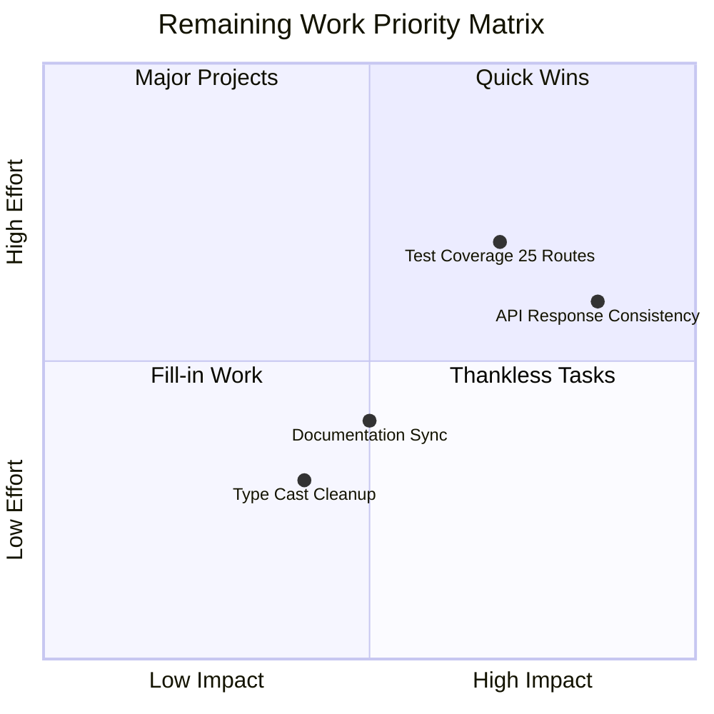

# LaundryEase - Remaining Work Action Plan

**Date:** 2026-02-19  
**Current Grade:** A/A- (97/100)  
**Goal:** Reach A+ (99/100) through consistency and depth improvements

---

## Executive Summary

The codebase has solid fundamentals with critical paths (payments, escrow, complaints, auth) well-hardened. The remaining work focuses on **consistency polish** and **test coverage depth**, not correctness failures.

---

## Priority Matrix



---

## Work Stream 1: API Response Consistency

### Problem Statement
API routes return mixed response shapes:
- Some use `{ error: string }`
- Some use `{ message: string }`
- Some use `{ success: boolean }`
- Some use `{ ok: boolean }`

This creates:
- Frontend code complexity
- Integration testing fragility
- Poor developer experience

### Existing Infrastructure
- [`lib/api/legacy-response.ts`](lib/api/legacy-response.ts) - Compatibility helpers already exist:
  - `legacyMessageBody()` / `legacyMessageResponse()`
  - `legacySuccessBody()` / `legacySuccessResponse()`

### Action Items

#### Phase 1: Audit Current State
- [ ] Create inventory of all API routes and their current response shapes
- [ ] Categorize by pattern type (error, message, success, ok)
- [ ] Identify high-traffic routes for priority migration

#### Phase 2: Migrate High-Traffic Routes
Priority order based on usage:

| Route | Current Shape | Target Shape |
|-------|---------------|--------------|
| `/api/bookings/[id]/pay` | Mixed | Dual-key compatible |
| `/api/orders/[id]/payment` | Mixed | Dual-key compatible |
| `/api/bookings/[id]/accept` | Done | ✅ |
| `/api/bookings/[id]/reject` | Done | ✅ |
| `/api/orders/[id]/status` | Done | ✅ |

#### Phase 3: Migrate Remaining Routes
Routes still needing migration (estimated 15-20):

```
app/api/
├── bookings/
│   ├── [id]/
│   │   ├── arrive/route.ts
│   │   ├── invoice/route.ts
│   │   └── reschedule/route.ts
├── orders/
│   ├── [id]/
│   │   ├── cancel/route.ts (done)
│   │   ├── confirm-delivery/route.ts (done)
│   │   └── otp/*.ts (done)
├── complaints/
│   └── route.ts
├── reviews/
│   └── route.ts
└── profile/
    └── route.ts
```

#### Phase 4: Frontend Alignment
- [ ] Update frontend API clients to use consistent response handling
- [ ] Add TypeScript types for API responses
- [ ] Remove defensive handling for multiple shapes

### Success Criteria
- All API routes return consistent response shapes
- Frontend code uses single response handling pattern
- API documentation reflects consistent shapes

---

## Work Stream 2: Test Coverage Expansion

### Current State
- 70 test files, 277 tests passing
- Critical flows well-covered
- **25 API route handlers without direct tests**

### Routes Needing Tests

#### High Priority (Financial/Security Impact)
| Route | Risk Level | Reason |
|-------|------------|--------|
| `/api/admin/refund/route.ts` | HIGH | Direct financial impact |
| `/api/bookings/[id]/invoice/route.ts` | HIGH | Invoice generation |
| `/api/invoices/[id]/review/route.ts` | HIGH | Order creation (done ✅) |
| `/api/webhooks/route.ts` | HIGH | Payment verification |

#### Medium Priority (User Operations)
| Route | Risk Level | Reason |
|-------|------------|--------|
| `/api/bookings/[id]/arrive/route.ts` | MEDIUM | Arrival tracking |
| `/api/bookings/[id]/reschedule/route.ts` | MEDIUM | Booking modification |
| `/api/complaints/route.ts` | MEDIUM | Complaint creation |
| `/api/reviews/route.ts` | MEDIUM | Review submission |
| `/api/upload/route.ts` | MEDIUM | File uploads |

#### Lower Priority (Query/Read Operations)
| Route | Risk Level | Reason |
|-------|------------|--------|
| `/api/profile/route.ts` | LOW | Profile CRUD |
| `/api/providers/route.ts` | LOW | Provider search |
| `/api/providers/[id]/route.ts` | LOW | Provider details (done ✅) |

### Test Template

```typescript
// Standard API route test structure
import { describe, it, expect, beforeEach, afterEach } from 'vitest';
import { POST, GET } from './route';
import { getDb } from '@/lib/mongodb';
import { ObjectId } from 'mongodb';

describe('/api/route-path', () => {
  describe('POST', () => {
    it('returns 401 when not authenticated', async () => {
      // Test unauthorized access
    });
    
    it('returns 400 for invalid payload', async () => {
      // Test validation
    });
    
    it('returns 200 for valid request', async () => {
      // Test happy path
    });
    
    it('handles edge case X', async () => {
      // Test edge cases
    });
  });
});
```

### Action Items

- [ ] Create test files for HIGH priority routes (4 routes)
- [ ] Create test files for MEDIUM priority routes (5 routes)
- [ ] Create test files for LOW priority routes (remaining)
- [ ] Add integration tests for complex flows

### Success Criteria
- All API routes have direct test coverage
- Critical paths have integration test coverage
- Test count reaches 300+ tests

---

## Work Stream 3: Type Cast Cleanup

### Current State
- Backend runtime casts cleaned up ✅
- Remaining casts in tests and UI interop

### Locations of Remaining Casts

```typescript
// Pattern 1: Test scaffolding
const mockUser = { ... } as unknown as User;

// Pattern 2: UI interop
(session.user as any).id;

// Pattern 3: API response handling
const data = response as unknown as ExpectedType;
```

### Action Items

#### Phase 1: Test Scaffolding
- [ ] Create proper test factory functions
- [ ] Replace `as unknown as` with typed factories
- [ ] Add test utility types

#### Phase 2: UI Interop
- [ ] Extend NextAuth types properly
- [ ] Remove `as any` from session handling
- [ ] Add proper type guards

#### Phase 3: API Response Handling
- [ ] Add response type definitions
- [ ] Use zod for runtime validation
- [ ] Remove unsafe casts

### Success Criteria
- Zero `as unknown as` in production code
- Zero `as any` in production code
- All test casts use typed factories

---

## Work Stream 4: Documentation Sync

### Current State
- Docs-sync guard exists
- PR template includes docs checklist
- Risk of drift during rapid iteration

### Action Items

- [ ] Audit current documentation accuracy
- [ ] Update API documentation for response shapes
- [ ] Add architecture decision records (ADRs)
- [ ] Create runbook for common operations

### Success Criteria
- All docs pass sync check
- API documentation matches implementation
- ADRs exist for major decisions

---

## Implementation Timeline

### Sprint 1: Foundation
- [ ] Audit API response shapes
- [ ] Create test file templates
- [ ] Set up type cast linting rules

### Sprint 2: High Priority
- [ ] Migrate high-traffic API routes
- [ ] Add tests for HIGH priority routes
- [ ] Clean up session type handling

### Sprint 3: Medium Priority
- [ ] Migrate remaining API routes
- [ ] Add tests for MEDIUM priority routes
- [ ] Create test factory functions

### Sprint 4: Polish
- [ ] Add tests for LOW priority routes
- [ ] Final type cast cleanup
- [ ] Documentation audit

---

## Metrics to Track

| Metric | Current | Target |
|--------|---------|--------|
| Test Count | 277 | 350+ |
| API Routes Without Tests | 25 | 0 |
| Response Shape Consistency | ~70% | 100% |
| Type Casts (production code) | ~15 | 0 |
| Documentation Sync Score | Unknown | 100% |

---

## Risk Mitigation

### Risk: Breaking Changes During Migration
**Mitigation:** Use dual-key compatibility responses (`error` + `message`, `success` + `ok`) to maintain backward compatibility

### Risk: Test Coverage Gaps
**Mitigation:** Prioritize by financial impact, use mutation testing to verify coverage quality

### Risk: Documentation Drift
**Mitigation:** Enforce docs-sync check in CI, add to PR template

---

## Conclusion

The remaining work is **polish and consistency**, not correctness failures. The codebase is production-ready at A/A- grade. Completing this action plan will elevate it to A+ (99/100).

**Estimated Effort:**
- API Response Consistency: 2-3 sprints
- Test Coverage: 2 sprints
- Type Cast Cleanup: 1 sprint
- Documentation: 1 sprint

**Total: 6-7 sprints to A+**
